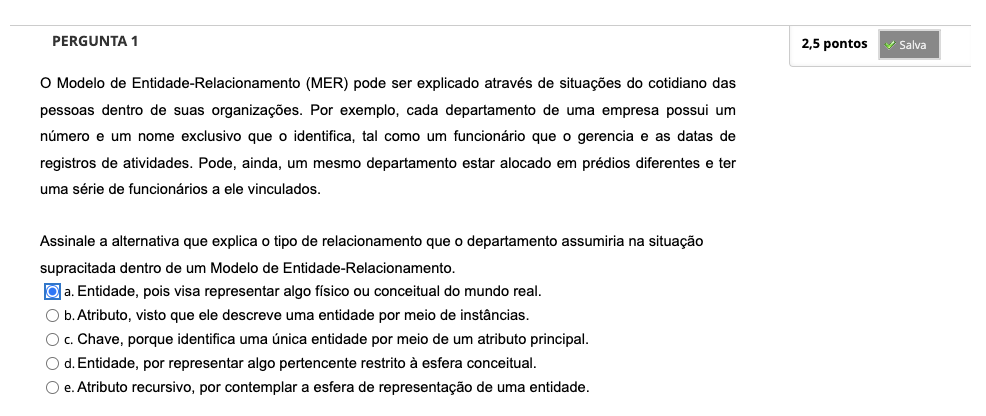
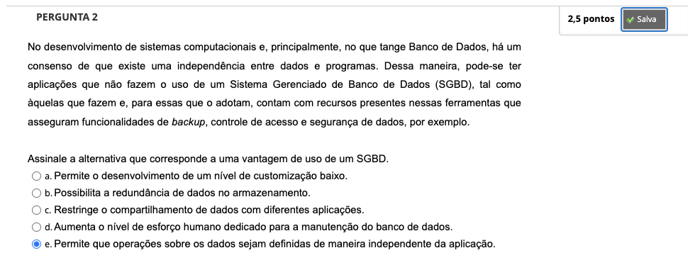
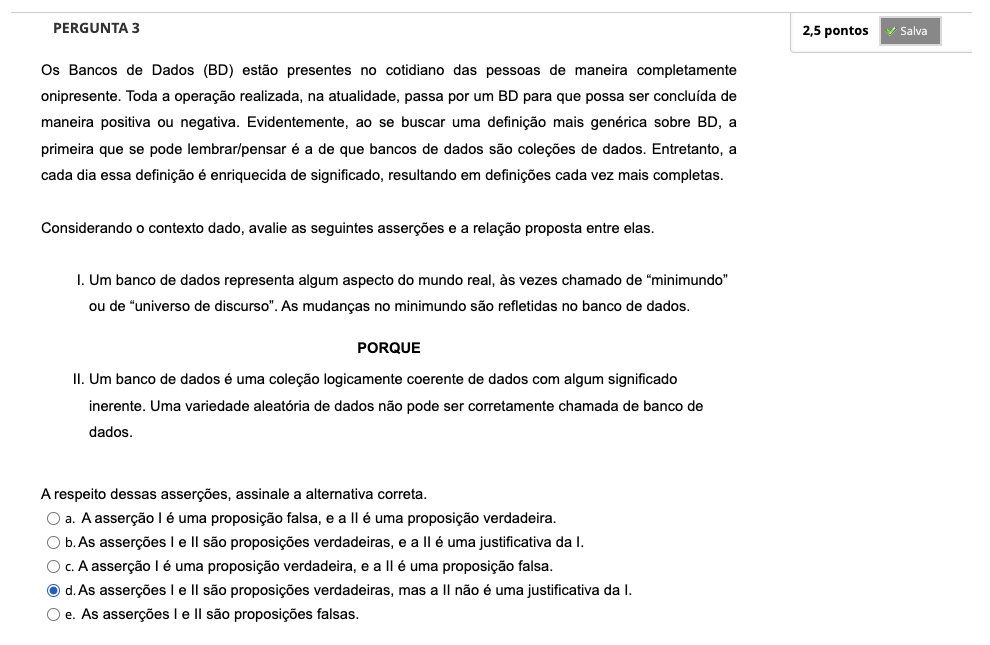
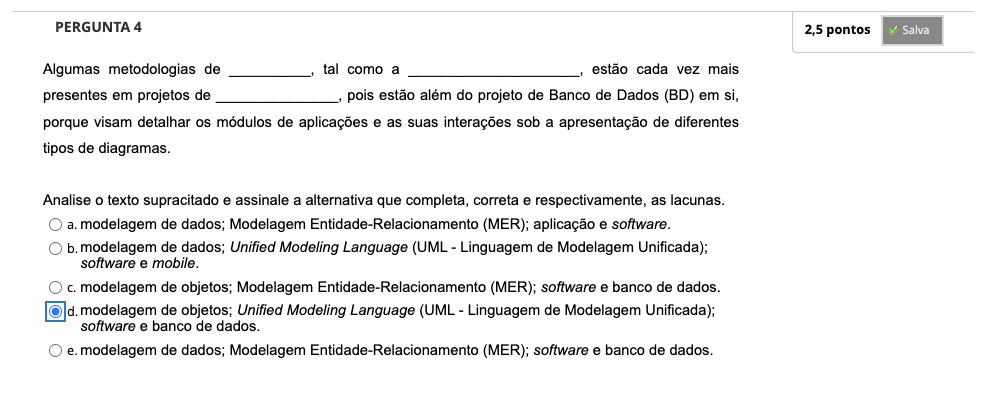

# Semana 1 - Introdução a Banco de Dados e Modelo Entidade-Relacionamento

##
### Videoaula 1 - Visão geral sobre Banco de Dados
https://youtu.be/Uua7T2Dzndk

- dado é um fato que deve ser armazenado (persistido) e que tem um significado implícito
- independência entre dados e programa
- SGBD (sistema gerenciador de banco de dados)
- modelo de dados conceitual

#### usuários de um sistema de banco de dados
- administrador de banco de dados (DBA)
- projetistas de banco de dados
- analistas de sistemas e programadores
- usuários finais

#### vantagens da abordagem baseada em SGBDs
- controle de redundância: evita inconsistências
- controle de acesso
- persistência para programas e estruturas de dados (objetos)
- eficiência no processo de consulta
- oferecimento de sistemas de backup e recuperação
- garantia das restrições de integridade

#### Modelos de Dados
##### Modelos de Alto Nível ou Modelos de Dados Conceituais
- ex: Modelo Entidade-Relacionamento (MER)

##### Modelos de Baixo Nível ou Modelos de Dados Físicos
- ex: formato de registros, ordenação e formas de acesso

##### Modelos de Dados de Representação (ou Implementação)
- ex: Modelo Relacional

#### Esquemas, Instâncias e Estado do Banco de Dados

#### Linguagens
##### DDL
##### DML

---

## Atividade Avaliativa - Semana 1

---

## Em Síntese