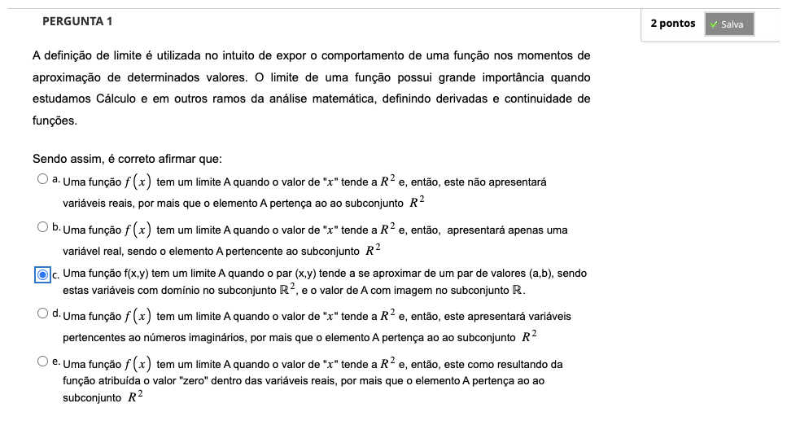
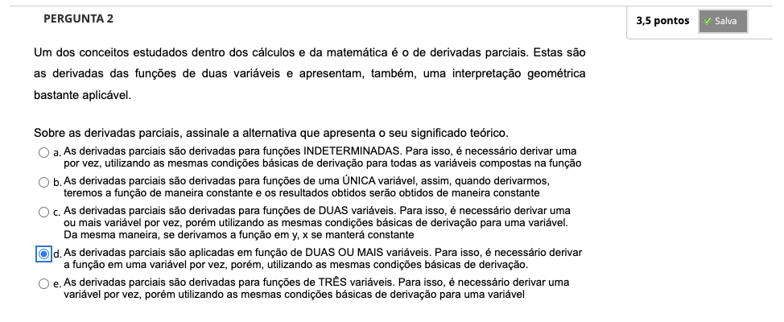
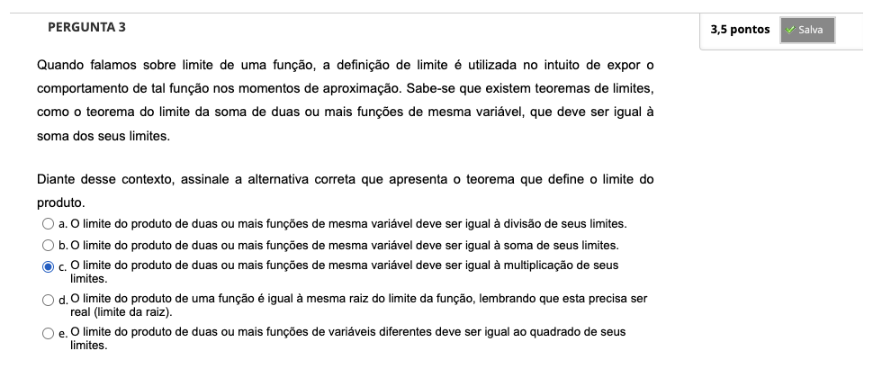
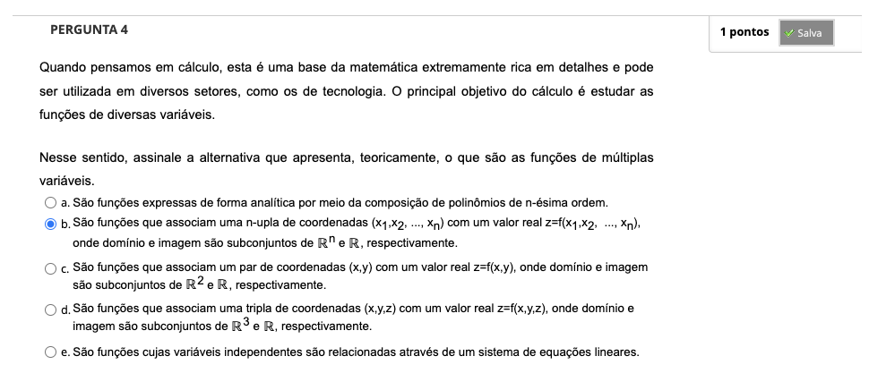

## Semana 1 - Funções de várias variáveis

### Videoaula 1 - Apresentação da disciplina e Funções de várias variáveis
https://youtu.be/v90QbOma17I

#### ```Funções de várias variáveis```
- possuem UMA variável DEPENDENTE (imagem) e mais de uma variável INDEPENDENTE
- gráficos tipicamente serão superfícies
- softwares para figuras espaciais:
    - Winplot
    - Geogebra
    - GnuPlot

- Paraboloide de Revolução
- função limitada: se seu conjunto imagem é um conjunto limitado em R
- Curvas de Nível: conjunto de pontos no domínio da função onde esta tem valores constantes


### Videoaula 2 - Limites e Continuidade
https://youtu.be/v1Ik-QrrFDs


---

## Atividade Avaliativa - Semana 1







