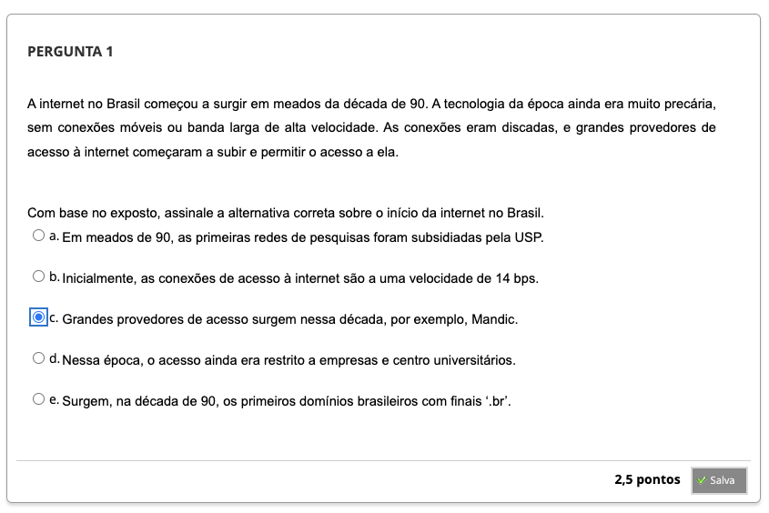
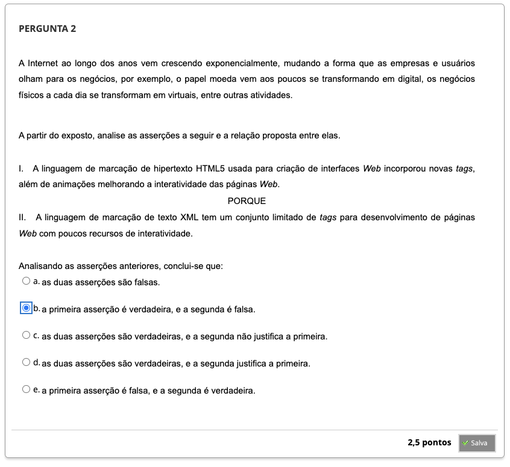
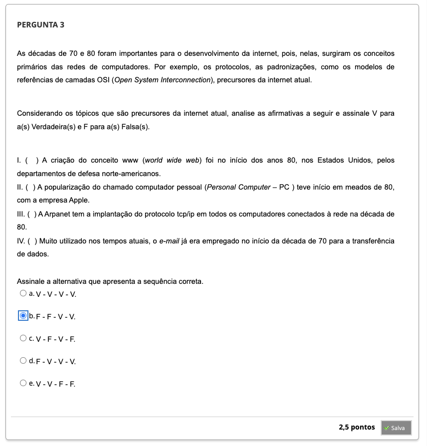
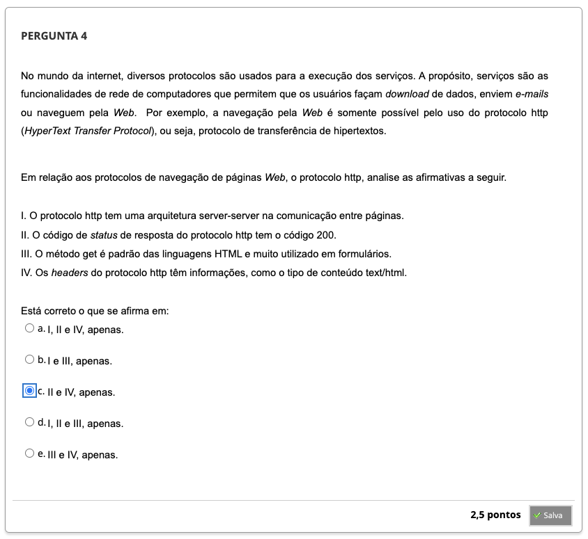

## Semana 1 - História da Web

### Revisitando Conhecimentos

### Videoaula 1 - História da Internet e Web
https://youtu.be/oXnVDHhPKtY

### Quiz da videoaula 1

### Videoaula 2 - Protocolos e Aplicações

### Quiz da videoaula 2

## Materiais-base
### Texto-base 1: Primórdios da Rede
### Texto-base 2: O começo da Internet no Brasil
### Texto-base 3: Desenvolvimento de Software II

### Quiz - Objeto Educacional

## Aprofundando o tema

---

## Atividade Avaliativa

---

## Em Síntese