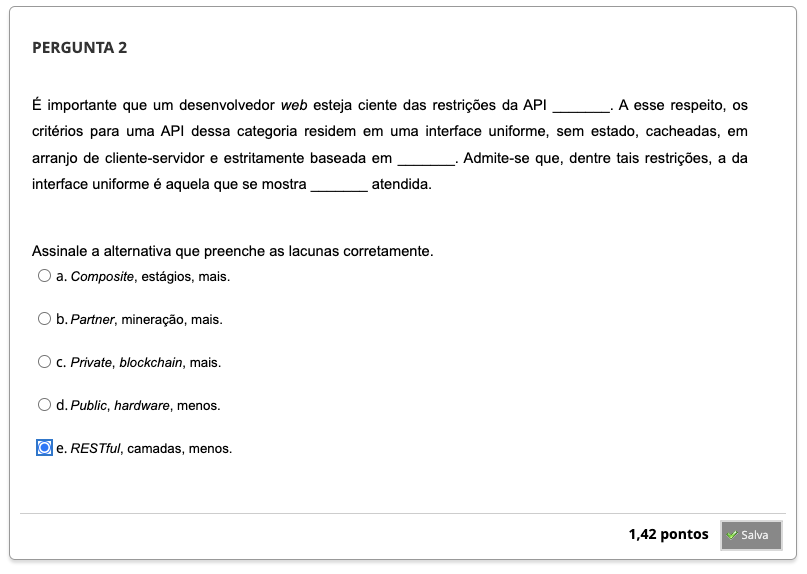
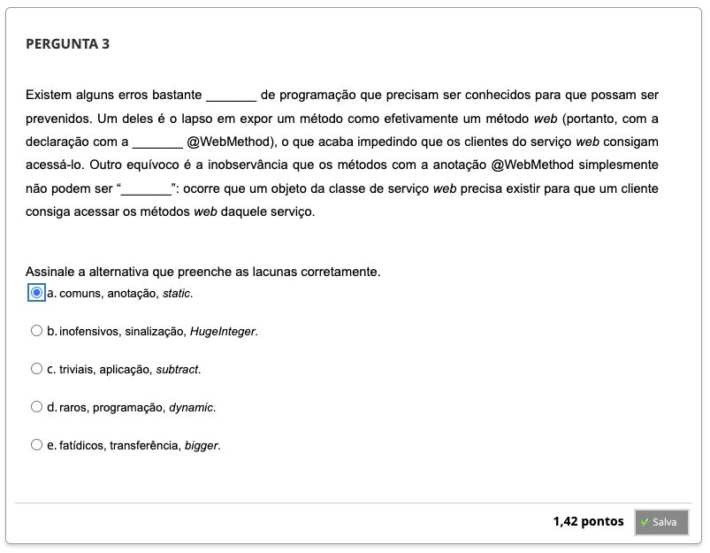
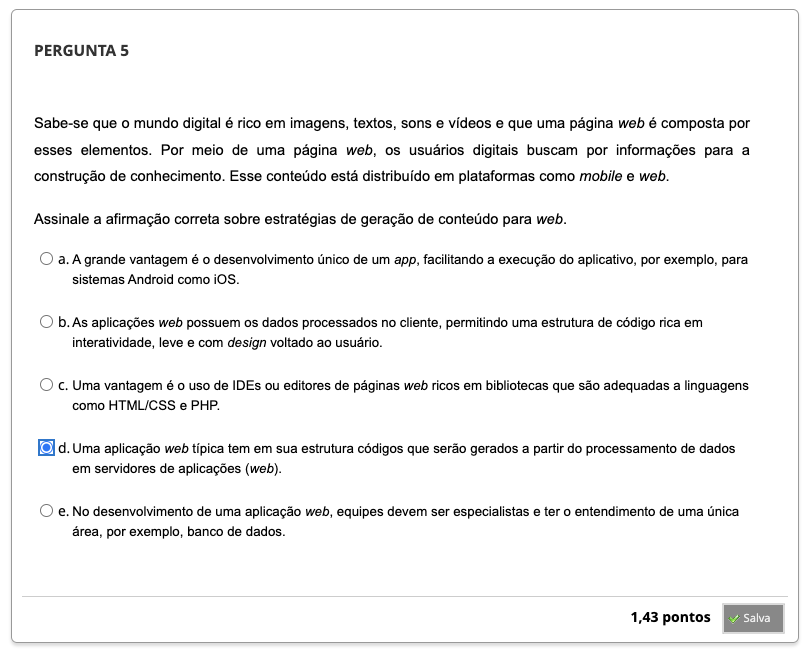
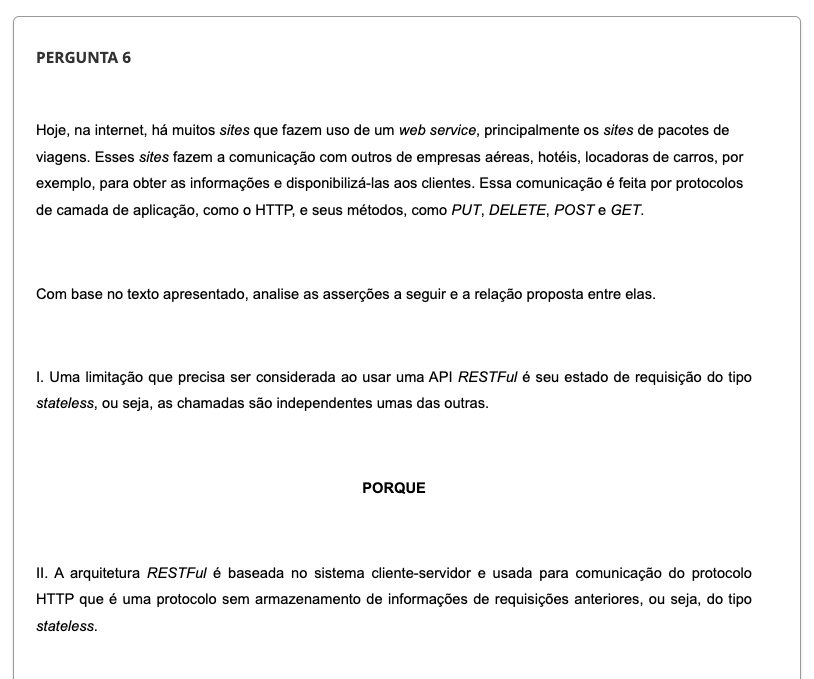
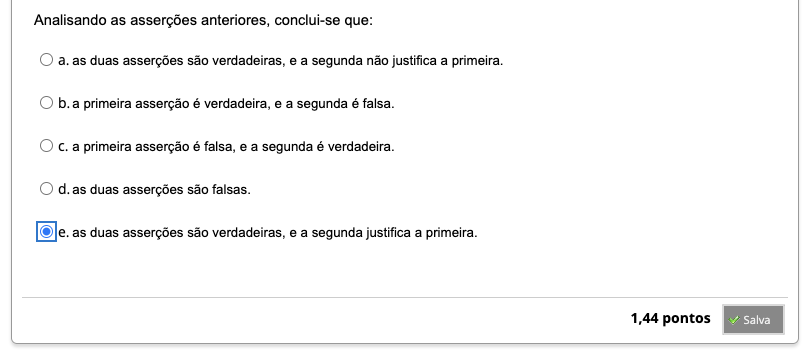
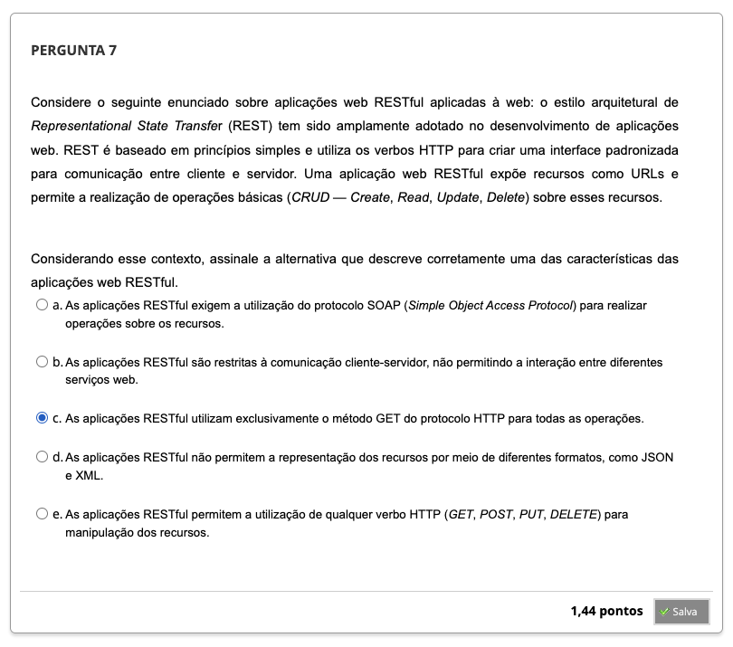

## Semana 5 - Metodologias de Desenvolvimento de Aplicações Web

### Desafio
### Revisitando Conhecimentos
### Orientação de Estudos
#### Videoaula 10 - Arquiteturas e Metodologias para Desenvolvimento Web
#### Quiz da Videoaula 10
#### Videoaula 11 - Aplicações Web RESTFul
#### Quiz da Videoaula 11

### Materiais Base
#### Texto-base 1:
#### Texto-base 2:
#### Quiz Objeto Educacional

### Aprofundando o Tema

---

### Atividade Avaliativa - Semana 5

---

### Em Síntese