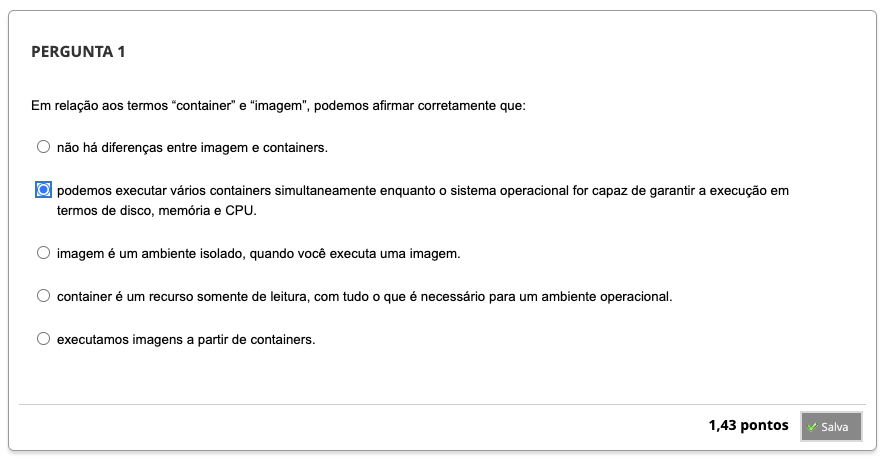
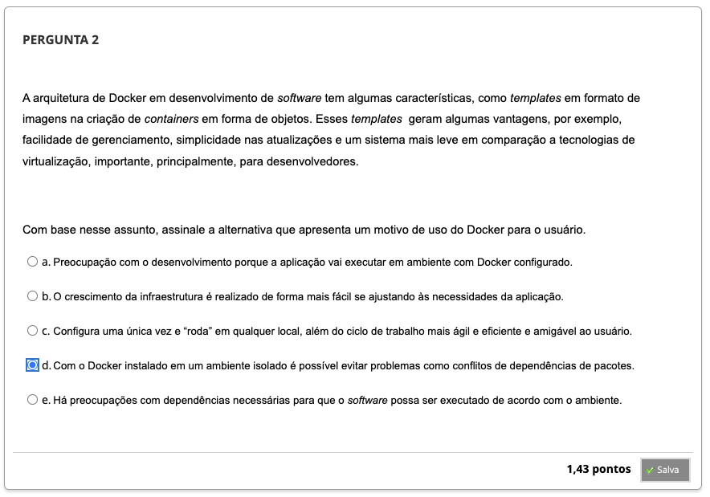
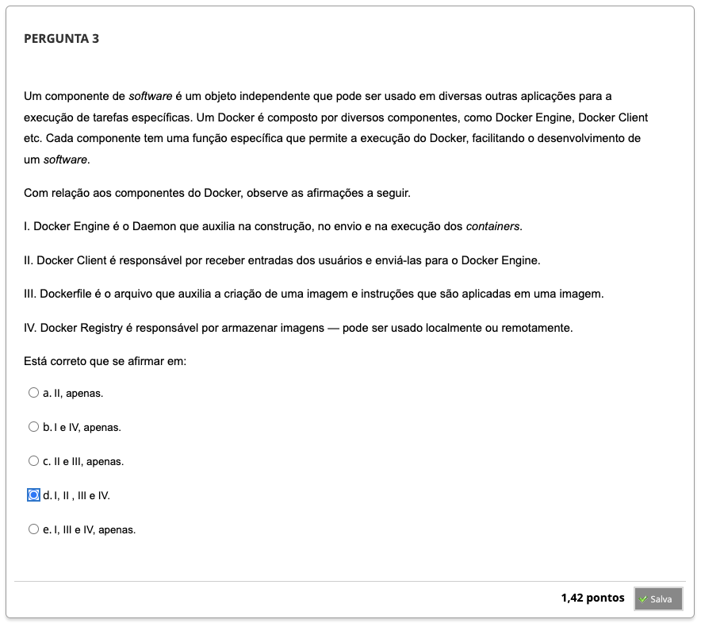
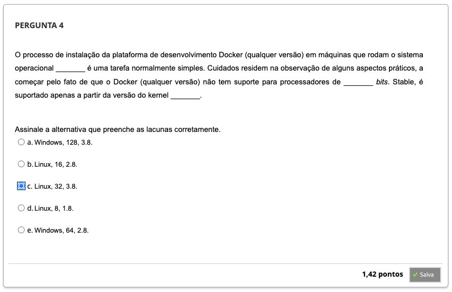
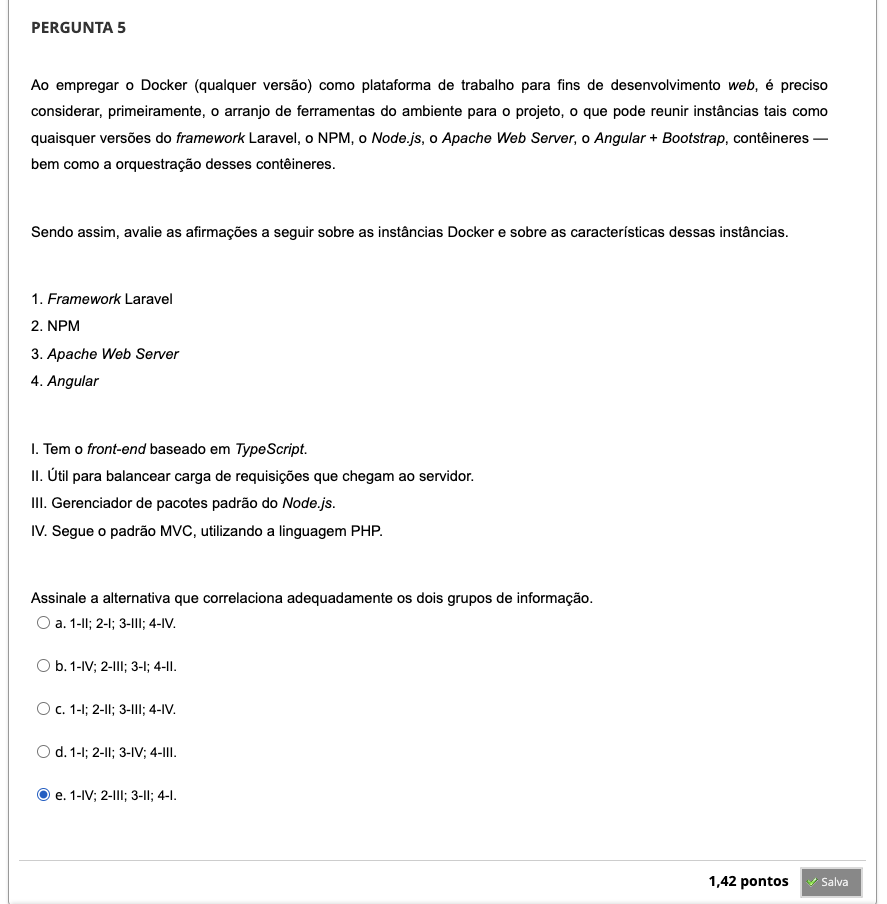
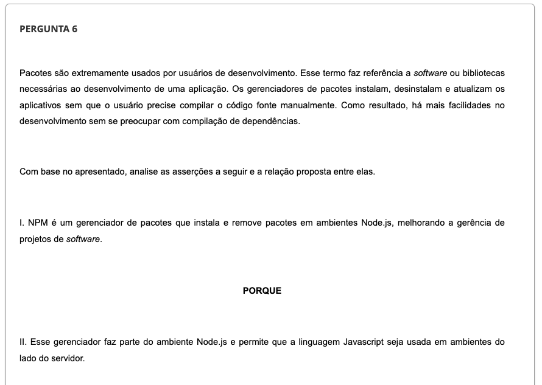
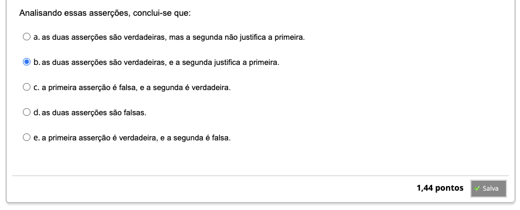
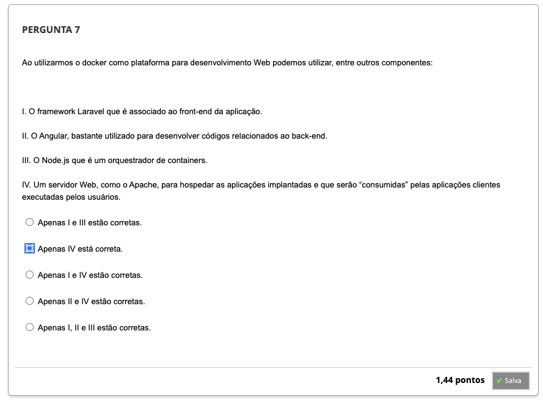

## Semana 6 - Aplicações Web em Containers

### Desafio

### Revisitando Conhecimentos

### Orientação de Estudos
#### Videoaula 12 - Introdução ao Docker - Parte 1
#### Quiz - videoaula 12
#### Videoaula 13 - Introdução ao Docker - Parte 2
#### Quiz - videoaula 13
#### Videoaula 14 - Docker como plataforma de desenvolvimento web
#### Quiz - videoaula 14

### Materiais Base
#### Texto-base 1
#### Texto-base 2

#### Quiz - Objeto Educacional

### Aprofundando o tema

---

### Atividade Avaliativa - Semana 6

---

### Em síntese