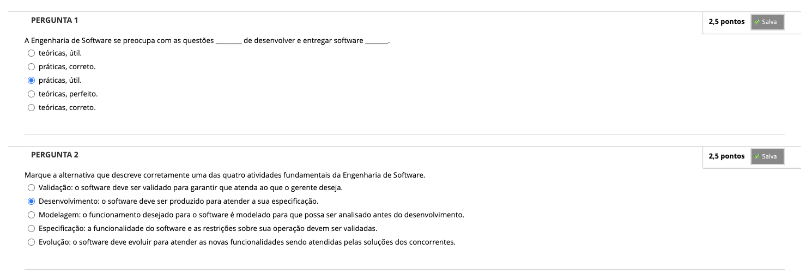
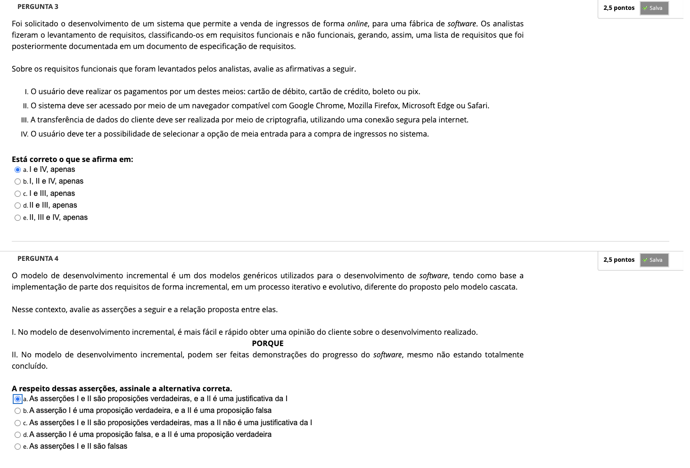

# Semana 1 - Processo de Software

### Videoaula 1 - Introdução à Engenharia de Software

### Quiz da videoaula 1

### Texto base 1

### Texto base 2

### Texto base 3

### Videoaula 2 - Modelos de processo de software

### Quiz da videoaula 2

### Videoaula 3 - Métodos de desenvolvimento ágeis

### Quiz da videoaula 3

## Aprofundando o Tema
### Texto de apoio
### Texto de apoio
### Vídeo de apoio
### Vídeo de apoio

## Quiz Objeto Educacional

## Atividade Avaliativa - Semana 1

## Desafio

## Em Síntese