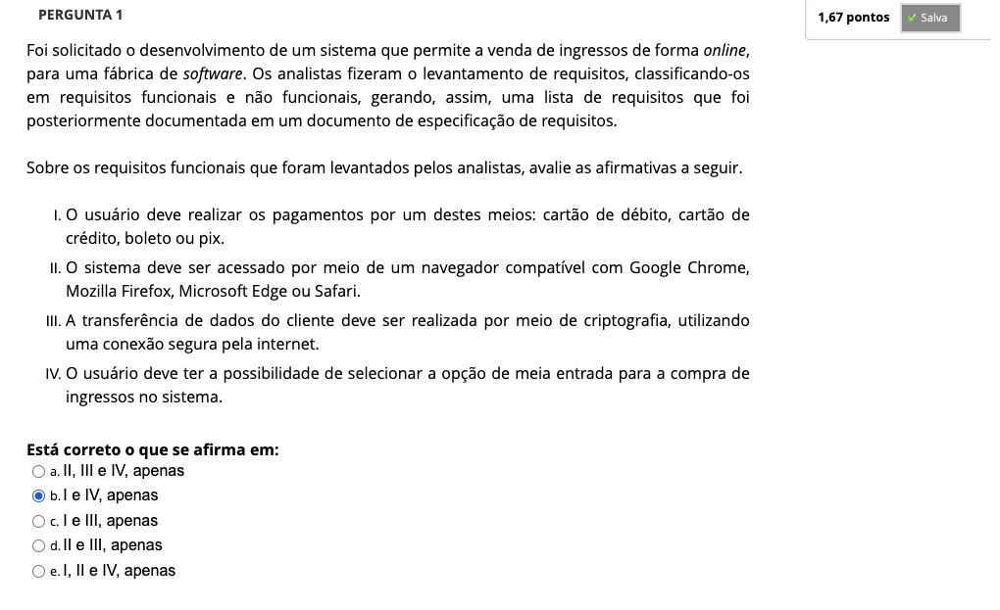
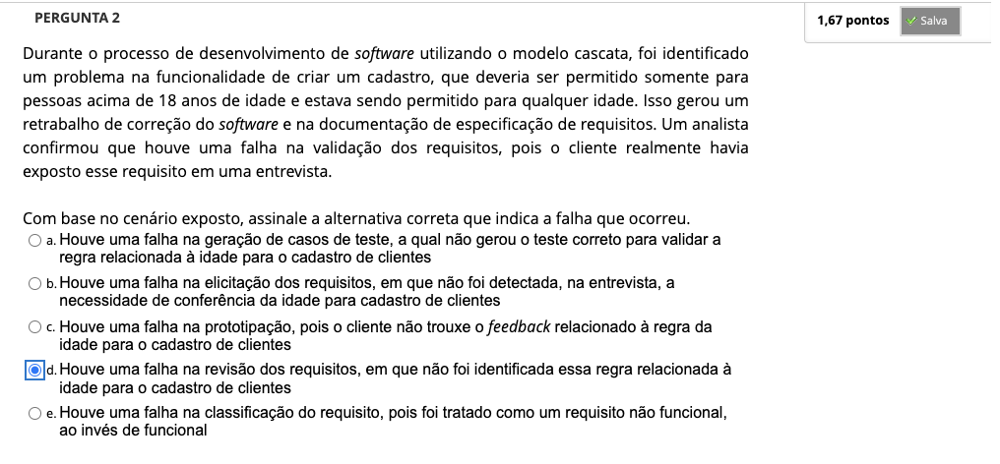
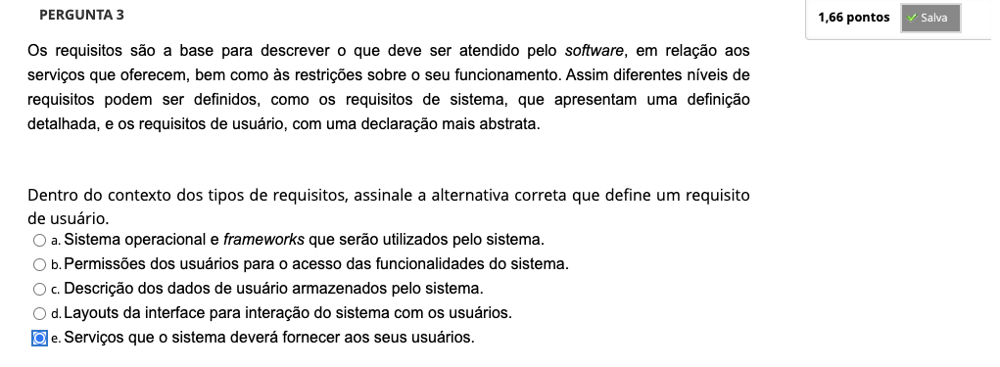
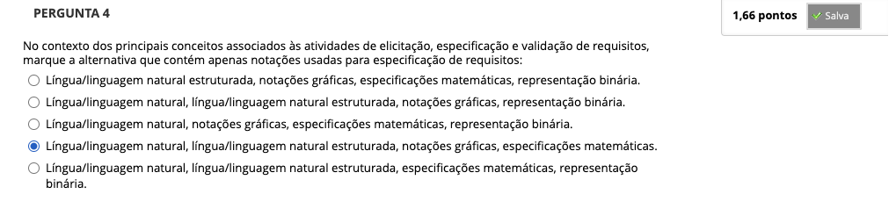
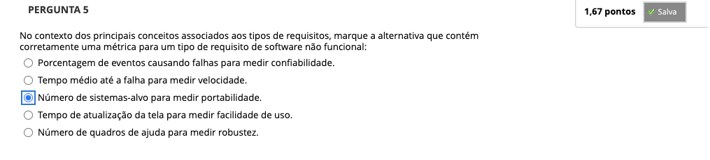

# Semana 2 - Engenharia de Requisitos

### Videoaula 4 - Tipos de requisitos de software

### Quiz da videoaula 4

### Texto base 1: 

### Texto base 2:

### Texto base 3:

### Videoaula 5 - Processos de engenharia de requisitos e elicitação de requisitos

### Quiz da videoaula 5

### Videoaula 6 - Especificação e validação de requisitos

### Quiz da videoaula 6

### Quiz Objeto Educacional

## Aprofundando o tema
### Texto de apoio
### Texto de apoio

---

## Atividade Avaliativa - Semana 2

---

## Desafio

## Em Síntese