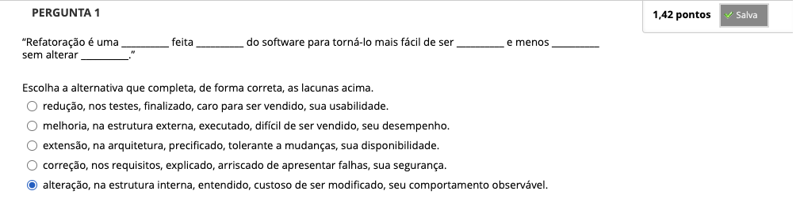
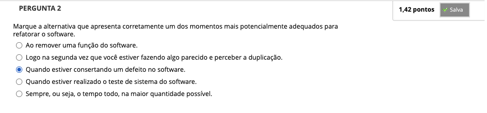
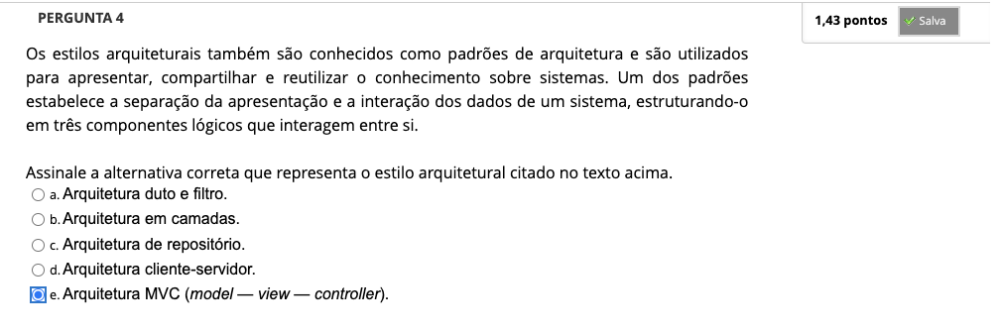
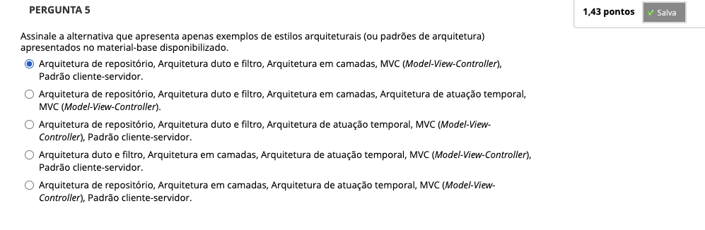
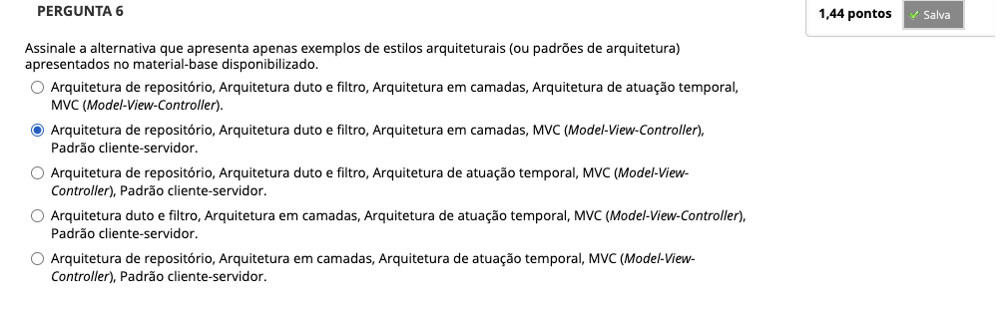
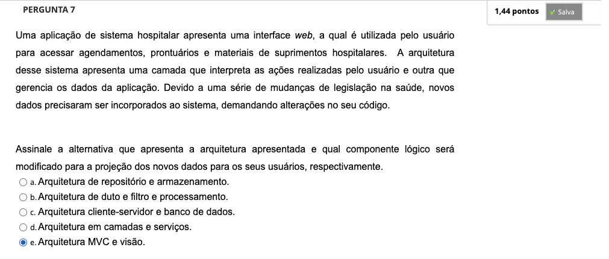

# Semana 3 - Arquitetura e Projeto de Software

### Videoaula 7 - Projeto de arquitetura e visões de arquitetura

### Quiz da videoaula 7

### Videoaula 8 - Estilos arquiteturais

### Quiz da videoaula 8

### Texto base 1:

### Texto base 2: Refatoração

### Videoaula 9 - Refatoração de software

### Quiz da videoaula 9

### Quiz Objeto Educacional

## Aprofundando o tema
### Texto de apoio
### Texto de apoio
### Texto de apoio

---

## Atividade Avaliativa - Semana 3

<!-- # 3 -->

---

## Desafio

## Em Síntese