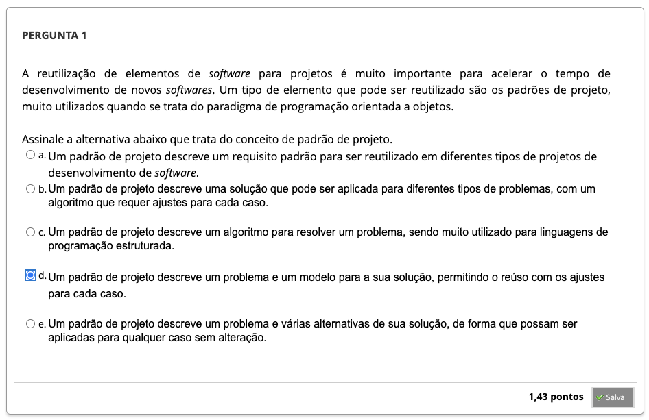
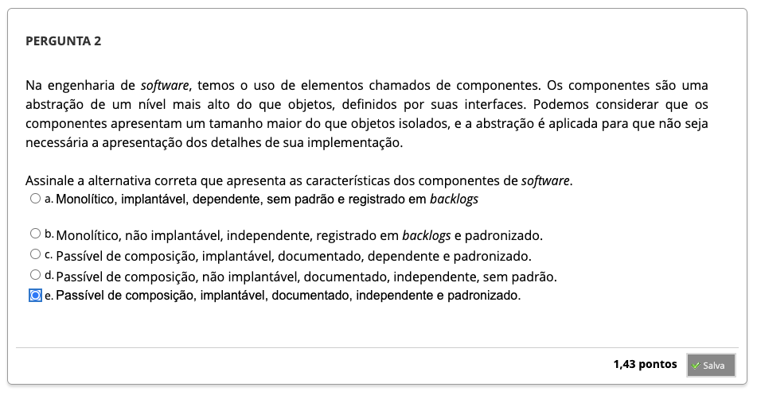
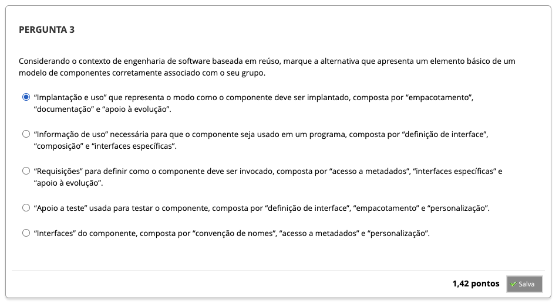
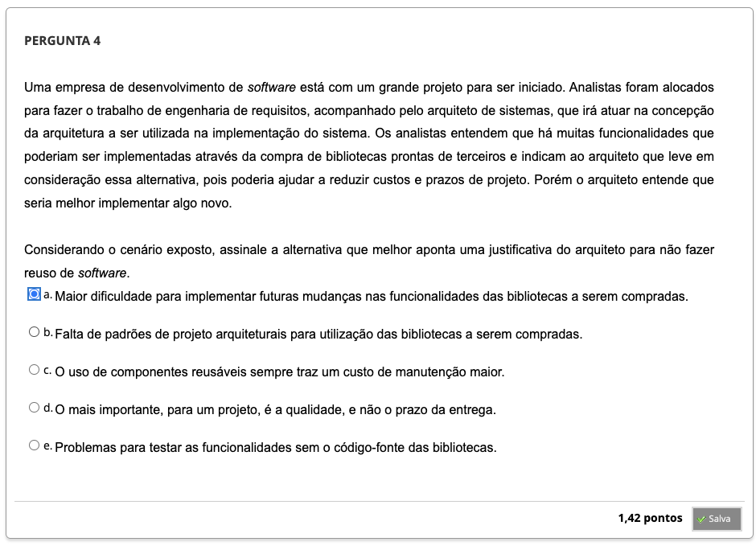
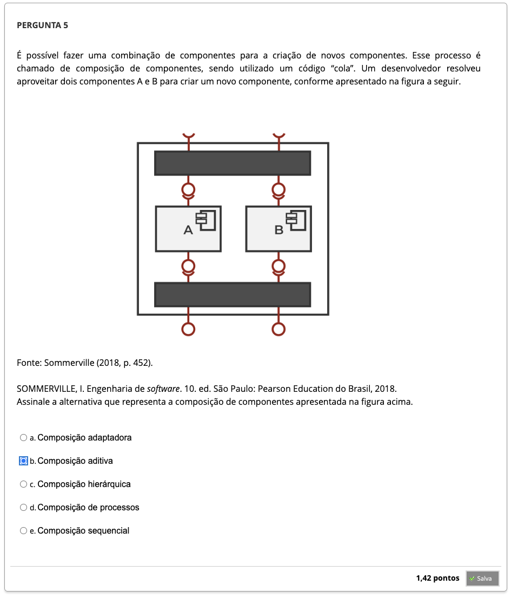
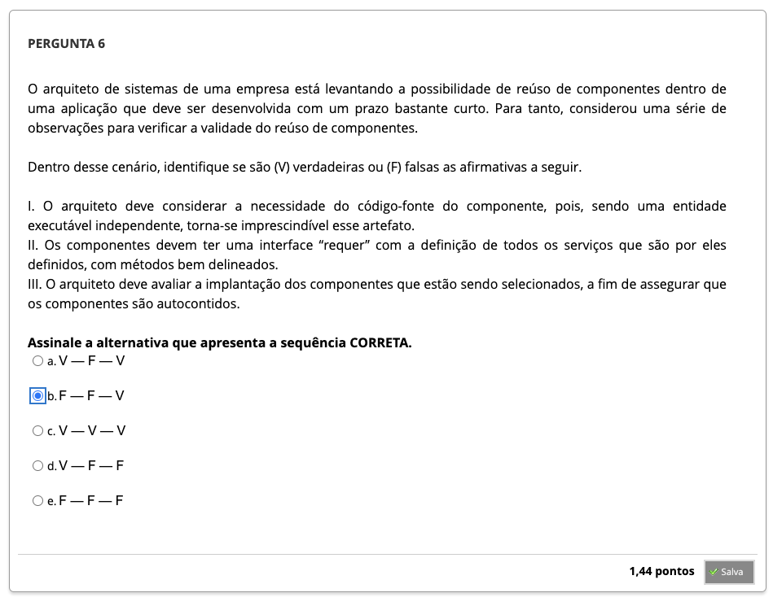
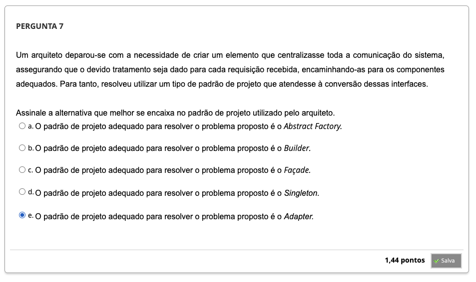

# Semana 4 - Reúso de Software

### Videoaula 10 - Reúso de Software

### Quiz da videoaula 10

### Texto base 1:

### Texto base 2:

### Texto base 3:

### Videoaula 11 - Padrões de Projeto

### Quiz da videoaula 11

### Videoaula 12 - Componentes de Software

### Quiz da videoaula 12

### Quiz Objeto Educacional

## Aprofundando o tema
### Texto de apoio
### Texto de apoio

---

## Atividade Avaliativa - Semana 4

---

## Desafio

## Em Síntese