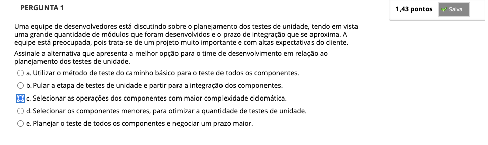
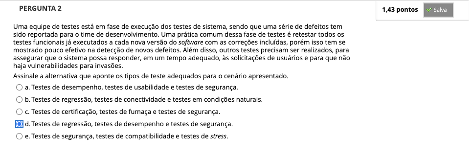
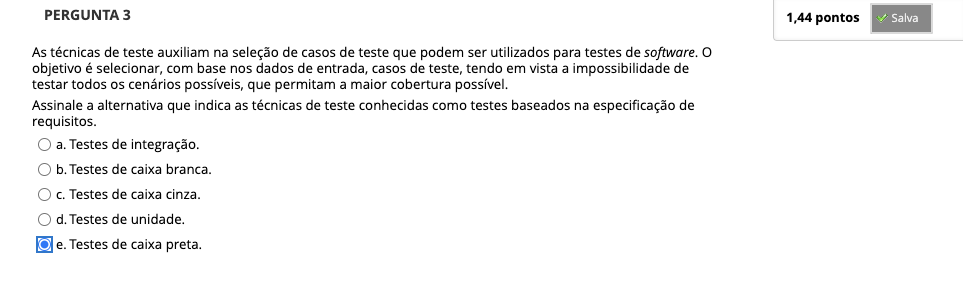
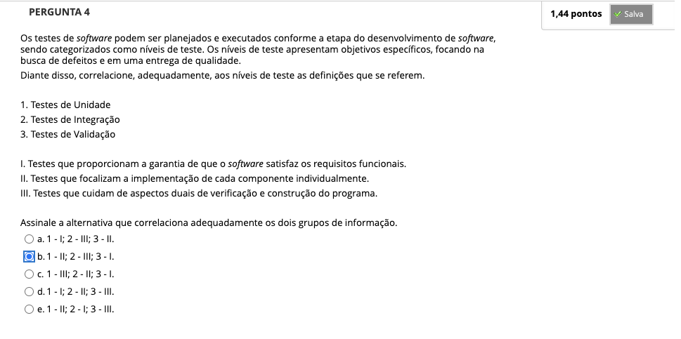
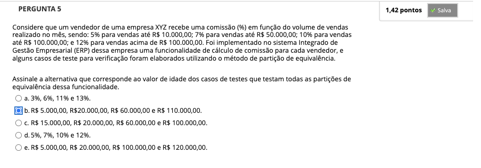
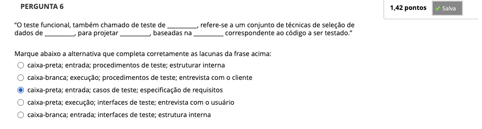
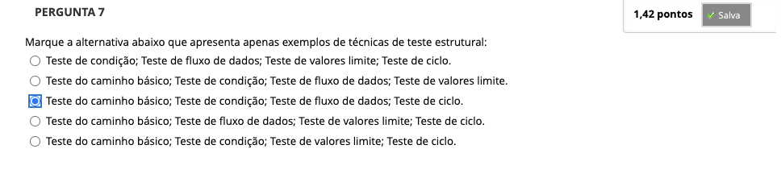

# Semana 5 - Estratégias e Técnicas de Teste de Software

### Videoaula 13 - Estratégias de teste de software
### Quiz da videoaula 13
### Videoaula 14 - Teste Funcional
### Quiz da videoaula 14
### Videoaula 15 - Teste estrutural
### Quiz da videoaula 15

## Material Base
### Texto base: Engenharia de Software - Uma Abordagem Profissional

## Quiz Objeto Educacional

## Aprofundando o tema
### Texto de apoio
### Texto de apoio

---

## Atividade Avaliativa - Semana 5

---

## Desafio

## Em Síntese