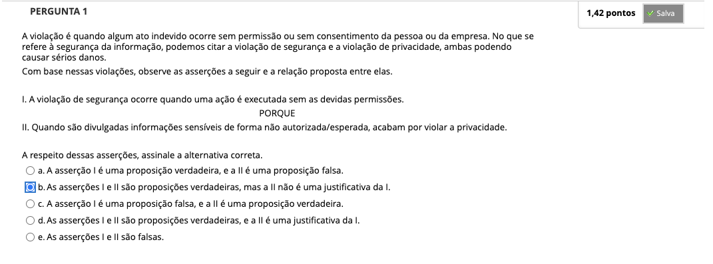
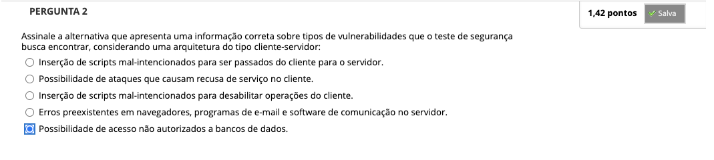
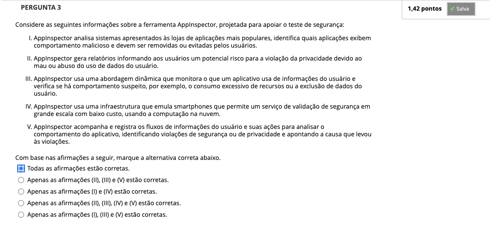
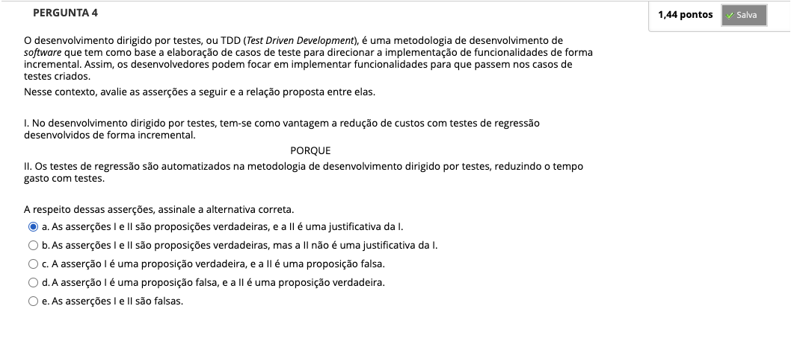
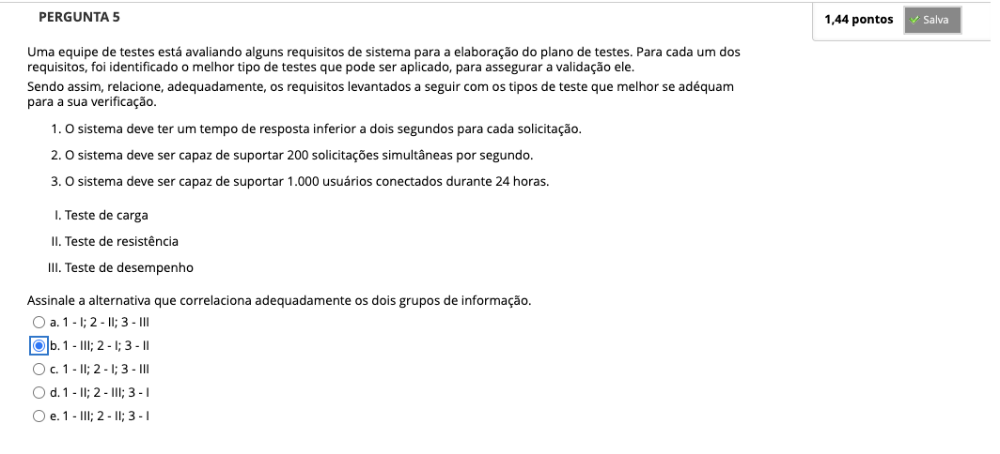
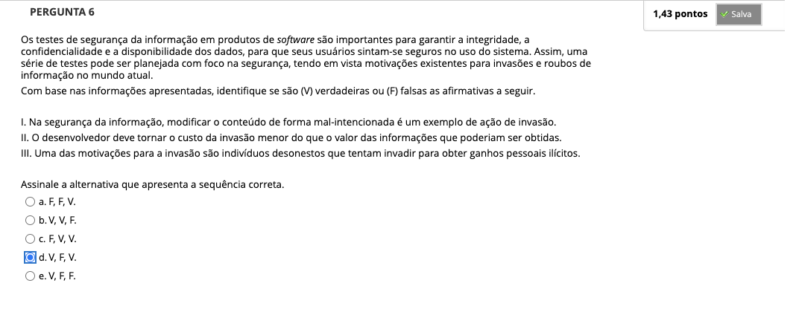
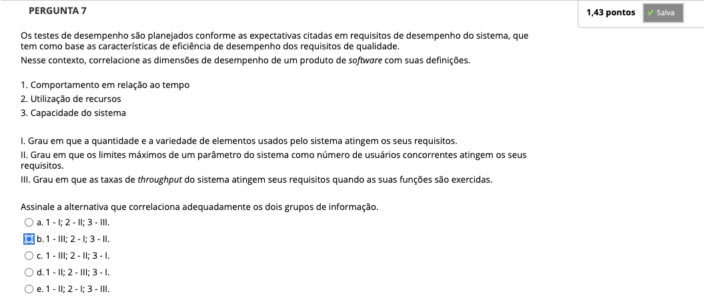

# Semana 6 - Tipos de Teste de Software e Desenvolvimento Dirigido por Testes

### Videoaula 16 - Teste de Desempenho

### Quiz da videoaula 16

### Texto base 1

### Texto base 2

### Texto base 3

### Videoaula 17 - Teste de Segurança

### Quiz da videoaula 17

### Videoaula 18 - Desenvolvimento dirigido por testes

### Quiz da videoaula 18

## Quiz Objeto Educacional

## Aprofundando o Tema
### Texto de apoio
### Texto de apoio
### Texto de apoio
### Texto de apoio

---

## Atividade Avaliativa - Semana 6

---

## Desafio

## Em Síntese