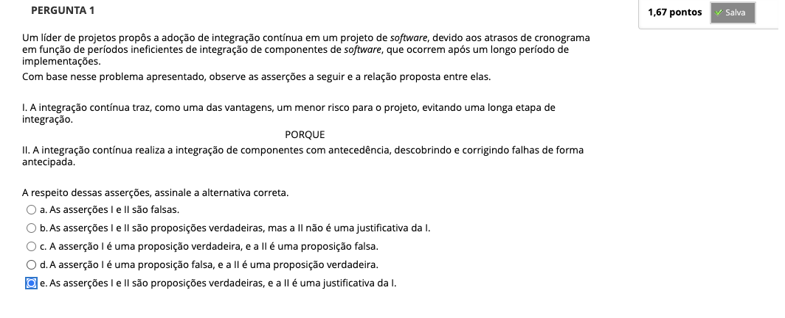
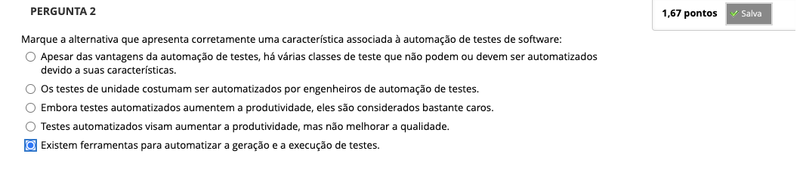
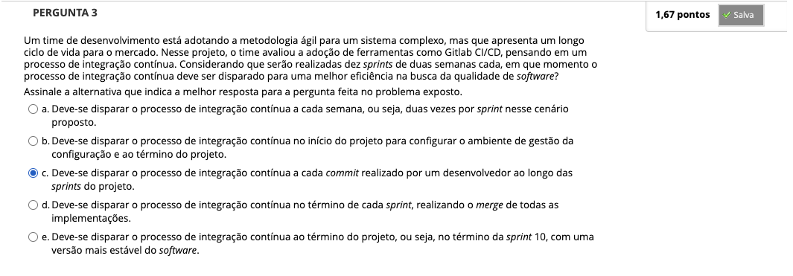
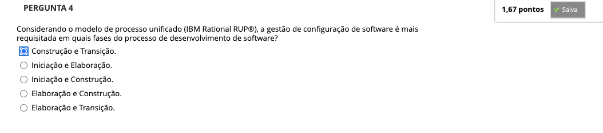
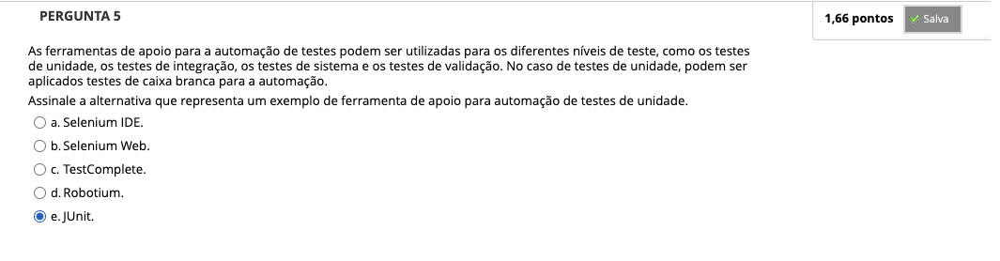
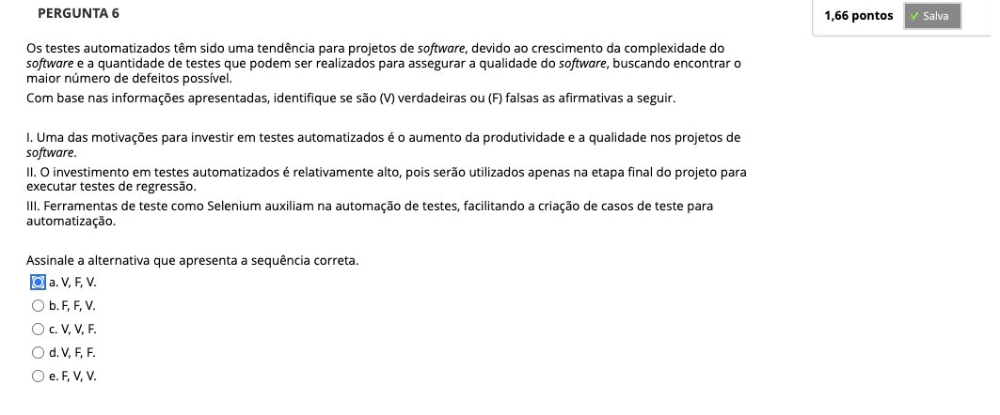

## Semana 7 - Entrega Contínua

### Videoaula 19 - Testes automatizados
### Quiz da videoaula 19
### Texto base 1:
### Texto base 2:
### Texto base 3:
### Videoaula 20 - Integração Contínua
### Quiz da videoaula 20
### Videoaula 21 - Gestão de Configuração de Software
### Quiz da videoaula 21

## Quiz Objeto Educacional

## Aprofundando o tema
### Texto de apoio:
### Texto de apoio:
### Texto de apoio:
### Texto de apoio:
### Texto de apoio:

---

## Atividade Avaliativa - Semana 7

---

## Desafio

## Em Síntese