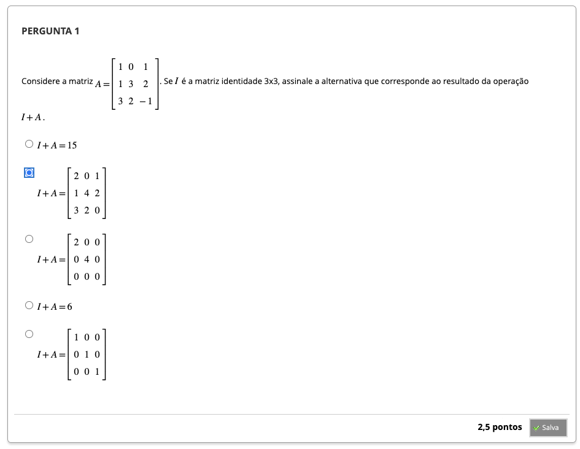
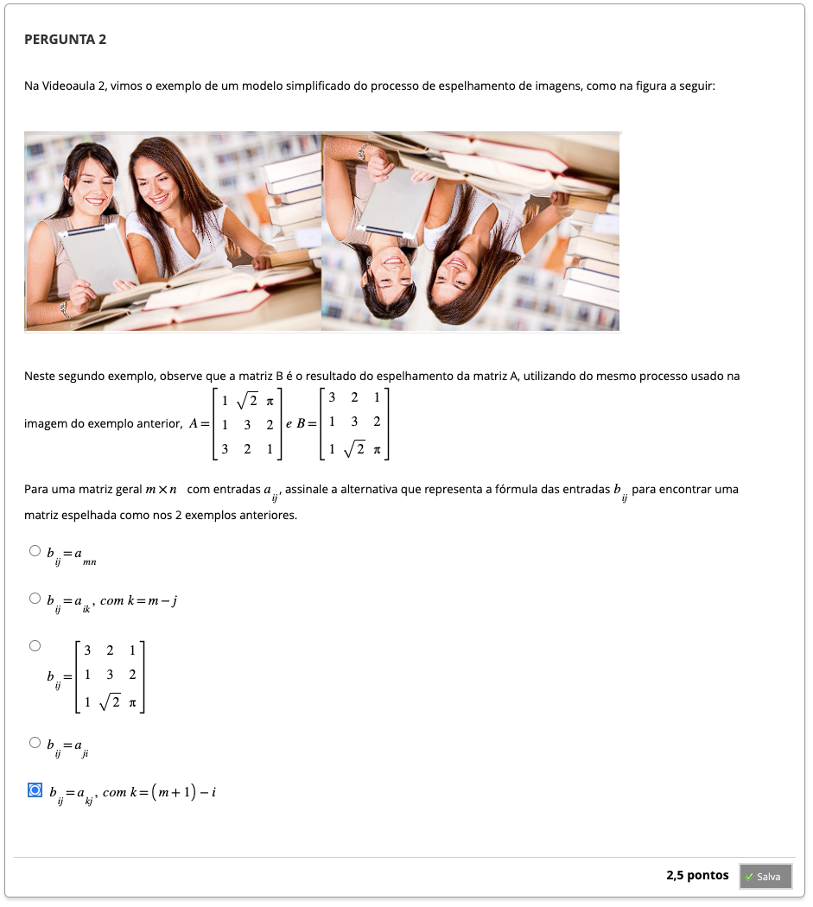
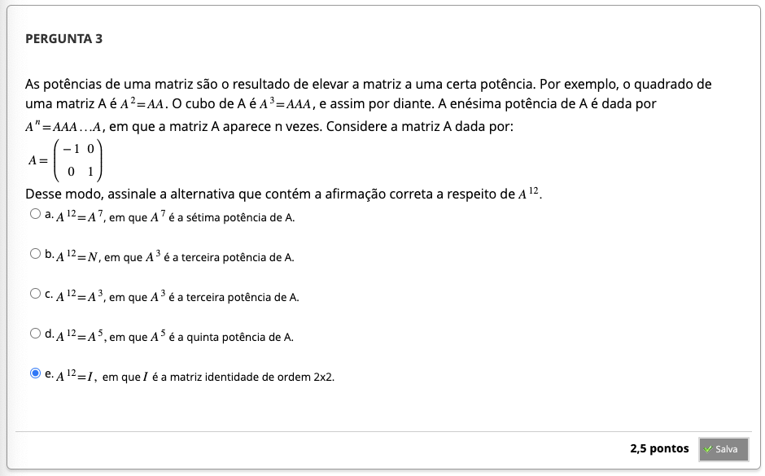
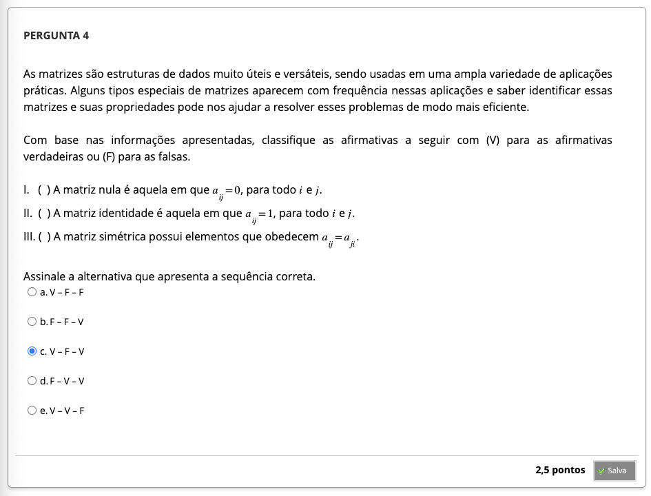

# Semana 1 - Matrizes

### Videoaula 1 - Uma ideia geral da disciplina
https://youtu.be/n62o-iA1KjE

- software: Geogebra
- sistemas lineares: intersecção de retas = solução
- escalonamento de matrizes
- vetores - combinação lineares

- matriz dos coeficientes
- matriz das incógnitas
- matriz dos termos independentes

- geometria no plano
- desenvolvimento algébrico
- teoria de matrizes
- teoria de vetores

#### Próximas aulas
- teoria de matrizes
- espaços vetoriais
- geometria no plano e espaço

### Quiz da videoaula 1
Assinale a alternativa que mostra o sistema linear abaixo na forma matricial $Ax = b$.

$\begin{cases}
2x - y = 3\\
-x + 2y = 0
\end{cases}$

a)$
\begin{bmatrix}2 & -1 \\ -1 & 2\end{bmatrix}
\begin{bmatrix} x \\ y \end{bmatrix} = 
\begin{bmatrix} 3 \\ 0 \end{bmatrix}$     &check;

b)$
\begin{bmatrix}2 & 1 \\ 1 & 2 \end{bmatrix}
\begin{bmatrix} x \\ y \end{bmatrix} =
\begin{bmatrix} 0 \\ 3 \end{bmatrix}$

c)$\begin{bmatrix} 2 & -1 \\ -1 & 2 \end{bmatrix}$

d) $x = 2$ e $y = 1$

e) $ 
\begin{bmatrix} 2 \\ -1 \end{bmatrix} x +
\begin{bmatrix} -1 \\ 2 \end{bmatrix} y =
\begin{bmatrix} 3 \\ 0 \end{bmatrix} $

--- 

### Videoaula 2 - O que são matrizes?
https://youtu.be/0AcpZCOIAYk

- matriz "cat map"

- matriz linha = tem 1 linha
- matriz coluna = tem 1 coluna

#### Aplicações
- sistemas computacionais que lidam com grande quantidade de dados
- computação gráfica

#### Próximas aulas:
- Operações com matrizes
- Tipologia das matrizes
- Multiplicação de matrizes

### Quiz da videoaula 2
Considere a matriz: $
A = 
\begin{bmatrix}
1 & 7 & 2 \\
17 & 5 & 3 \\
9 & 10 & 35
\end{bmatrix}
$

Se a matriz B é obtida somando 1 a cada elemento da matriz A, então assinale a alternativa que corresponde à matriz B:

a) $
B =
\begin{bmatrix}
 1 & 17 & 9 \\
 7 & 5 & 10 \\
 2 & 3 & 35
\end{bmatrix}
$

b) $
B =
\begin{bmatrix}
 1 & 7 & 2 \\
 17 & 5 & 3 \\
 9 & 10 & 35
\end{bmatrix}
$

c) $
B =
\begin{bmatrix}
 2 & 18 & 10 \\
 8 & 6 & 11 \\
 3 & 4 & 36
\end{bmatrix}
$

d) $
B =
\begin{bmatrix}
 9 & 7 & 9 \\
 10 & 6 & 4 \\
 11 & 7 & 36
\end{bmatrix}
$

e) $
B =
\begin{bmatrix}
 2 & 8 & 3 \\
 18 & 6 & 4 \\
 10 & 11 & 36
\end{bmatrix}     
$     &check;

---

### Videoaula 3 - Operações com matrizes
https://youtu.be/hgkUTXf70aE

#### Operações com matrizes
##### Soma
- deve ser entre matrizes de mesma ordem: $A_{{m}\times{n}}$ e   $B_{{m}\times{n}}$
- soma dos elementos correspondentes

$
\begin{bmatrix}2 & 3 \\1 & 0 \\6 & 7 \\3 & 5\end{bmatrix} + 
\begin{bmatrix}0 & 1 \\8 & 2 \\1 & -3\\3 & 0\end{bmatrix} = 
\begin{bmatrix}2+0 & 3+1 \\1+8 & 0+2 \\6+1 & 7-3 \\3+3 & 5+0\end{bmatrix} =
\begin{bmatrix}2 & 4 \\9 & 2 \\7 & 4 \\6 & 5\end{bmatrix}
$

##### Produto por escalar
$
4A = 4 \begin{bmatrix} 2 & 3 & 3\\ 1 & 0 & 1\\ 6 & -2 & 3\\3&5&2\end{bmatrix} = 
\begin{bmatrix} 4*2 & 4*3 & 4*3\\ 4*1 & 4*0 & 4*1\\ 4*6 & 4*-2 & 4*3\\4*3&4*5&4*2\end{bmatrix} =
\begin{bmatrix} 8 & 12 & 12\\ 4 & 0 & 4\\ 24 & -8 & 12\\12&20&8\end{bmatrix}
$

##### Produto de matrizes
- o número de colunas da primeira matriz deve ser igual ao número de linhas da segunda matriz
- $A_{{m}\times{n}} * B_{{n}\times{p}} = C_{{m}\times{p}}$
- composição de transformações lineares

Exemplo 1:
$
\begin{bmatrix} 1 & 3 & -2 & 5\end{bmatrix} * \begin{bmatrix} 2 \\ 0 \\ 1 \\ 3\end{bmatrix} = \begin{bmatrix}{1\times2} & + & {3\times0} & + & {-2\times1} & + & {5\times3}\end{bmatrix} = \begin{bmatrix}15\end{bmatrix}
$

Exemplo 2:
$
\begin{bmatrix}2&1&3\\1&0&4\end{bmatrix} * \begin{bmatrix}1&-1\\2&3\\5&7\end{bmatrix} = \begin{bmatrix}2*1+1*2+3*5 & 2*-1+1*3+3*7\\1*1+0*2+4*5 & 1*-1+0*3+4*7\end{bmatrix} = \begin{bmatrix}20 & 26\\21 & 25\end{bmatrix}
$

#### Próximas aulas:
- Sistemas lineares
- Inversão de matrizes

### Quiz da videoaula 3
Considere as matrizes: $A = \begin{bmatrix}2&1\\1&3\\0&1\end{bmatrix}$ e $B = \begin{bmatrix}0&3&0\\4&1&1\end{bmatrix}$
Selecione a opção que corresponde à matriz AB.

d) $ AB = \begin{bmatrix}4&7&1\\12&6&3\\4&1&1\end{bmatrix}$ &check;

---

## Material-base
### Texto-base
- Geometria Analítica I - Doherty Andrade e Jorge Ferreira de Lacerda p.11-26

### Quiz Objeto Educacional

## Aprofundando o tema
### Vídeo de apoio 1: A definição de matriz

### Vídeo de apoio 2

### Vídeo de apoio 3

### Video de apoio 4

---

## Atividade Avaliativa - Semana 1

---

## Em Síntese