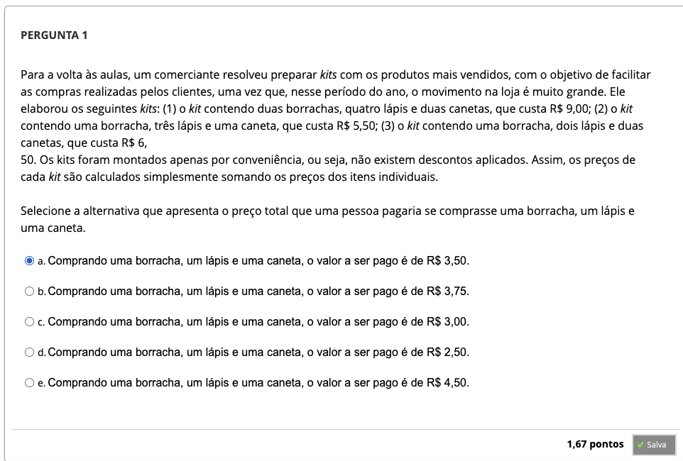
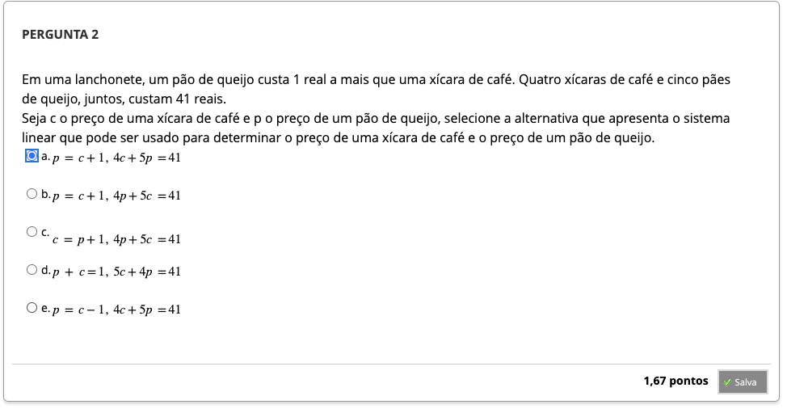
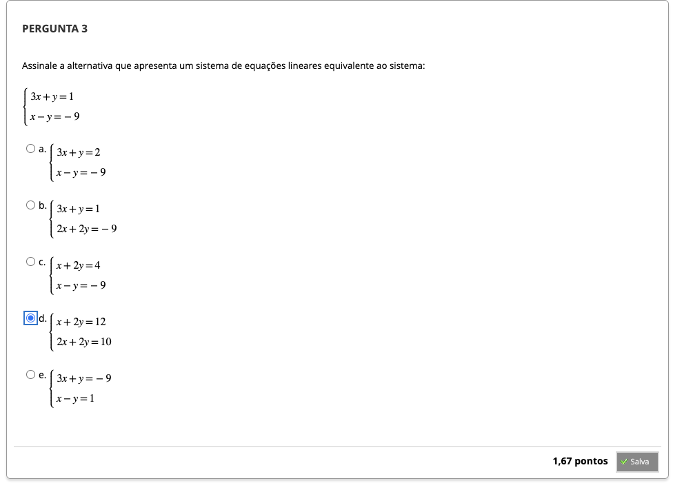
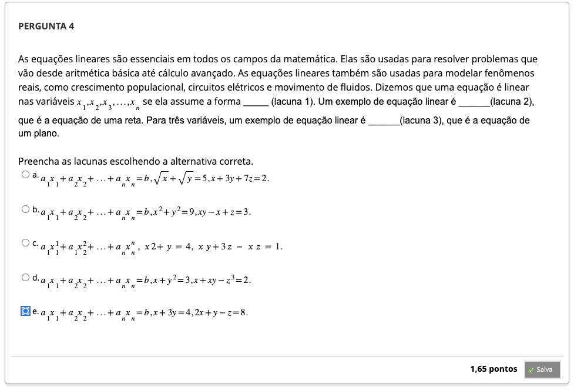
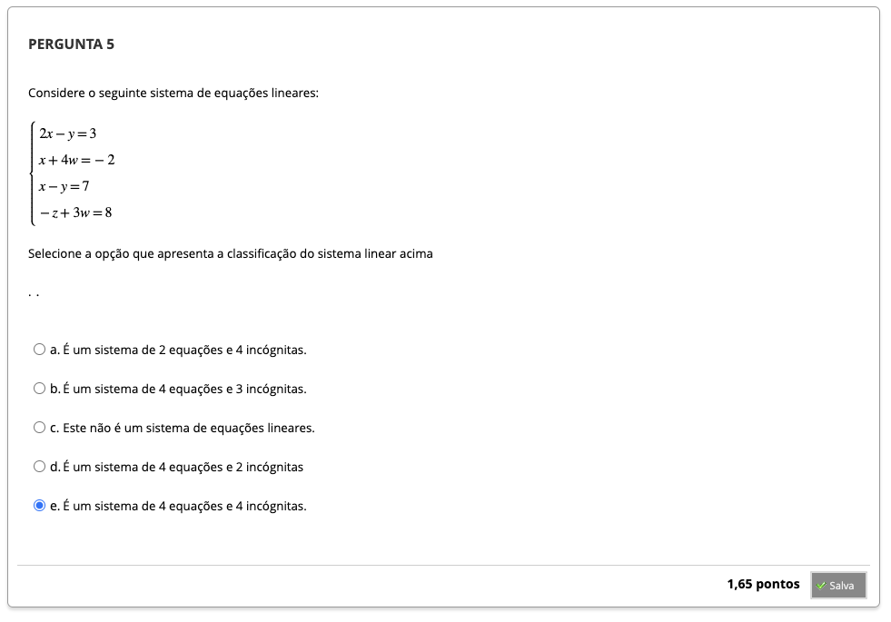
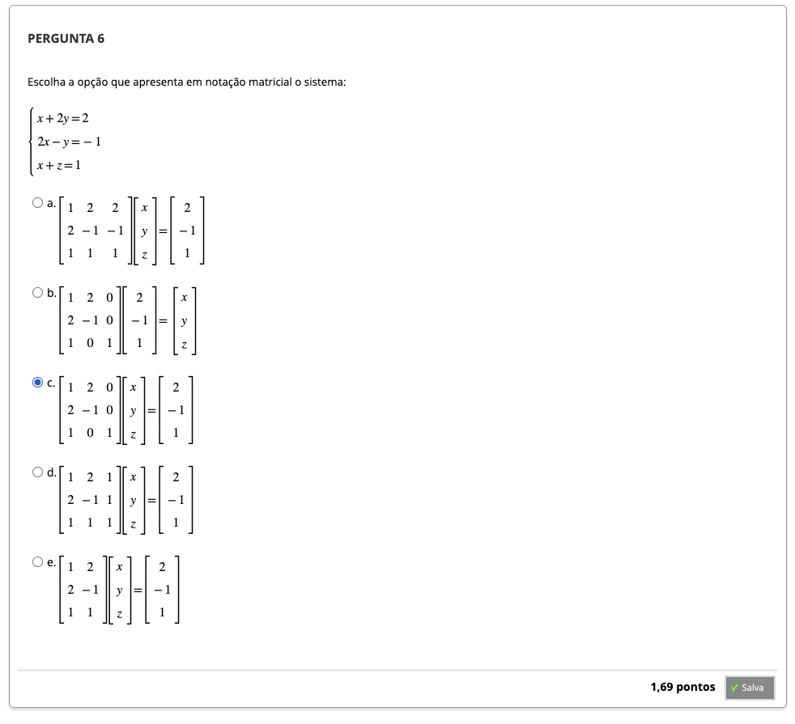

# Semana 2 - Sistemas Lineares

### Videoaula 4 - Sistemas Lineares
https://youtu.be/0kquQZdajk8

#### Classificação de sistemas lineares por:
- número de equações
- número de incógnitas
- pelas soluções

##### Exemplo 1:
- única solução: intersecção de duas retas

$\begin{cases}x - y = 1 \\x + 2y = 4 \end{cases} =$

$\begin{cases}(x - x) + (2y - (-y)) = (4 - 1)\\ \end{cases} =$

$3y = 3$

$x = 2$
$y = 1$

##### Exemplo 2: 
- infinitas soluções
- uma única reta (retas concorrentes)

$\begin{cases}2x - y = -1\\-2x + y = 1\end{cases}$

$\begin{cases}(2x - 2x) + (-y + y) = (-1 + 1)\end{cases}=$

$0 = 0$

##### Exemplo 3:
- não tem solução
- duas retas paralelas

$\begin{cases}2x - y = -1\\-2x + y = 2\end{cases}$

$\begin{cases}(2x - 2x) + (-y + y) = (-1 + 2)\end{cases}$

$0 = 1$

#### Forma matricial: $Ax = b$

$\begin{cases}a_{11}x_1 + a_{12}x_2 + ... + a_{1n}x_n = b_1\\ a_{21}x_2 + a_{22}x_3 + ... + a_{2n}x_n = b_2\\...\\a_{m1}x_1 + a_{m2}x_2 + ... + a_{mn}x_n = b_n\end{cases}
$

##### matriz dos coeficientes: $A$
$\begin{bmatrix}a_{11} & ... & a_{1n}\\a_{m1} & ... & a_{mn}\end{bmatrix}$

##### matriz das incógnitas: $x$
$\begin{bmatrix}x_1\\...\\x_n\end{bmatrix}$

##### matriz dos termos independentes: $b$
$\begin{bmatrix}b_1\\...\\b_n\end{bmatrix}$

$\begin{bmatrix}a_{11} & ... & a_{1n}\\a_{m1} & ... & a_{mn}\end{bmatrix} \times \begin{bmatrix}x_1\\...\\x_n\end{bmatrix} = \begin{bmatrix}b_1\\...\\b_n\end{bmatrix} $

##### Exemplo:
$\begin{cases}2x + y = 2 \\y + z = 1\\x - z = 3\end{cases}$

$\begin{bmatrix}2 & 1 & 0\\0 & 1 & 1\\1&0&-1\end{bmatrix} \times \begin{bmatrix}x \\ y\\z\end{bmatrix} = \begin{bmatrix}2 \\ 1\\3\end{bmatrix}$

#### Próximas aulas:
Método da Eliminação de Gauss

### Quiz da videoaula 4

Considere o seguinte sistema de equações lineares: 
$\begin{cases}x + y = 1\\x - y = 0\\ x + 2 = 1\end{cases}$

Selecione a alternativa com a afirmação correta:

a) O sistema possui 2 equações e 3 incógnitas.
b) O sistema possui 3 equações e 2 incógnitas. &check;
c) O sistema possui 3 equações e 5 incógnitas.
d) O sistema possui 2 equações e 2 incógnitas. 
e) O sistema possui 5 equações e 3 incógnitas.

---

### Videoaula 5 - O problema $Ax = b$
https://youtu.be/qDX-eT5ZpgU

#### Matriz Ampliada de um Sistema de Equações Lineares
$\begin{cases}2x + y = 2 \\y + z = 1\\x - z = 3\end{cases}$

$\begin{bmatrix}2 & 1 & 0 & | & 2 &\\0 & 1 & 1 & | & 1\\1&0&-1 & | & 3\end{bmatrix}$

#### Operações Elementares
##### 1. invertendo linhas
$\begin{bmatrix}2&1&2\\1&7&1\\3&-3&-1\\2&0&1\end{bmatrix}  \xrightarrow {L_2 \leftrightarrow L_3} \begin{bmatrix}2&1&2\\3&-3&-1\\1&7&1\\2&0&1\end{bmatrix}$

##### 2. multiplicando linhas por um escalar
$\begin{bmatrix}2&1&2\\1&7&1\\3&-3&-1\\2&0&1\end{bmatrix} \xrightarrow {2L_4 \rightarrow L_4} \begin{bmatrix}2&1&2\\1&7&1\\3&-3&-1\\4&0&2\end{bmatrix}$

##### 3. soma de uma linha com outra multiplicada por um escalar
$\begin{bmatrix}2&1&2\\1&7&1\\3&-3&-1\\2&0&1\end{bmatrix} \xrightarrow{L_2 + 2L_1 \rightarrow L_2} \begin{bmatrix}2&1&2\\1+2(2)&7+2(1)&1+2(2)\\3&-3&-1\\2&0&1\end{bmatrix}= \begin{bmatrix}2&1&2\\5&9&5\\3&-3&-1\\2&0&1\end{bmatrix}$

#### Eliminação de Gauss ou Método de Escalonamento
$\begin{cases}x - y = 1 \\x + 2y = 4\end{cases}$

$\begin{bmatrix}1&-1& | & 1&\\1&2& | & 4\end{bmatrix}$

transformar em uma matriz triangular superior (abaixo da diagonal principal, todos os elementos = 0)

### Quiz da videoaula 5

---

## Material-base
### Texto-base

## Aprofundando o tema
### Vídeo de apoio 1
### Vídeos de apoio 2
### Vídeos de apoio 3
### Vídeos de apoio 4
### Vídeos de apoio 5
### Quiz Objeto Educacional

---

## Atividade Avaliativa - Semana 2

---

## Em Síntese