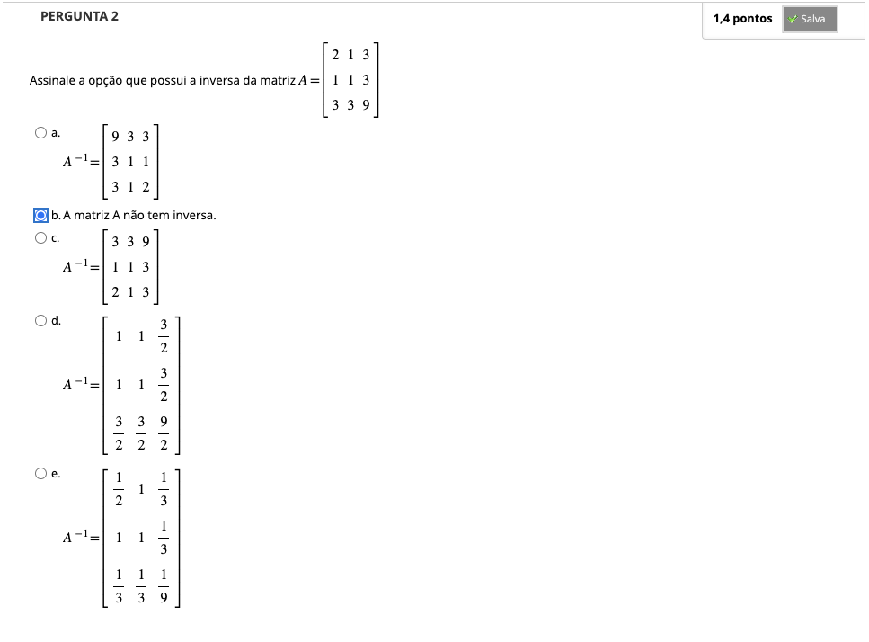
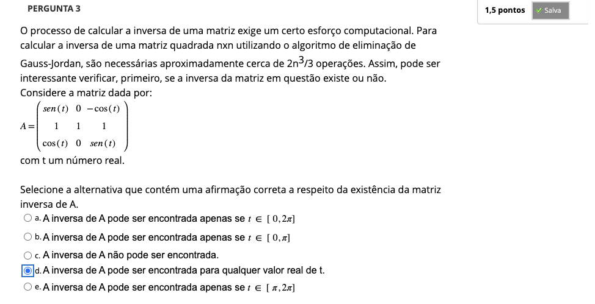
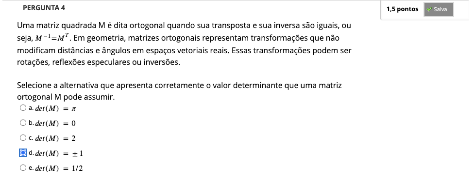
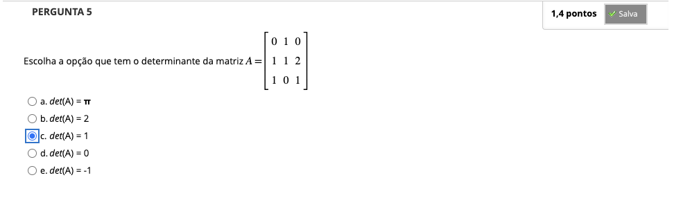
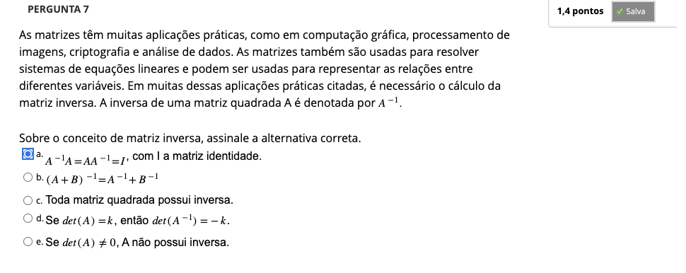

# Semana 3 - Determinantes de Matrizes

### Videoaula 6: Determinantes de Matrizes
### Quiz da videoaula 6

### Videoaula 7: Inversa de uma matriz
### Quiz da videoaula 7

### Videoaula 8: Revisão com exercícios
### Quiz da videoaula 8

## Material-base
### Texto-base

## Aprofundando o Tema
### Vídeo de apoio 1: Determinantes de Matriz de Ordem 1, 2 e 3 | Brasil Escola
### Vídeo de apoio 2: Teorema de Laplace | Brasil Escola
### Vídeos de apoio 3: Regra de Cramer | Brasil Escola

## Quiz Objeto Educacional

---

## Atividade Avaliativa - Semana 3

---

## Em Síntese