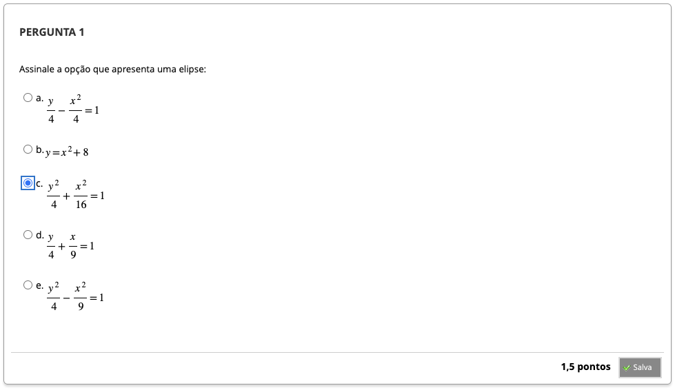
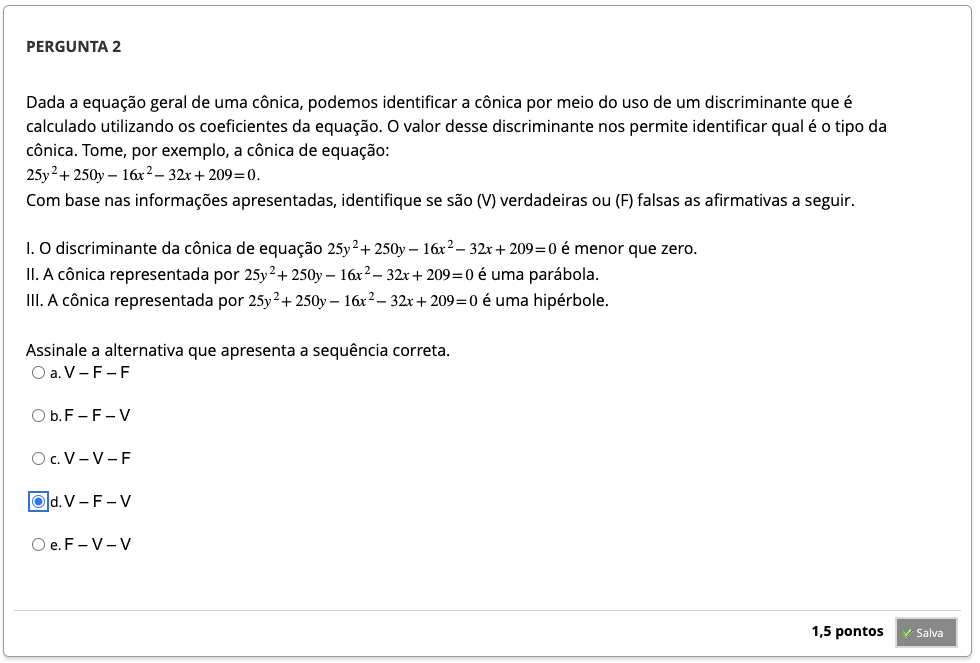
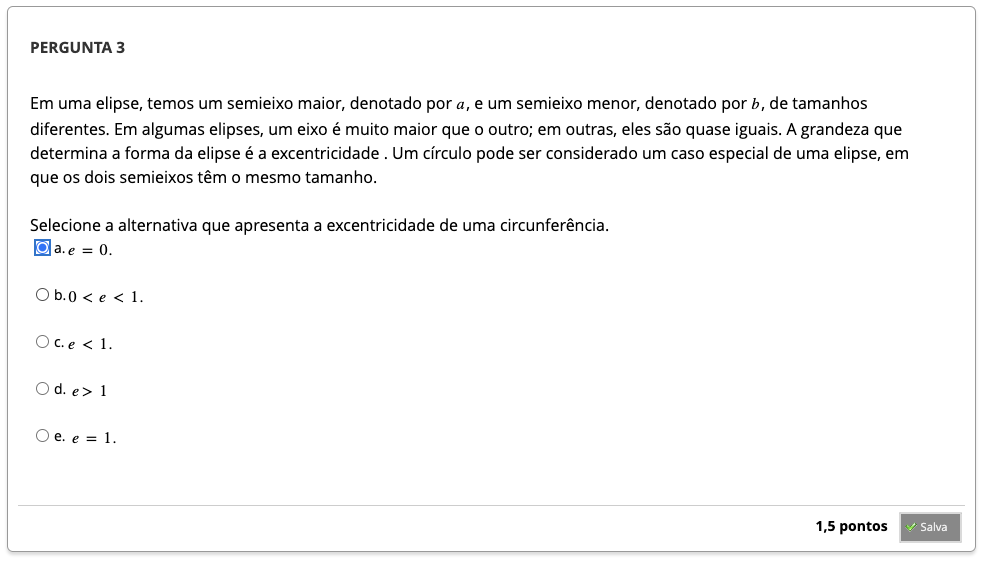
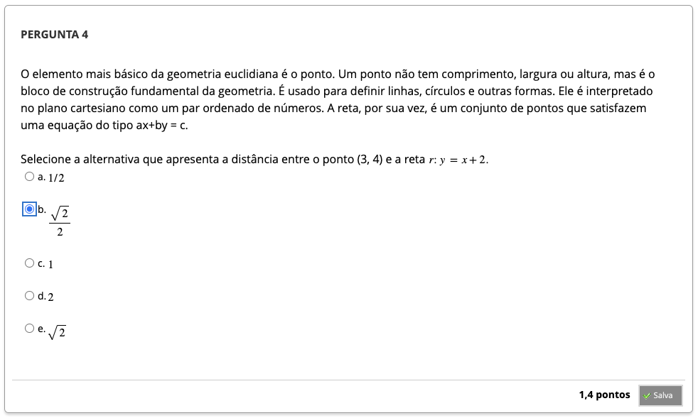
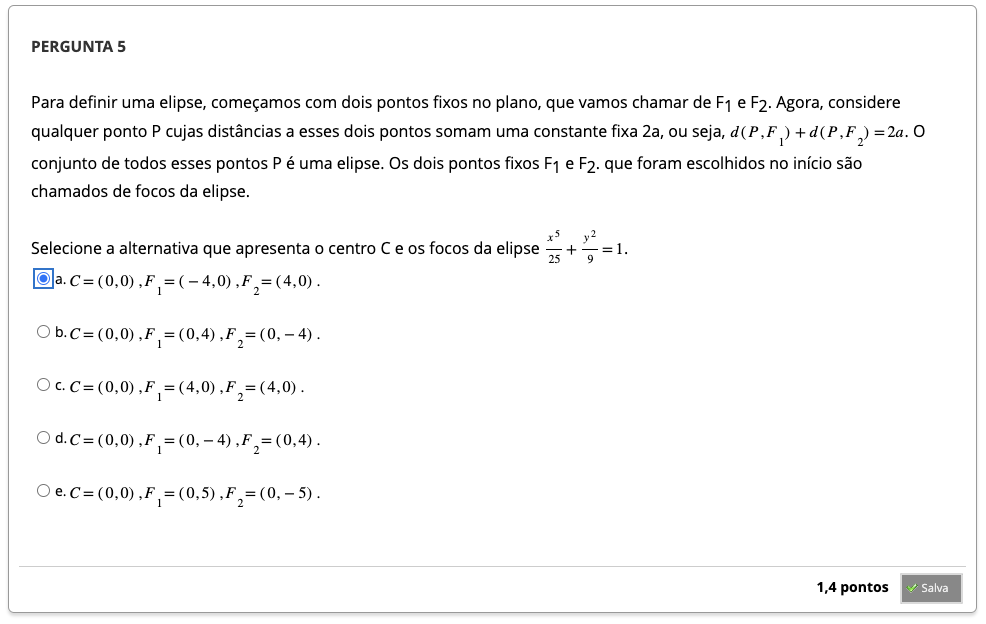
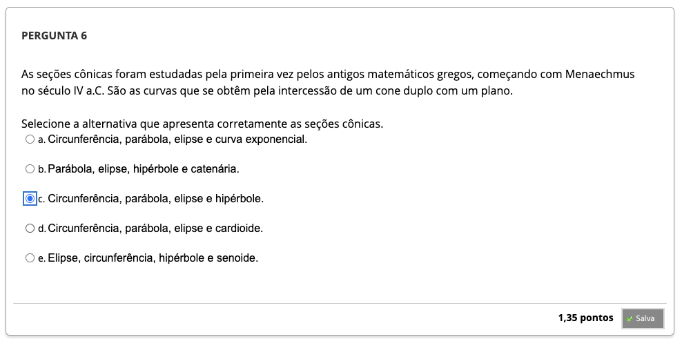
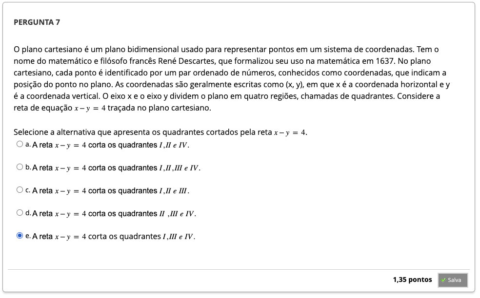

# Semana 4 - Geometria Analítica no Plano

## Objetivos de aprendizagem
## Orientação de estudos

### Videoaula 9 - Geometria Analítica no Plano
### Quiz da videoaula 9

### Videoaula 10 - Secções Cônicas
### Quiz da videoaula 10

## Material-base
### Texto-base

## Aprofundando o tema
### Video de apoio 1: Introdução às Cônicas
### Video de apoio 2: Introdução à Elipse
### Video de apoio 3: Equação da Elipse
### Vídeo de apoio 4: Introdução à Parábola
### Vídeo de apoio 5: Translação da Parábola
### Vídeo de apoio 6: Introdução à Hipérbole
### Vídeo de apoio 7: Equação da Hipérbole

#### Quiz Objeto Educacional
---

## Atividade Avaliativa - Semana 4

---

## Em Síntese