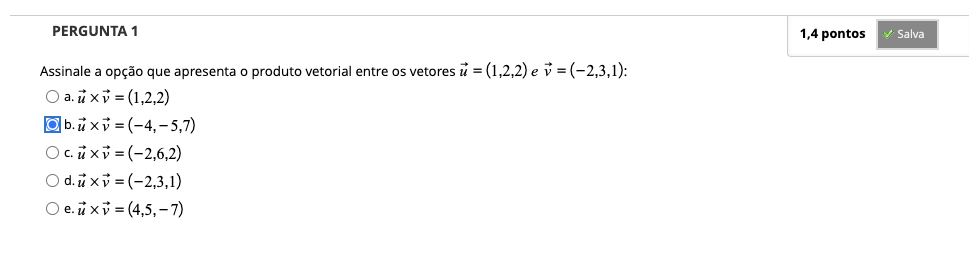
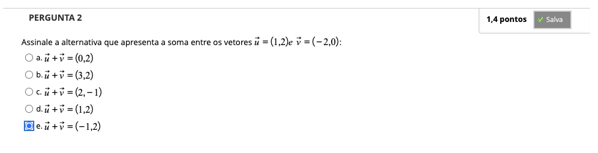
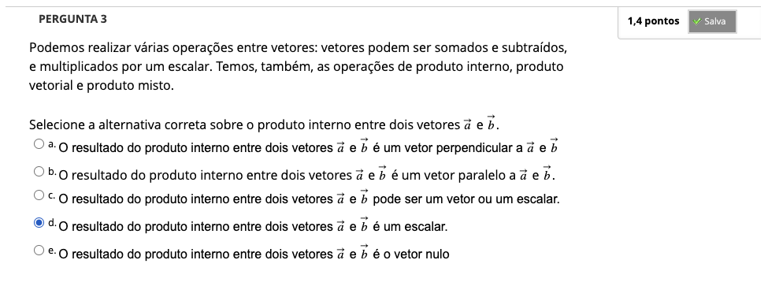
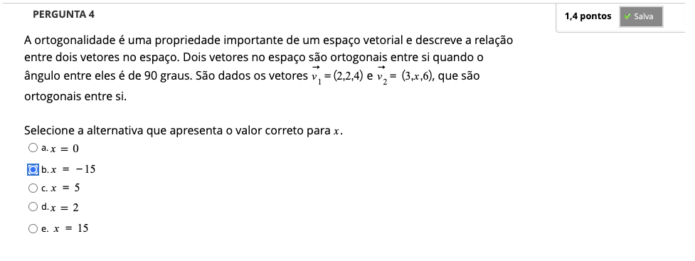
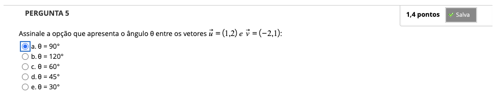
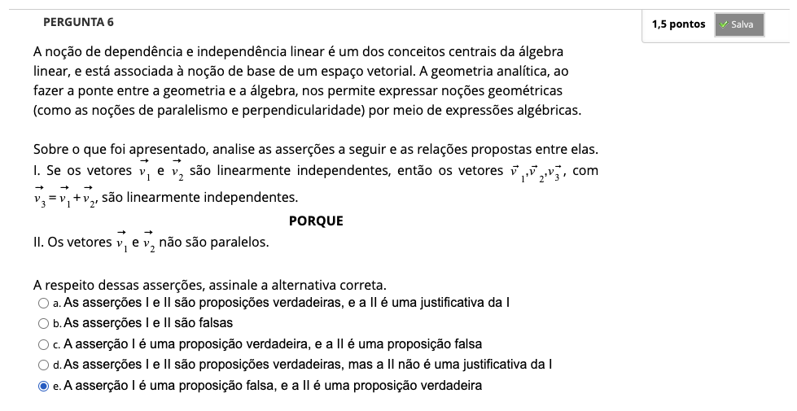
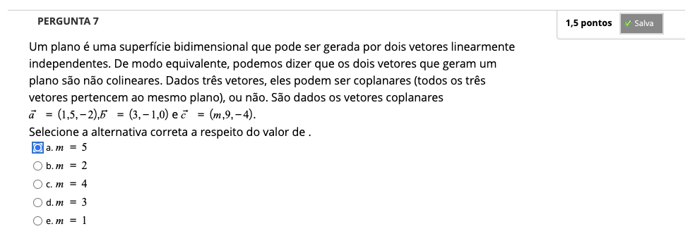

# Semana 5 - Vetores no Plano e no Espaço

### Videoaula 11 - Vetores no plano e espaço

### Quiz da videoaula 11

### Videoaula 12 - Operações com vetores

### Quiz da videoaula 12

### Videoaula 13 - Revisão com exercícios 2

### Quiz da videoaula 13

## Material-base
### Texto-base

## Aprofundando o tema
### Vídeo de apoio 1
### Vídeos de apoio 2
### Vídeos de apoio 3
### Vídeos de apoio 4
### Vídeos de apoio 5
### Vídeos de apoio 6
### Vídeos de apoio 7
### Vídeos de apoio 8

## Quiz Objeto Educacional
---

## Atividade Avaliativa - Semana 5

---

## Em Síntese