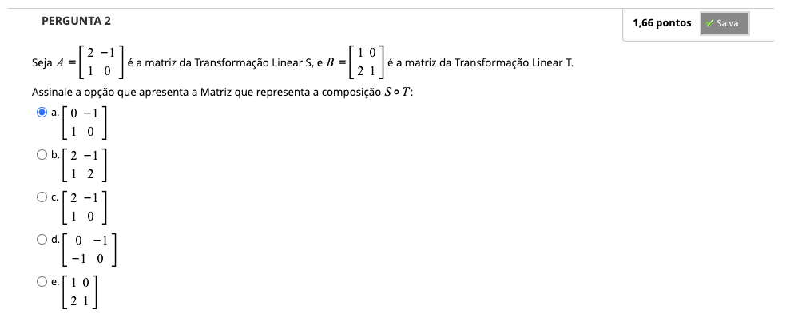
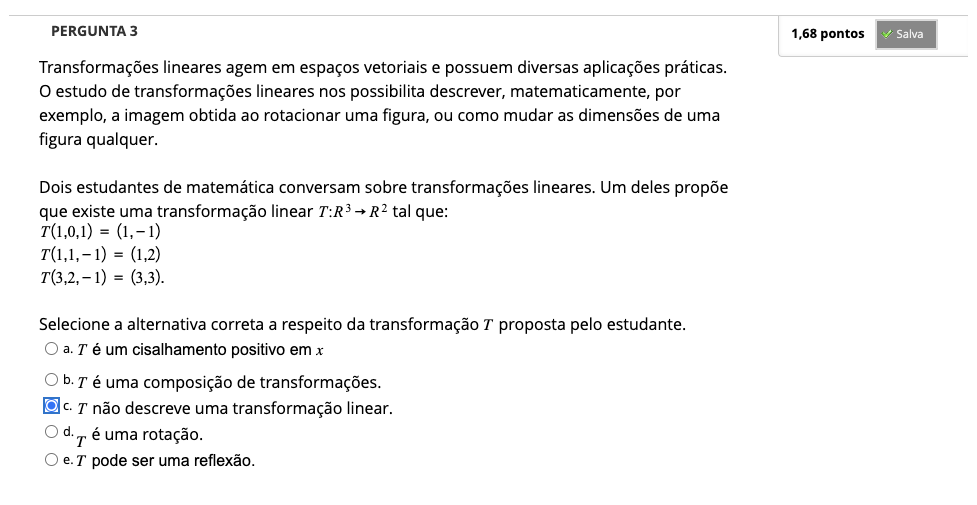
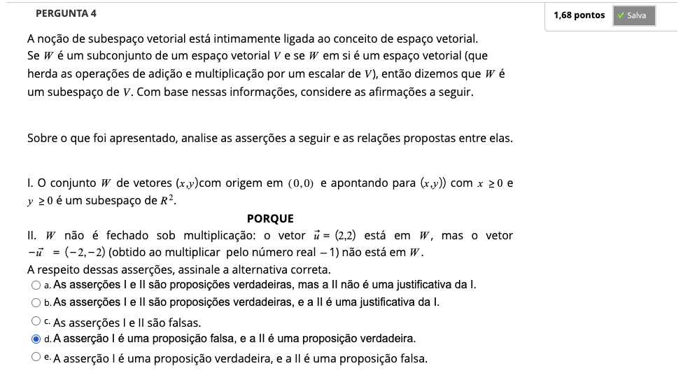
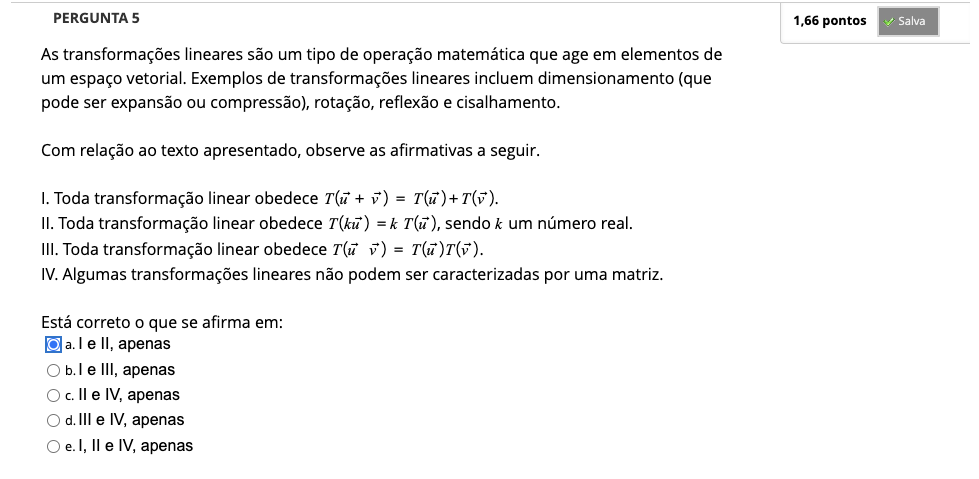
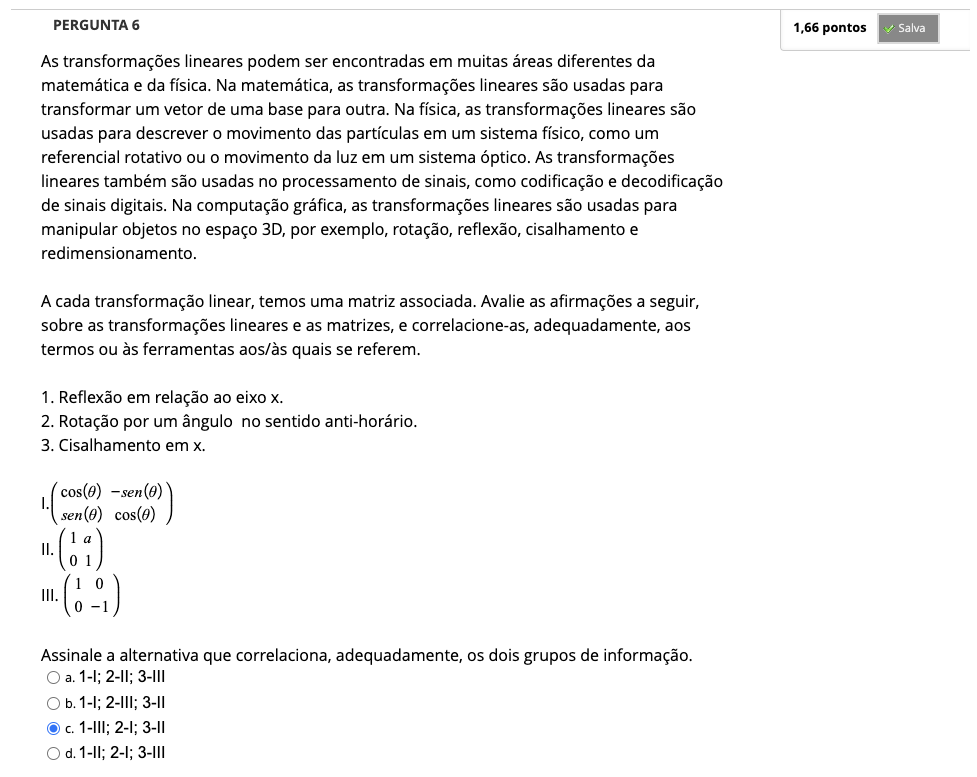

# Semana 7 - Transformações Lineares e Espaços Vetoriais

### Vídeoaula 16: Matrizes x transformações lineares
### Quiz da videoaula 16
### Videoaula 17: Espaços Vetoriais em $\mathbb{R}^{n}$
### Quiz da videoaula 17
### Videoaula 18 - Revisão com exercícios
### Quiz da videoaula 18

## Material-base
### Texto-base
### Texto-base

## Aprofundando o Tema
### Texto de apoio:
### Vídeo de apoio 1:
### Vídeo de apoio 2: Transformações lineares e vetores canônicos | Portal da Matemática OBMEP

### Quiz Objeto Educacional

---

## Atividade Avaliativa - Semana 7

---

## Em Sínteses