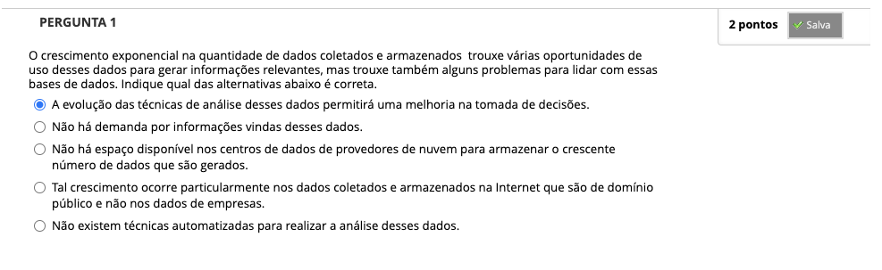
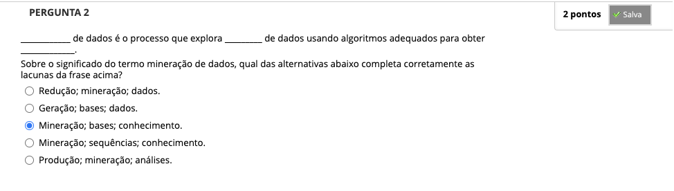
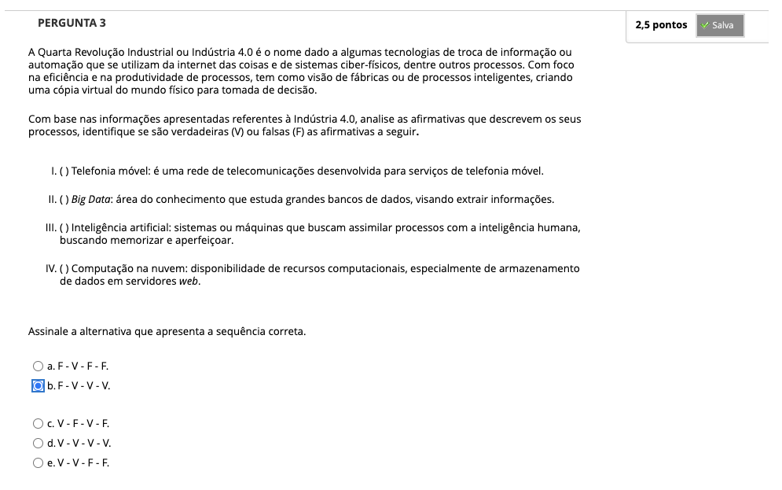

# Semana 1 - Introdução à mineração de dados e descoberta de conhecimento

## Objetivos
## Desafio

## Revisitando Conhecimentos
### Texto de apoio

## Orientação de estudos

## Material-base
### Vídeo-base
https://youtu.be/z6jbqkmshig
### Vídeo-base
### Texto-base

### Videoaula 1: Introdução à mineração de dados
https://youtu.be/S8eEPpLyTIA

#### Tipos de estruturas de dados
##### Estruturados
- banco de dados
- planilhas
##### Semiestruturados
- Marcadores (tags)
- email
##### Não estruturados
- PDF
- texto
- imagens

#### Tipos de atributos
##### Categóricos
- Binário
- Nominal
- Ordinal
##### Numéricos
- Discreto
- Contínuo
- Razão: diferença entre valores

### Texto-base

## Videoaula 2: Descoberta de conhecimento em bases de dados
https://youtu.be/61Di3FSRiG8

- KDD: Knowledge Discovery in Databases

#### Etapas do KDD
- Definição dos objetivos: determinar o domínio
- Seleção de fontes
- Pré-processamento
- Transformação
- Mineração de dados
- Avaliação dos resultados

#### Terminologia
- Inteligência Artificial
- Aprendizado de Máquina (Machine Learning)
- Aprendizado Profundo (Deep Learning)
- Ciência de Dados
- KDD
- Mineração de dados

#### Tarefas da Mineração de Dados
#### Descritivas
- propriedades dos dados
- conhecimento sobre os dados
#### Preditivas
- inferências
- relações
- geração de conhecimento

##### Análise Descritiva de Dados
- média
- desvio padrão
##### Predição
- classificação/estimação
- ex: análise de sentimentos
##### Agrupamento
##### Associação
##### Detecção de anomalias
- fraudes

### Quiz das videoaulas

## Aprofundando o tema
### Vídeo de apoio
### Vídeo de apoio
### Texto de apoio
### Texto de apoio

### Quiz Objeto Educacional

---

## Atividade Avaliativa - Semana 1

---

## Em Síntese