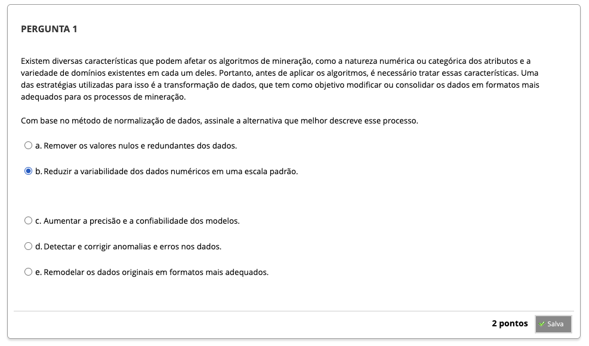
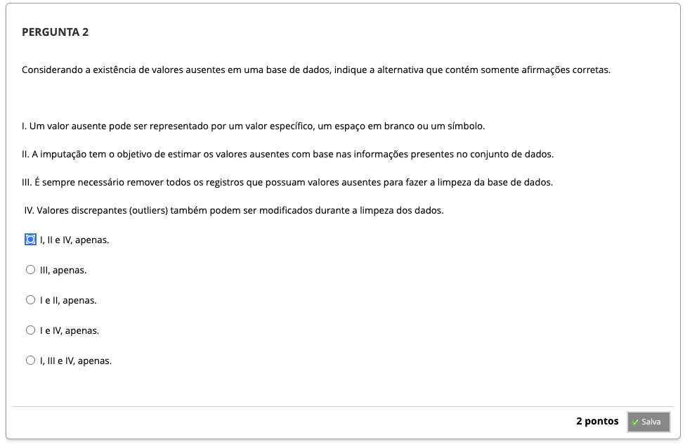
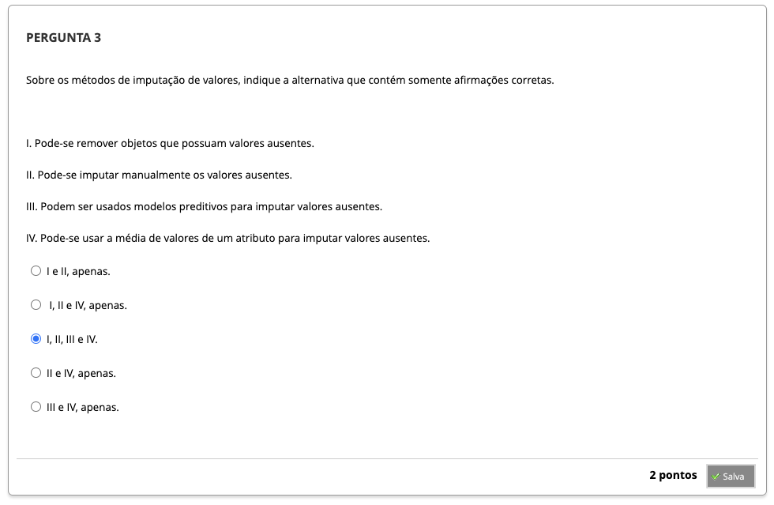
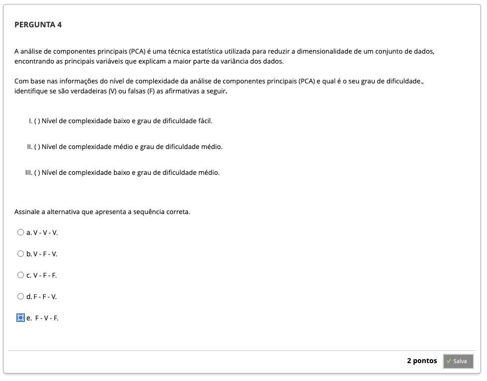
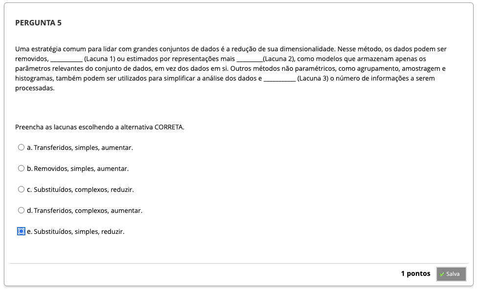
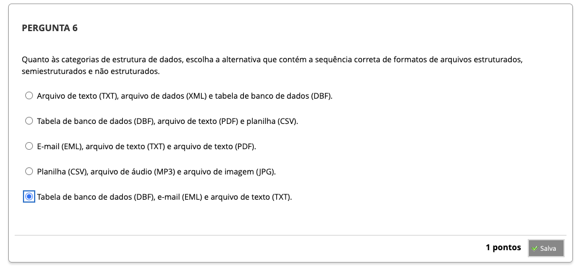

# Semana 2 - Pré-processamento de dados e redução de dados

## Desafio

## Revisitando Conhecimentos

### Texto-base

### Videoaula 3 - Preparação e limpeza dos dados
https://youtu.be/10kmcTfoxiM

### Texto-base
### Videoaula 4 - Redução e transformação dos dados
### Quiz das videoaulas
## # Exercício de Apoio
## Aprofundando o tema
### Texto de apoio
### Texto de apoio
### Quiz Objeto Educacional
---

## Atividade Avaliativa - Semana 2

---

## Em Síntese