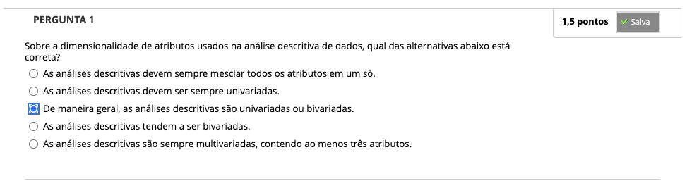
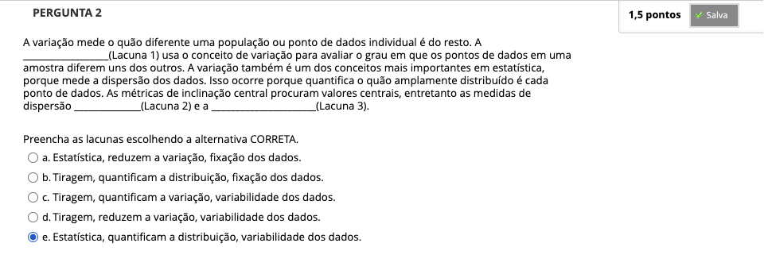
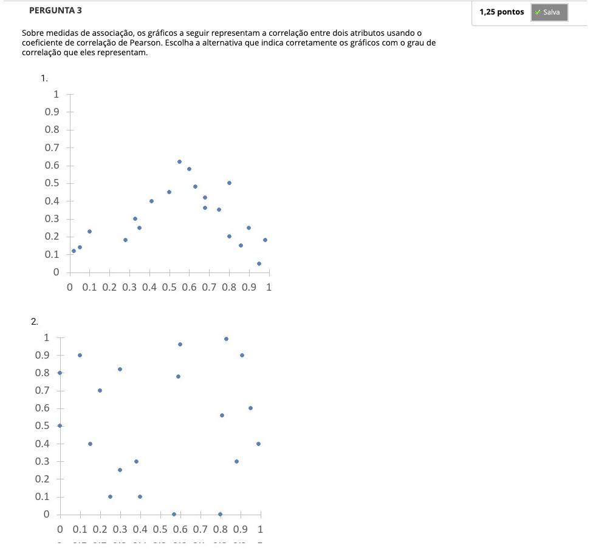
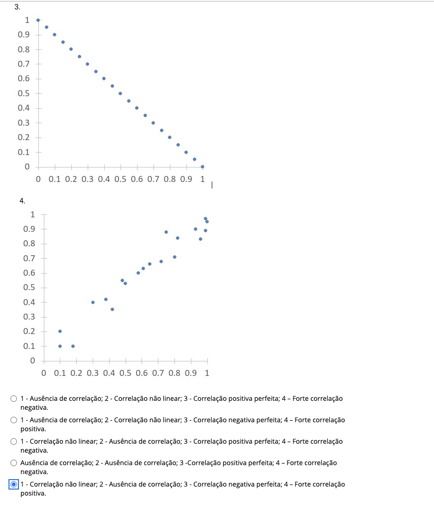
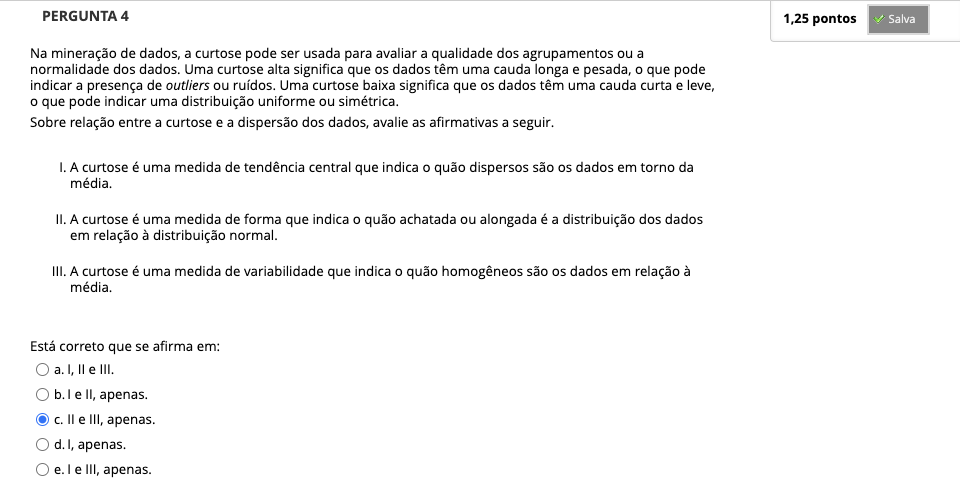
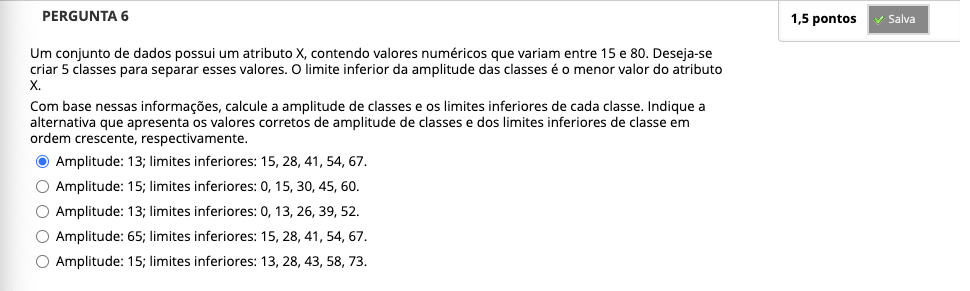
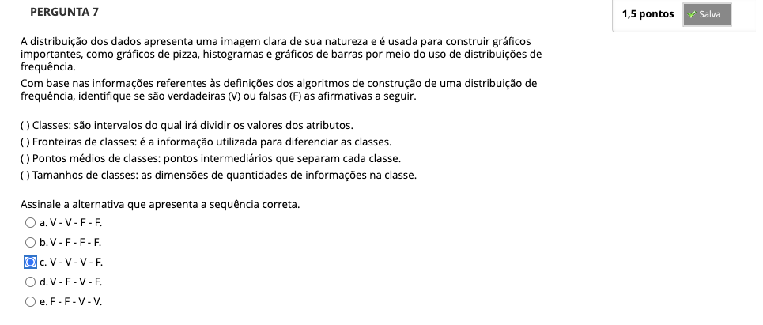

# Semana 3 - Análise Descritiva de Dados

## Desafio
## Revisitando Conhecimentos

### Videoaula 6: Análise Descritiva de Dados
### Videoaula 7: Exemplos de análise de dados
### Quiz das videoaulas

## Exercício de Apoio

## Aprofundando o tema

## Quiz Objeto Educacional

---

## Atividade Avaliativa - Semana 3

---

## Em Síntese