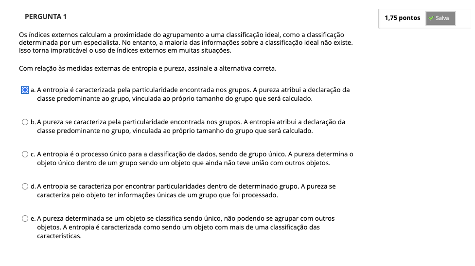
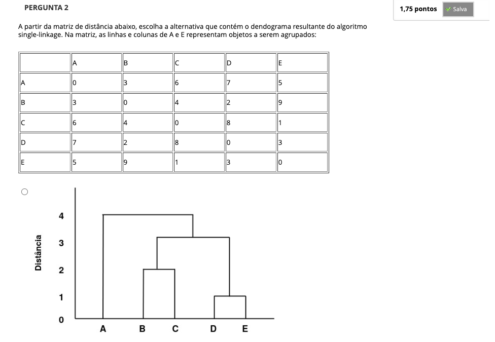
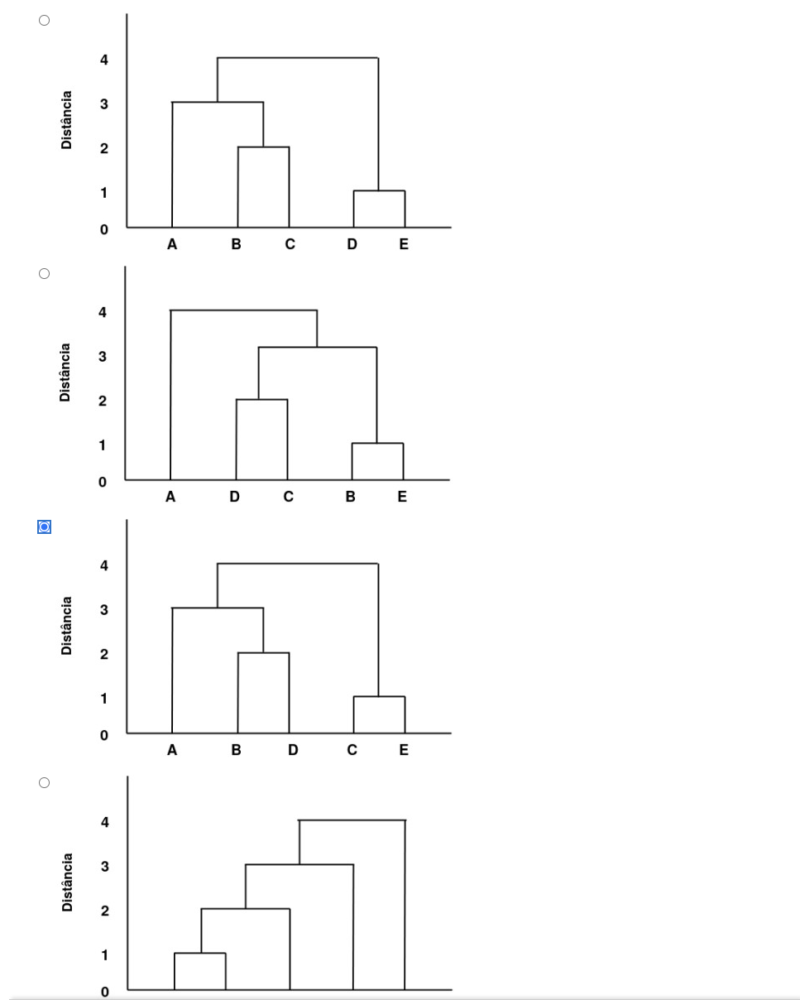
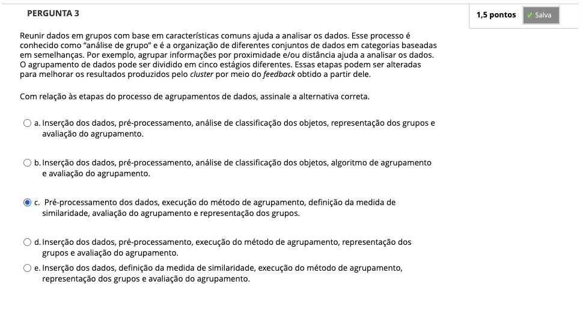
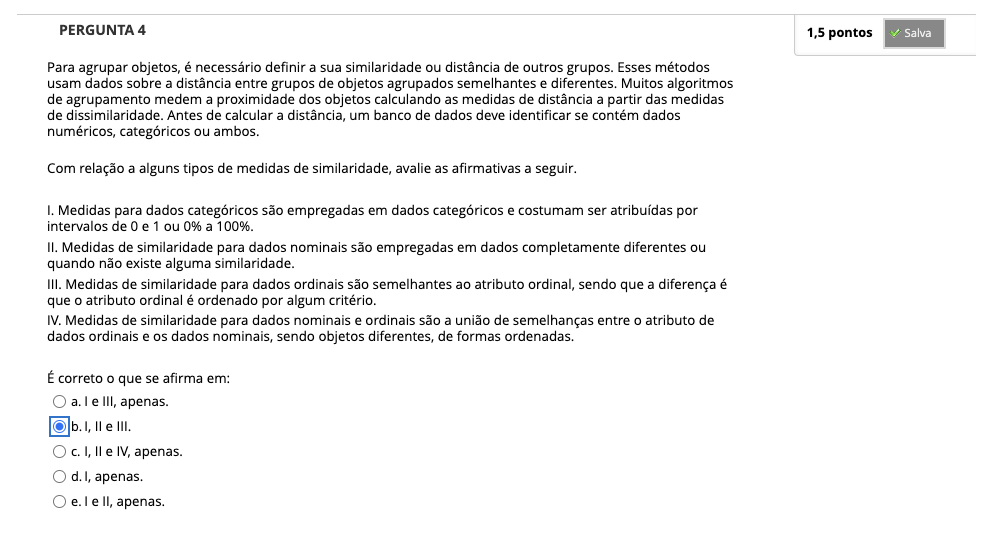
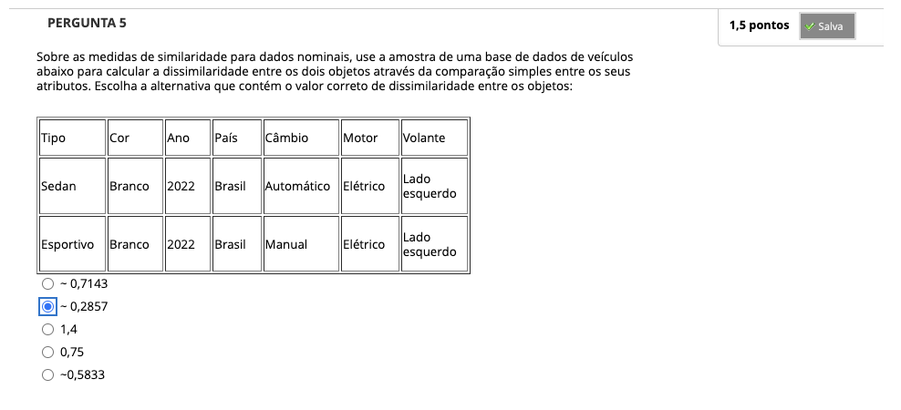
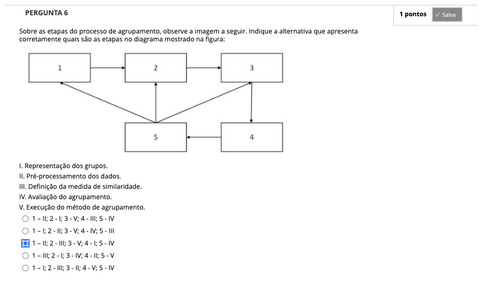
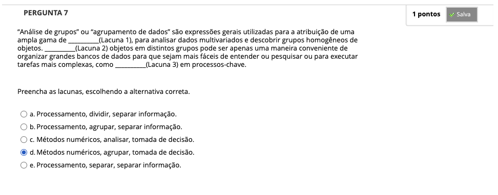

# Semana 5 - Análise de Agrupamento

## Desafio

## Revisitando Conhecimentos
https://youtu.be/MU14rYb3l8c

### Texto-base: Introdução à Mineração de Dados: Conceitos Básicos. Algoritmos e Aplicações

### Videoaula 12 - Agrupamento de dados
https://youtu.be/VpN7WlADiJE

### Texto-base

### Videoaula 13 - Algoritmos de Agrupamento
https://youtu.be/B2ytgwqDvwY

### Quiz da videoaula 13

### Exercício de Apoio

## Aprofundando o tema
### Material de apoio
### Texto de apoio
### Material de apoio

## Quiz Objeto Educacional

---

## Atividade Avaliativa - Semana 5

---

## Em Síntese