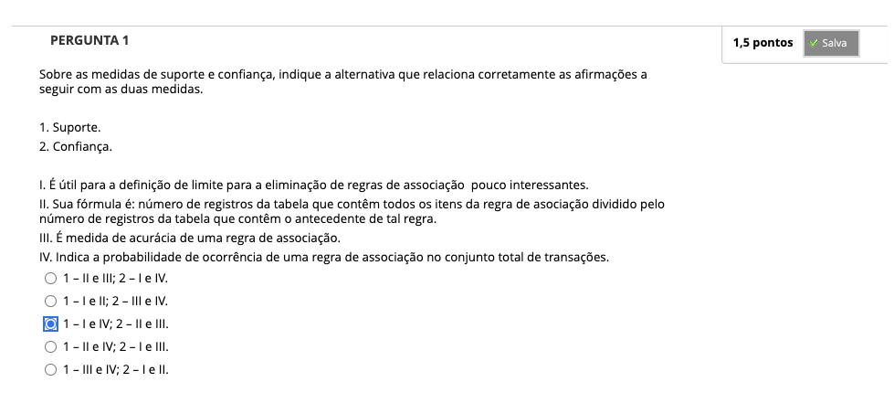
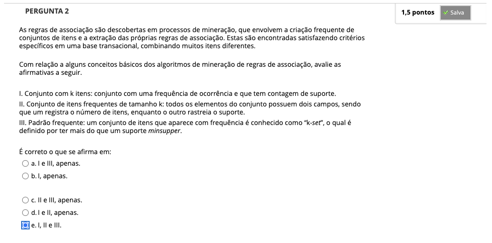
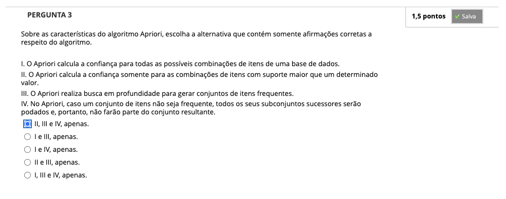
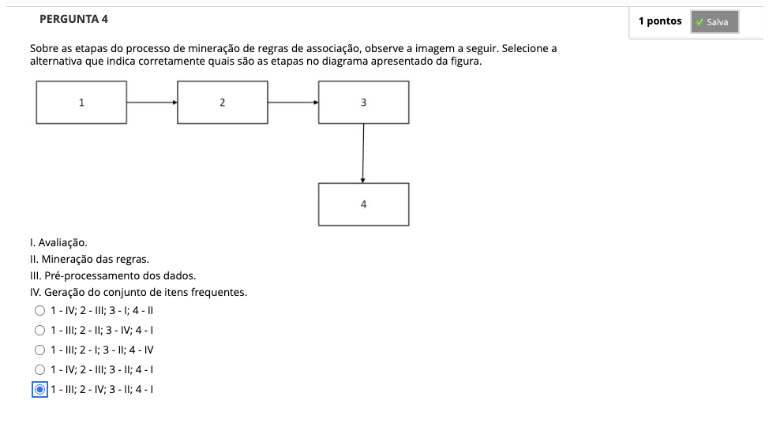
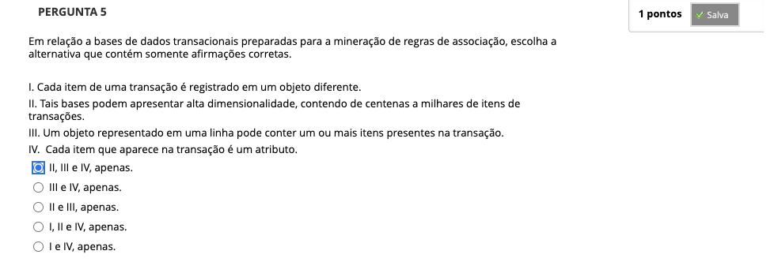
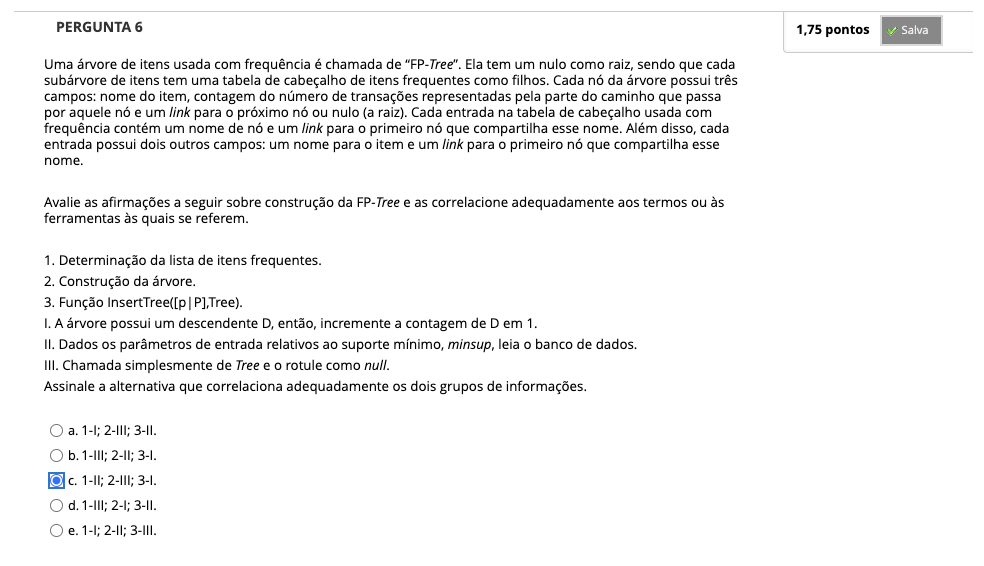
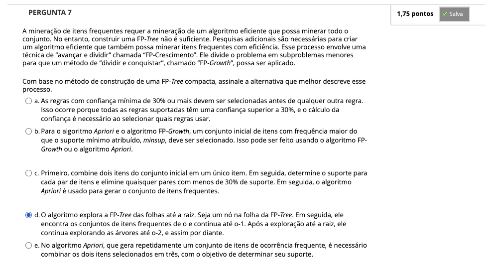

# Semana 6 - Análise de Associação

## Desafio
## Revisitando Conhecimentos
### Texto-base:

##
### Videoaula 15 - Regras de Associação
### Texto-base:
### Videoaula 16 - Algoritmos para Mineração de Regras de Associação
### Texto-base:
### Quiz das videoaulas
### Exercício de Apoio
####
####
## Aprofundando o Tema
### Material de Apoio
### Material de Apoio
### Material de Apoio

## Quiz Objeto Educacional

---

## Atividade Avaliativa - Semana 6

---

## Em Síntese