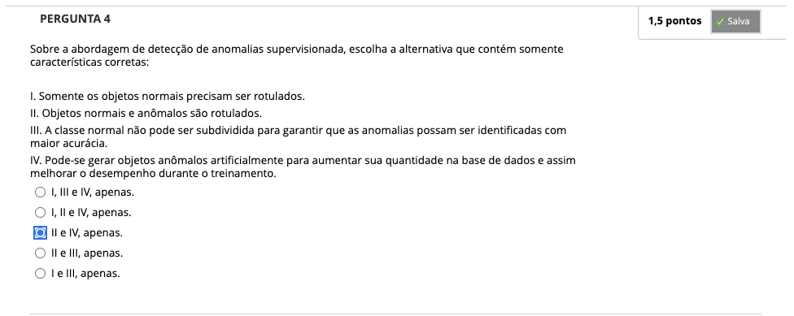
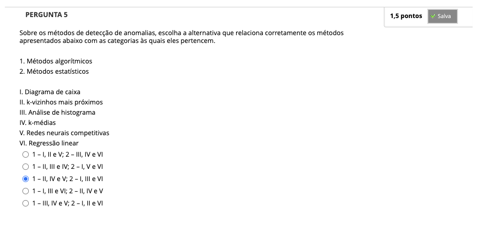

# Semana 7 - Detecção de Anomalias

## Desafio
## Revisitando Conhecimentos
### Vídeo de apoio
### Vídeo de apoio
### Texto-base

##
### Videoaula 18: Detecção de Anomalias
### Texto-base: Introdução à Mineração de Dados
### Videoaula 19: Métodos para Detecção de Anomalias
### Texto-base: Inteligência Artificial
### Quiz das videoaulas

## Exercício de Apoio
### Videoaula 20
### Videoaula 21
### Material de Apoio
### Material de Apoio

## Quiz Objeto Educacional

## Aprofundando o Tema
### Material de Apoio
### Material de Apoio
### Material de Apoio

---

## Atividade Avaliativa - Semana 7

---

## Em Síntese