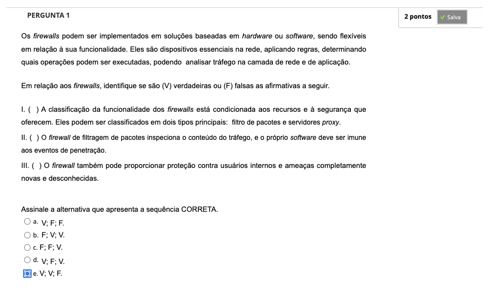
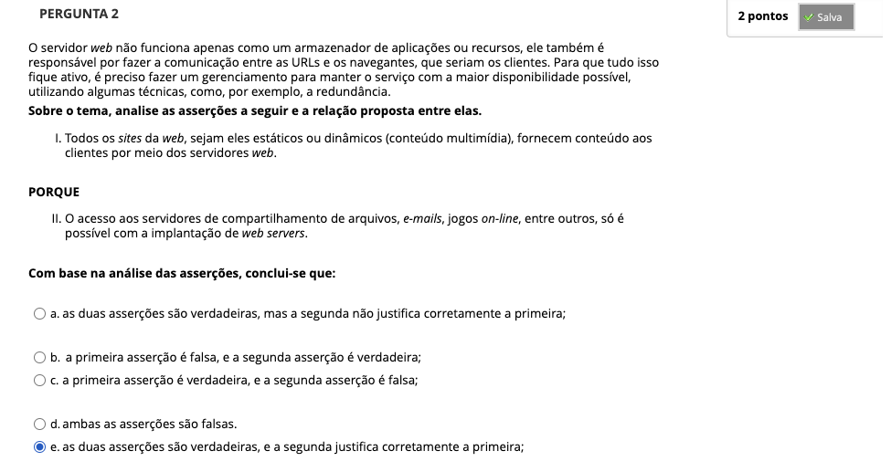
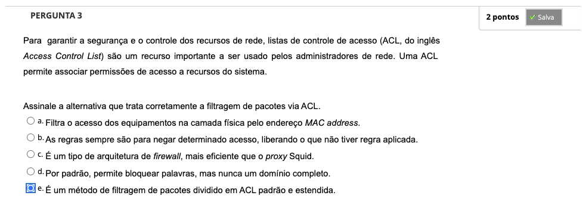
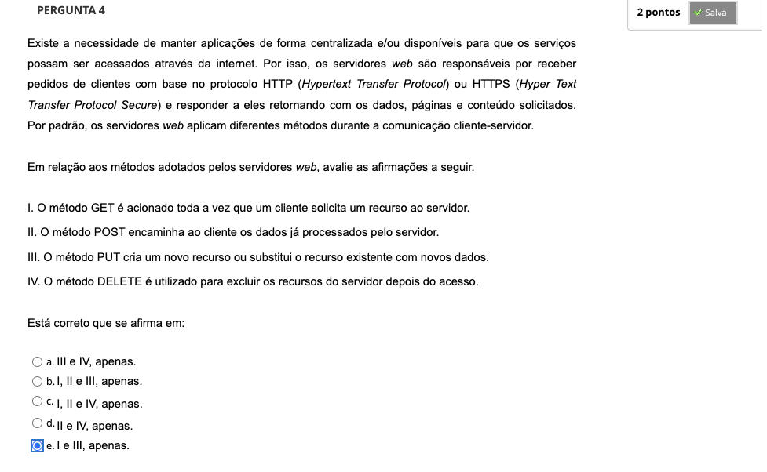
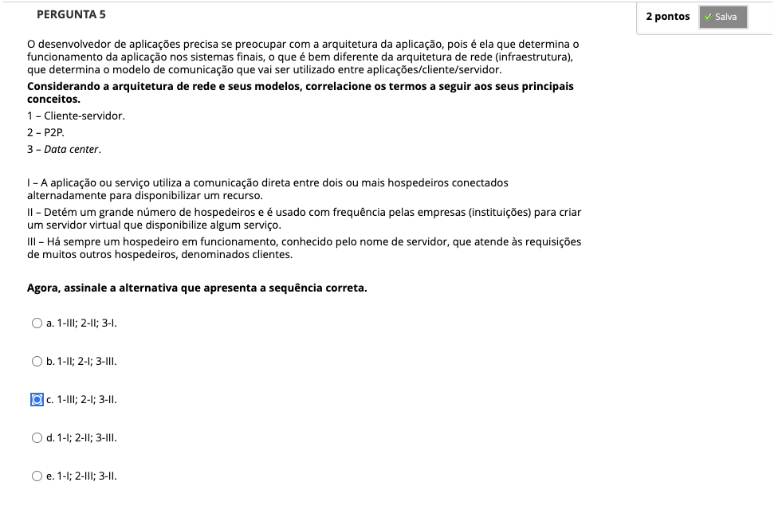

# Semana 2 - Modelagem da Infraestrutura Computacional para Aplicações em Larga Escala

## Desafio

---

## Revisitando Conhecimentos

---

##
### Videoaula 5 - Firewalls e Web Proxies - Parte 1

#### Quiz da videoaula 5

### Videoaula 6 - Firewalls e Web Proxies - Parte 2

#### Quiz da videoaula 6

### Videoaula 7 - Controle de Acesso e Mecanismos de Autenticação

#### Quiz da videoaula 7

### Videoaula 8 - Servidores Web

#### Quiz da videoaula 8

### Texto base 1 - Redes de Computadores e a Internet

### Texto base 2 - Manual completo do Linux

### Texto base 3 - Dominando Linux

### Quiz Objeto Educacional

---

## Atividades Práticas
## Texto de apoio
## Texto de apoio
## Texto de apoio

---

## Aprofundando o Tema
### Texto de apoio 1 -
### Texto de apoio 2 -
### Texto de apoio 3 - 
### Texto de apoio 4 - 
### Texto de apoio 5 -
### Texto de apoio 6 -

---

## Atividade Avaliativa - Semana 2

---

## Em Síntese