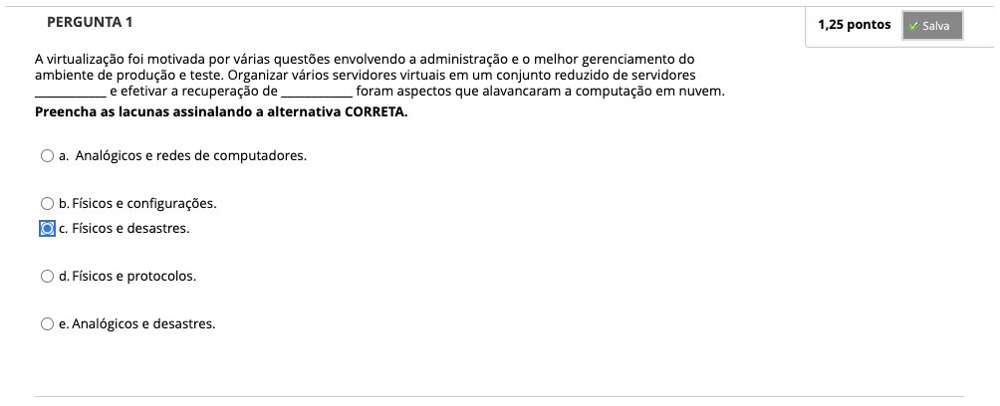
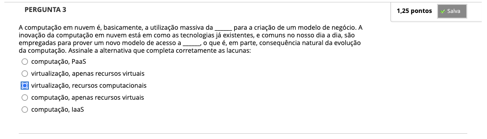
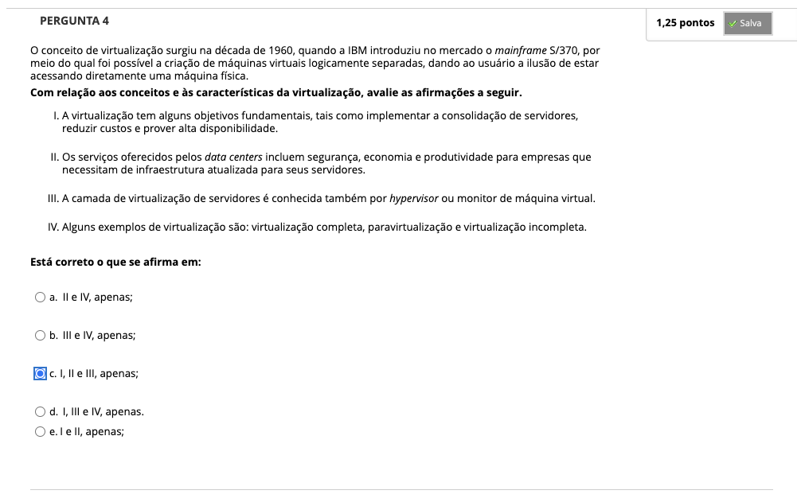
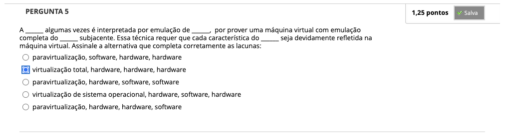
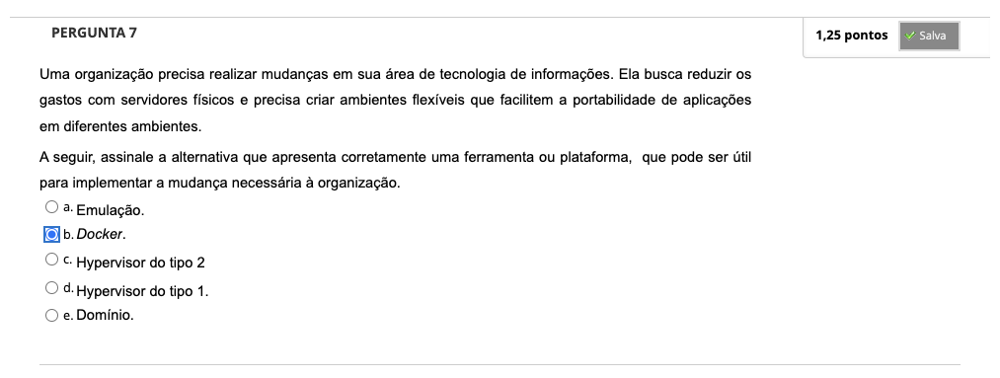
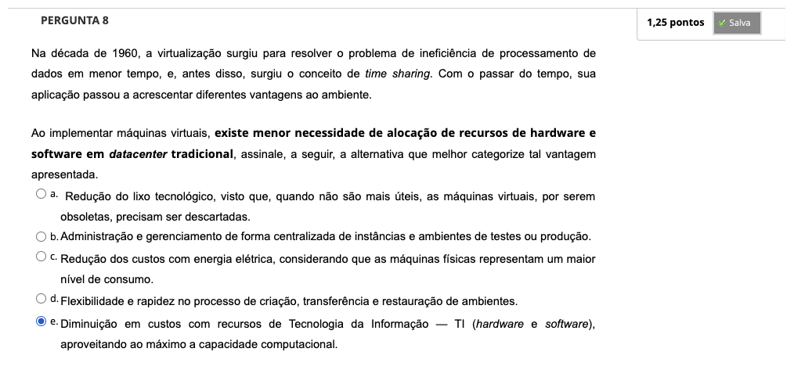

# Semana 4 - Virtualização

## Desafios

---

## Revisitando Conhecimentos
### Texto de apoio

---

##
### Videoaula 12 - Virtualização - Contexto e Conceitos

### Quiz da videoaula 12

### Videoaula 13 - Tipos de Virtualização

### Quiz da videoaula 13

### Videoaula 14 - Exemplos de Virtualizadores e Ferramentas de Gerenciamento

### Quiz da videoaula 14

### Texto-base:

### Texto-base:

### Quiz Objeto Educacional

---

## Atividades Práticas
### Orientações
### Vídeo de apoio
### Texto de apoio

---

## Aprofundando o tema
### Texto de apoio 1:
### Texto de apoio 2:
### Vídeo de apoio 1:
### Vídeo de apoio 2:
### Vídeo de apoio 3:
### Vídeo de apoio 4:

---

## Atividade Avaliativa - Semana 4

---

## Em Síntese