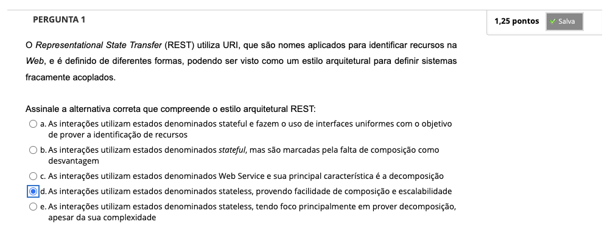
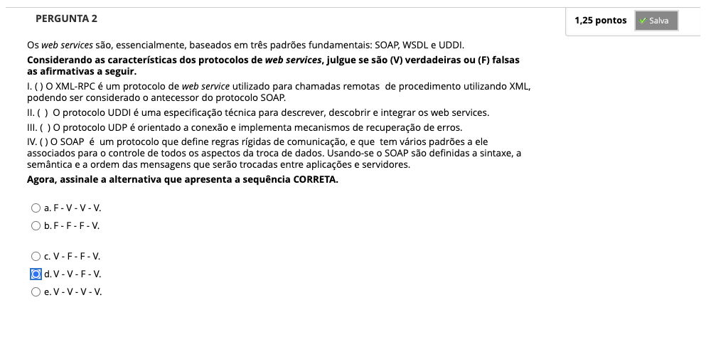
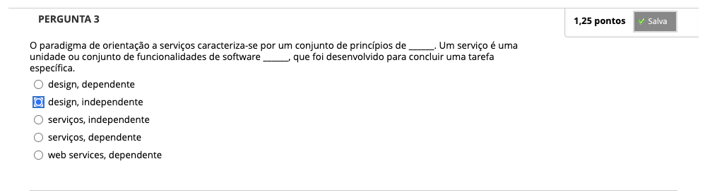
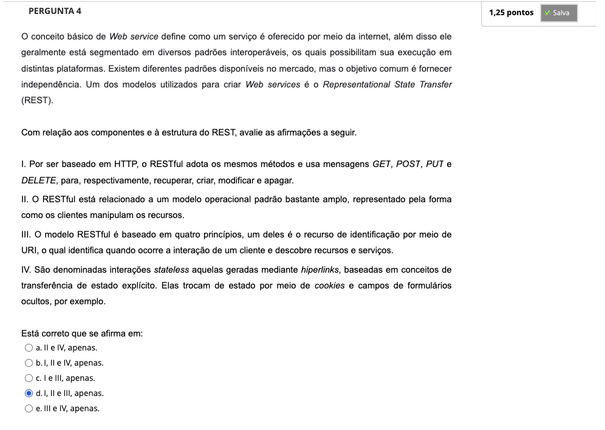
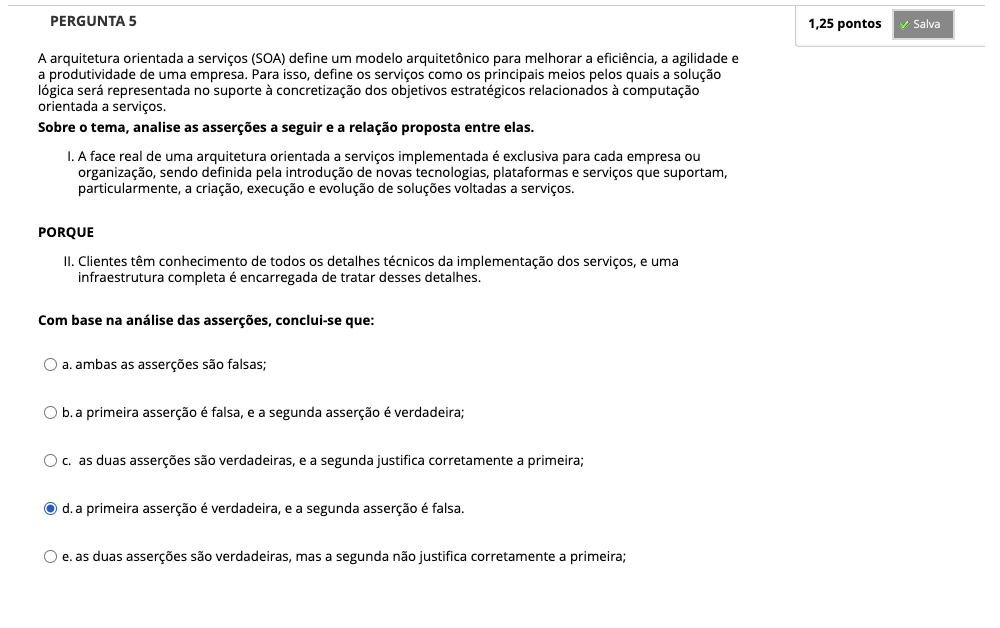
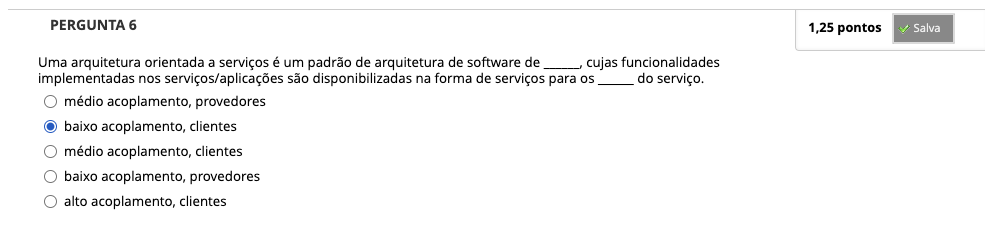
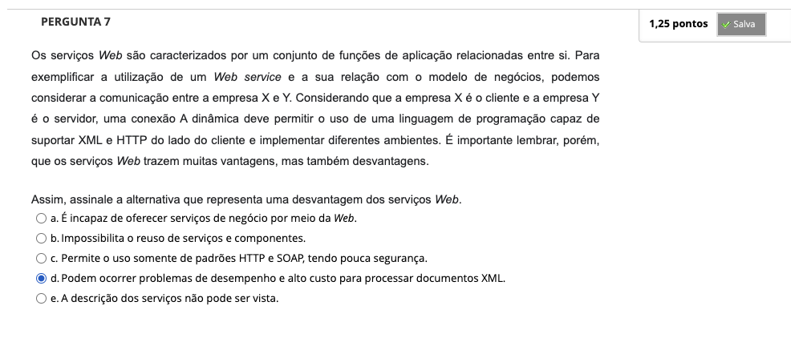

# Semana 5 - Arquiteturas SOA e Web Services

## Desafio

---

## Revisitando Conhecimentos
### Vídeo de apoio: Estilo Arquitetural Orientado a Serviços | André Santanchè

### Texto-base: SOA: Princípios de Design de Serviços (Capítulos 3 e 4) | Thomas Erl

### Texto-base: Rotas & REST | Daniel Cordeiro

### Texto-base: Avaliação de manutenibilidade entre as abordagens de web services RESTful e SOAP-WSDL (páginas 5 a 20) | Ricardo Ramos de Oliveira

--- 
## Quiz Objeto Educacional

---

##
### Videoaula 15 - SOA e Web Services
### Quiz da videoaula 15
### Videoaula 16 - RESTful Services
### Quiz da videoaula 16

---

## Atividades Práticas
### Vídeo de apoio: Aplicação PHP REST API

### Texto de apoio: Aplicação PHP utilizando uma interface REST API

---

## Aprofundando o tema
### Texto de apoio: Um estudo empírico sobre os benefícios de SOA nas empresas: a visão dos profissionais de TI | Flávio Lages

### Vídeo 1

### Vídeo 2

### Vídeo 3

---

## Atividade Avaliativa - Semana 5

---

## Em Síntese