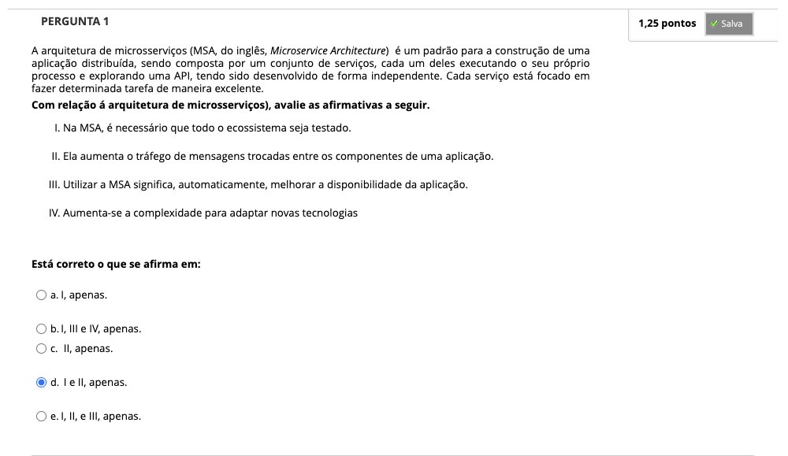
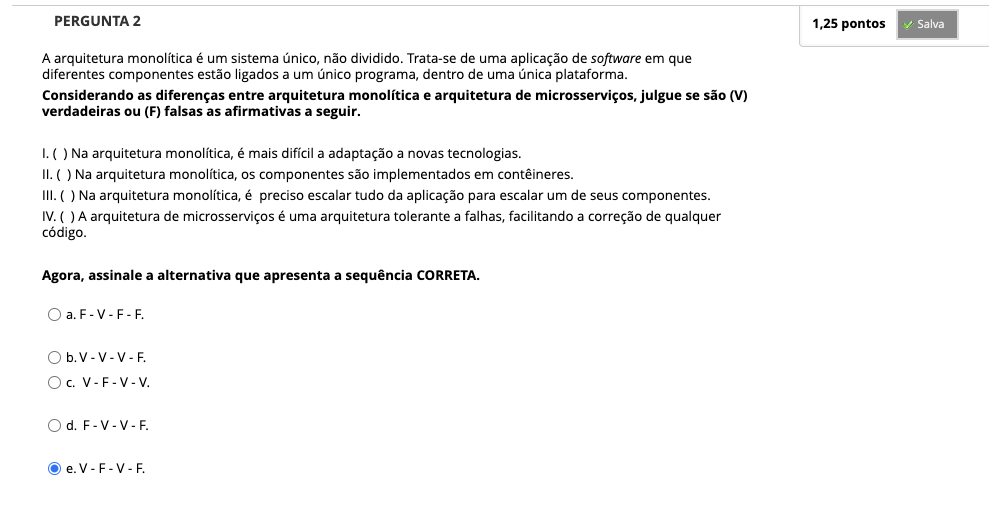
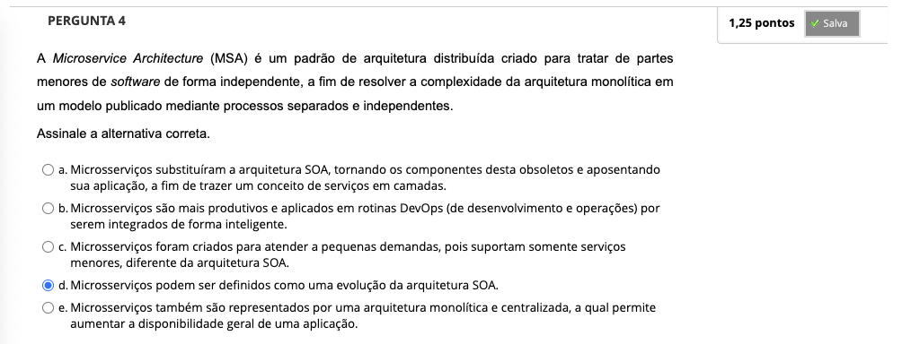
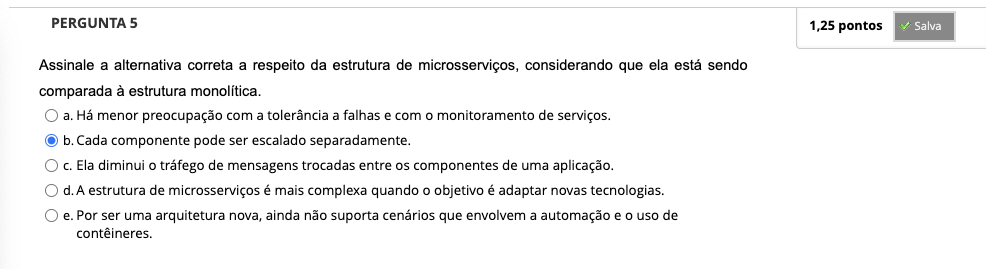
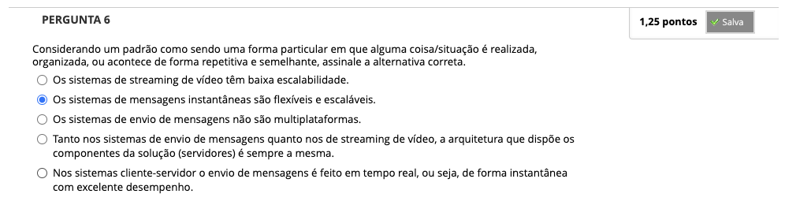
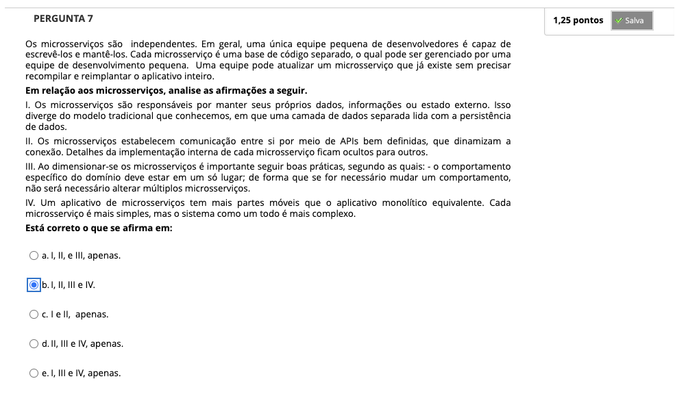
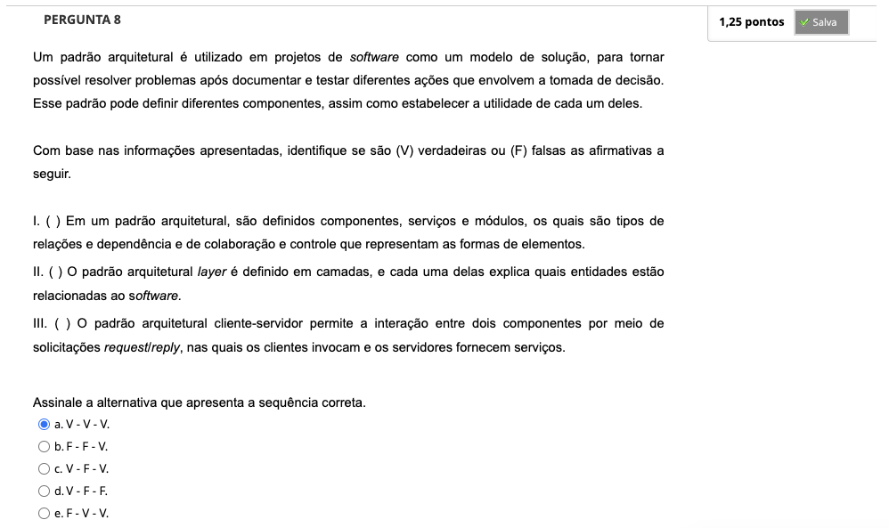

# Semana 6 - Fundamentos de Arquiteturas de Microsserviços

## Desafio

---

## Revisitando Conhecimentos

---

##
### Videoaula 17 - Arquitetura de Microsserviços para o Desenvolvimento de Aplicações

### Quiz da videoaula 17

### Videoaula 18 - Plataforma e Operação

### Quiz da videoaula 18

### Texto base 1: O que são microsserviços? | Red Hat

### Texto base 2: Introdução aos microsserviços | Red Hat

### Texto base 3: Estilo de arquitetura de microsserviços | Microsoft

### Quiz Objeto Educacional

---

## Atividades Práticas
### Vídeo de apoio
### Texto de apoio
### Texto de apoio

---

## Aprofundando o tema
### Texto de apoio 1
### Texto de apoio 2
### Texto de apoio 3
### Vídeo-base

---

## Atividade Avaliativa - Semana 6

---

## Em Síntese