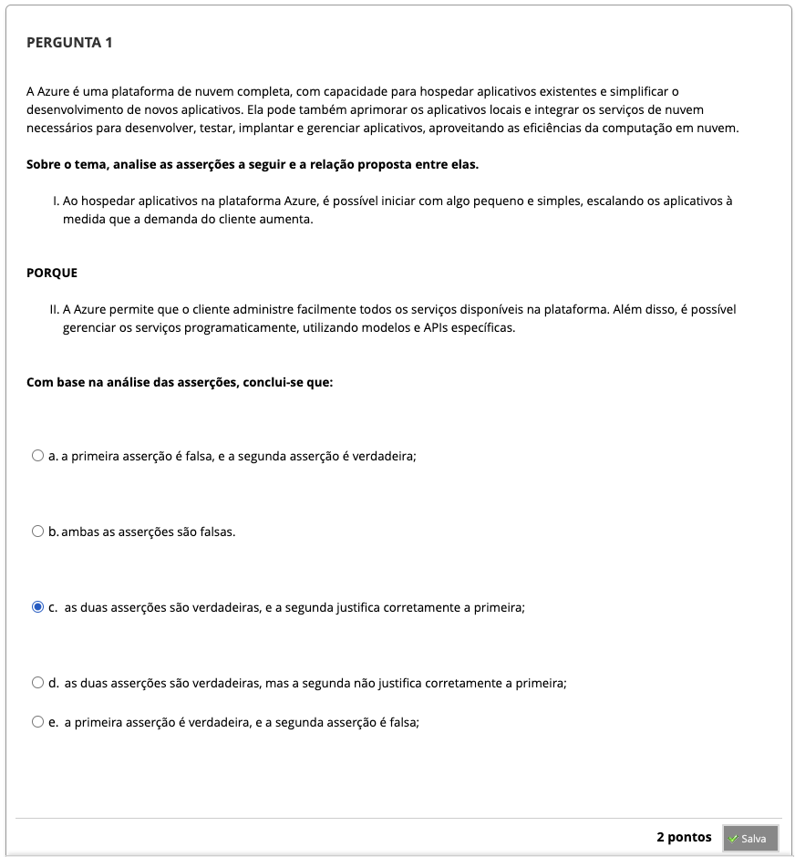
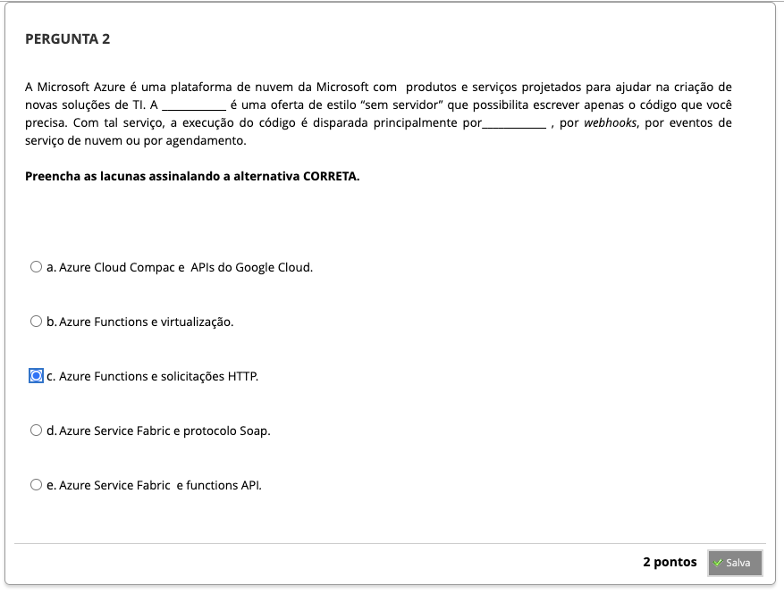
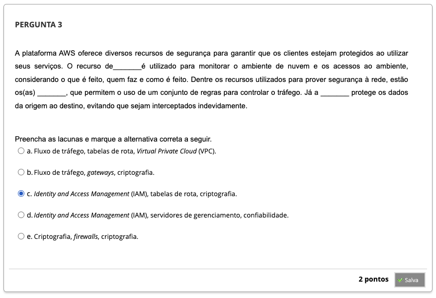
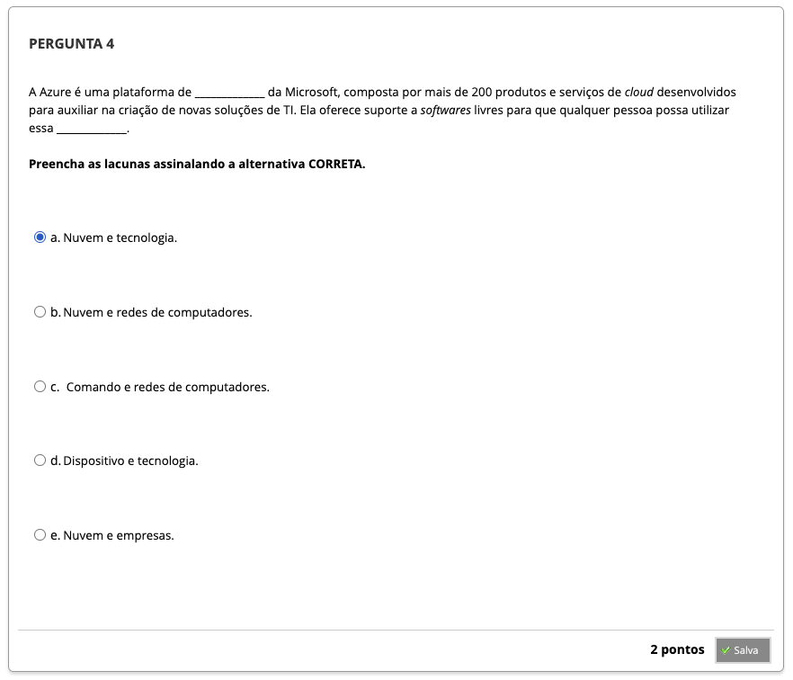
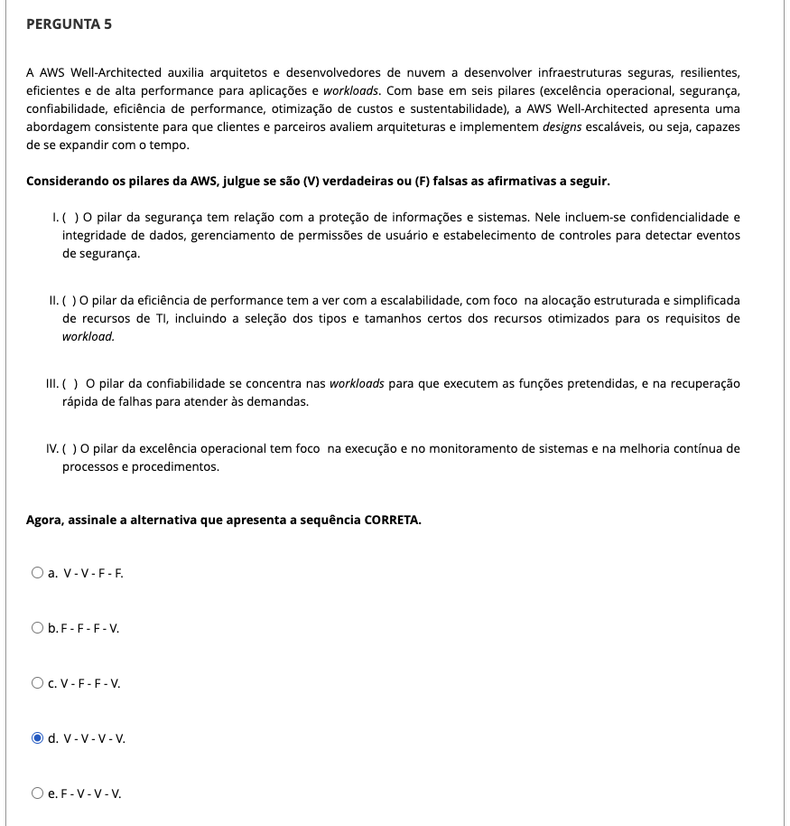

# Semana 7 - Estudos de caso de Infraestrutura para Sistemas de Software

## Desafio

---

## 
### Videoaula 19 - Introdução - Google Cloud, Azure e AWS

### Quiz da videoaula 19

### Videoaula 20 - Criação de Contas - Google Cloud e Microsoft Azure

### Quiz da videoaula 20

### Videoaula 21 - Criação de Contas - AWS

### Quiz da videoaula 21

### Texto-base 1: Guia de Introdução para Desenvolvedores do Azure | Microsoft

### Texto-base 2: Fundamentos do Google Cloud Platform | Lucas Gertel

### Texto-base 3: Fundamentos da Nuvem AWS: Guia de Conceitos Básicos | Amazon

### Quiz Objeto Educacional

---

## Atividades Práticas
### Vídeo de apoio: Guia Prático 1 - Docker - GCP

### Texto de apoio: Guia Prático 1 - Docker - GCP

### Vídeo de apoio: Guia Prático 2 - Docker - Azure

### Texto de apoio: Guia Prático 2 - Docker - Azure

---

## Aprofundando o tema
### Vídeo 1
### Vídeo 2
### Vídeo 3
### Vídeo 4
### Vídeo 5
### Vídeo 6
### Vídeo 7
### Vídeo 8

---

## Atividade Avaliativa - Semana 7

---

## Em Síntese