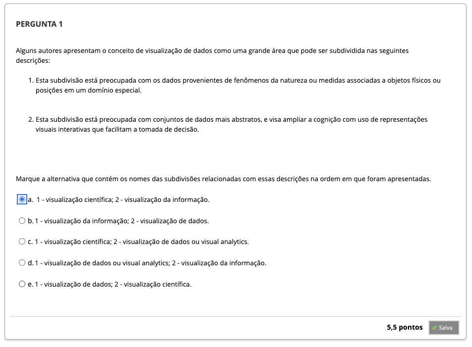
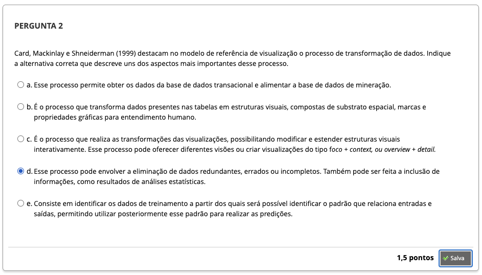
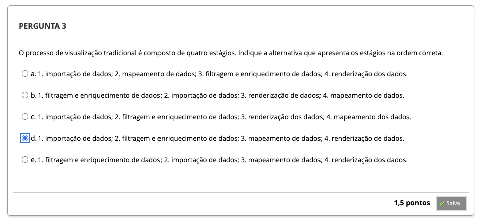
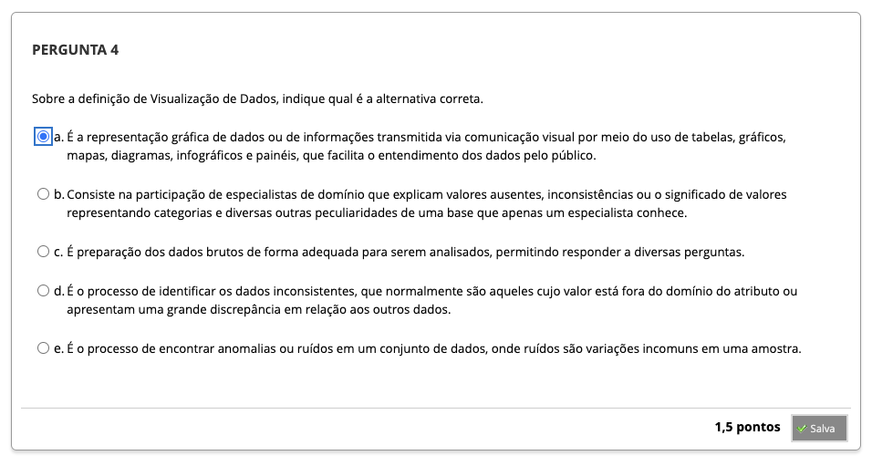

# Semana 1 - Introdução à Visualização de Dados e Análise de Dados

### Texto-base 1:

### Videoaula 1: Introdução à Visualização Computacional

#### Quiz da Videoaula 1

### Texto-base 2:

### Videoaula 2: Visualização e Análise de Dados

#### Quiz da Videoaula 2

### Quiz Objeto Educacional

### Exercício de apoio

---

## Aprofundando o tema
### Texto de apoio:

### Video de apoio:

---

## Atividade Avaliativa - Semana 1

