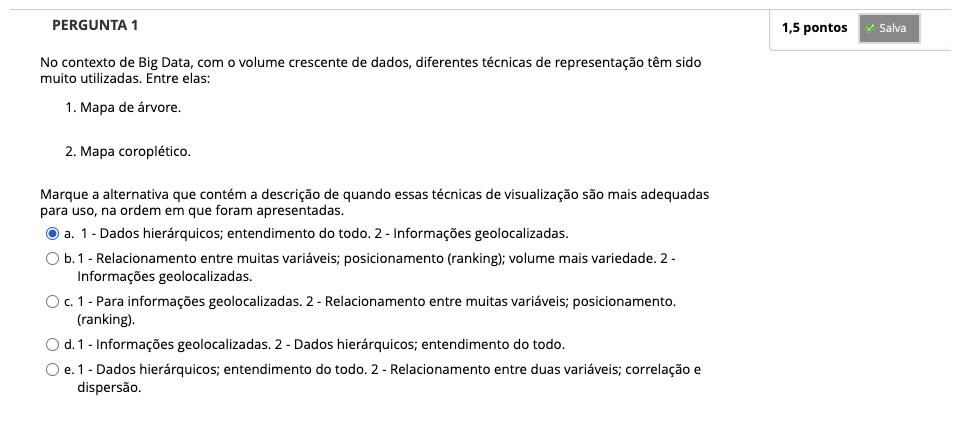
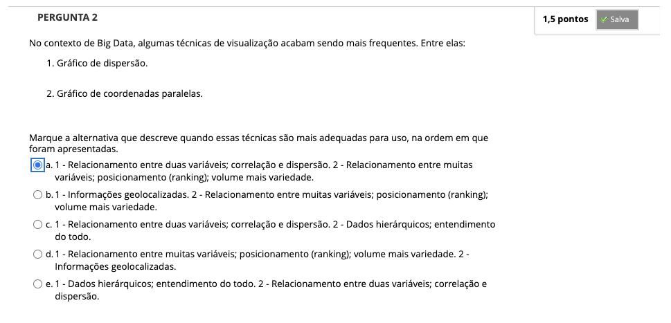
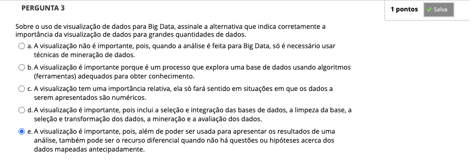
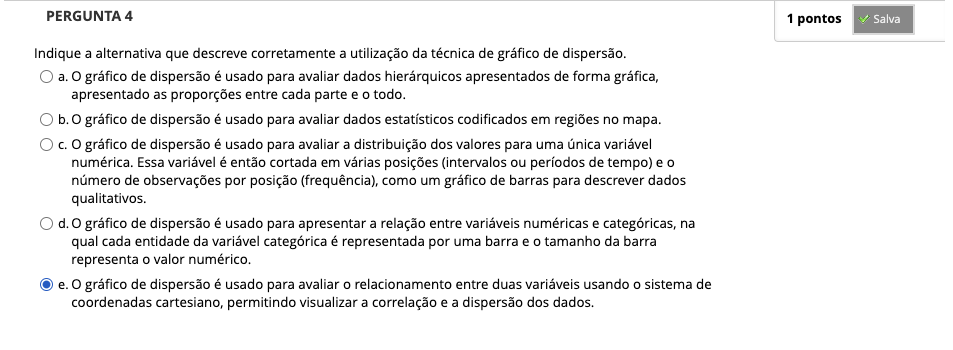
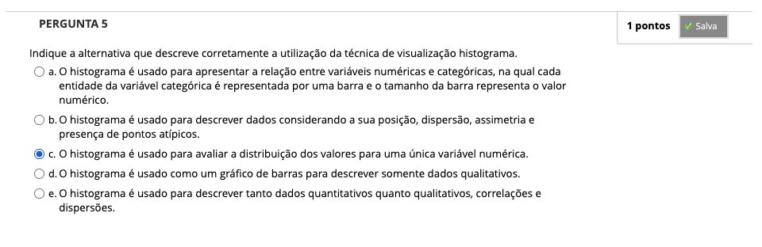
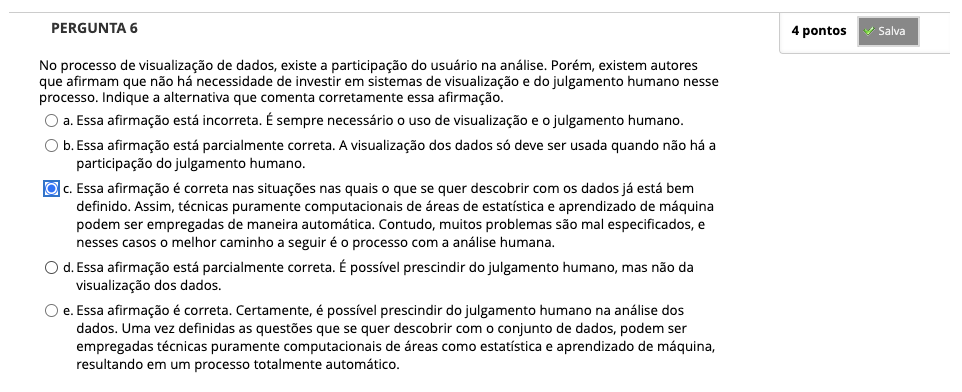

# Semana 2 - Visualização de dados em Big Data

## Desafio

---

## Revisitando Conhecimentos

---

##
### Texto base 1

### Videoaula 3 - Visualização de dados em Big Data

#### Quiz da videoaula 3

### Videoaula 4 - Planejamento da Visualização e Exemplos

#### Quiz da videoaula 4

### Texto base 2 - Artigo: Que tipo de gráfico usar? | Dados Finos

### Quiz Objeto Educacional

### Exercício de Apoio

---

## Aprofundando o Tema
### Material de apoio
### Material de apoio
### Texto de apoio
### Vídeo de apoio

---

## Atividade Avaliativa - Semana 2

---

## Em Síntese,