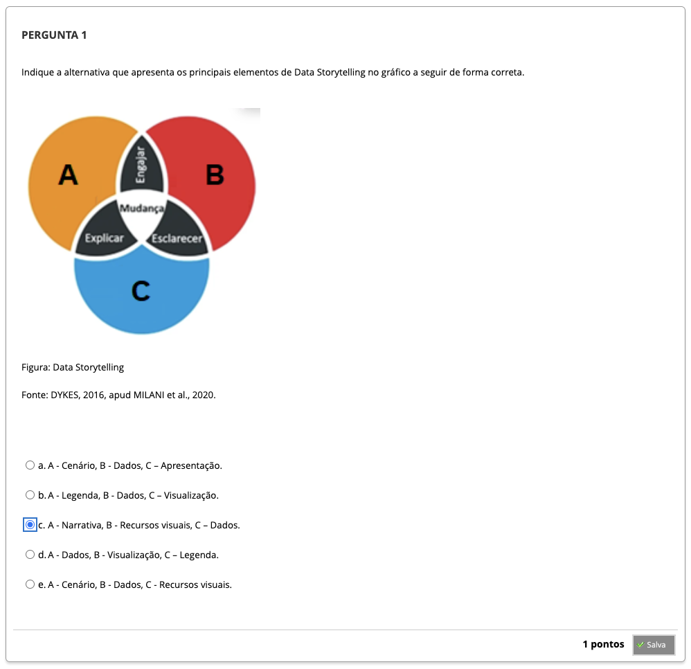
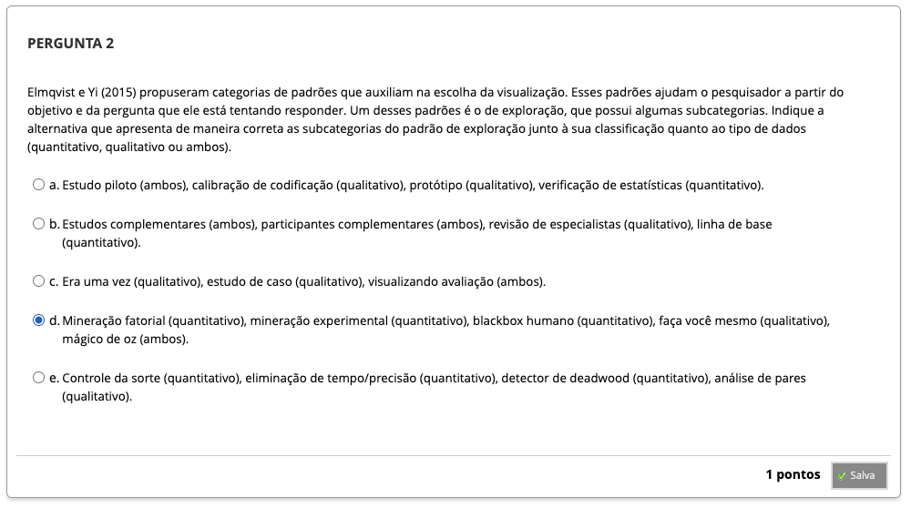
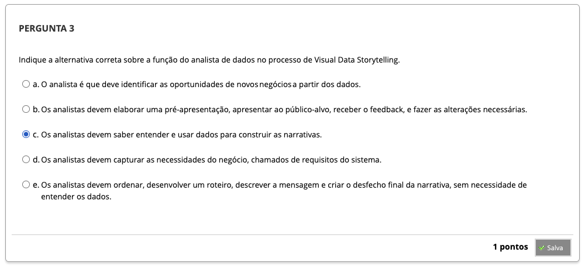
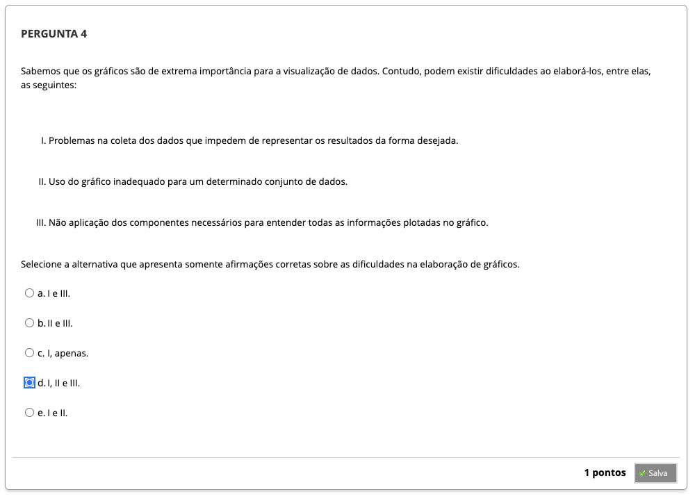
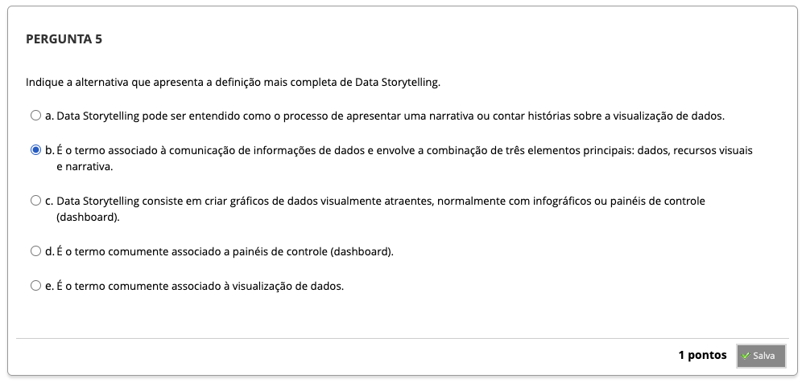
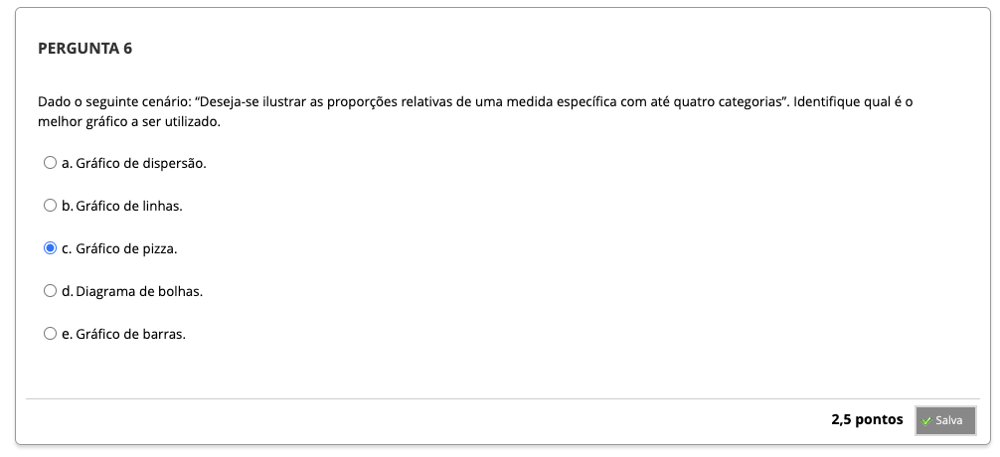
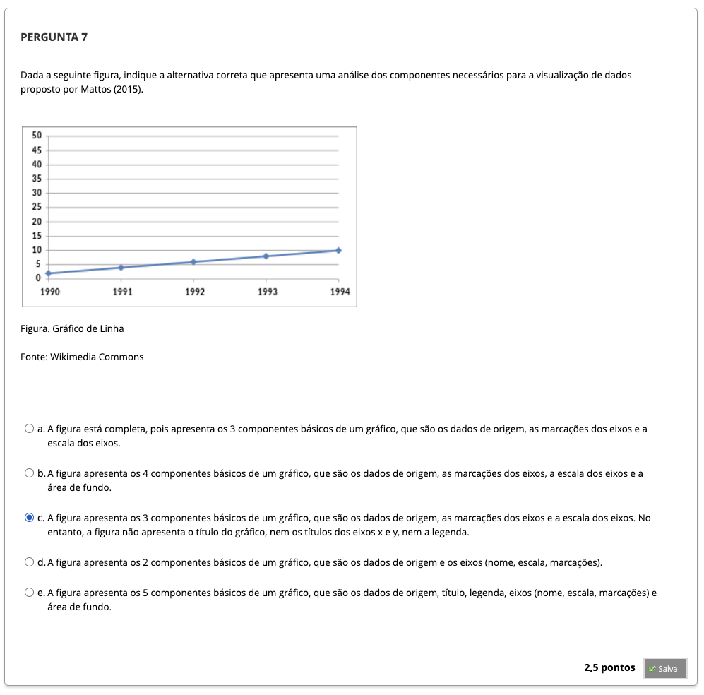

# Semana 3 - *Data Storytelling* / Métricas e abordagens de apresentação de dados

## Desafio

## Revisitando Conhecimentos
###
###

---

## 
### Texto base 1

### Videoaula 5 - Data Storytelling

### Quiz da videoaula 5

### Texto base 2

### Videoaula 6 - Métricas e abordagens de apresentação de dados

### Quiz da videoaula 6

### Quiz Objeto Educacional

### Exercício de apoio

---

## Aprofundando o tema

---

## Atividade Avaliativa - Semana 3

---

## Em Síntese