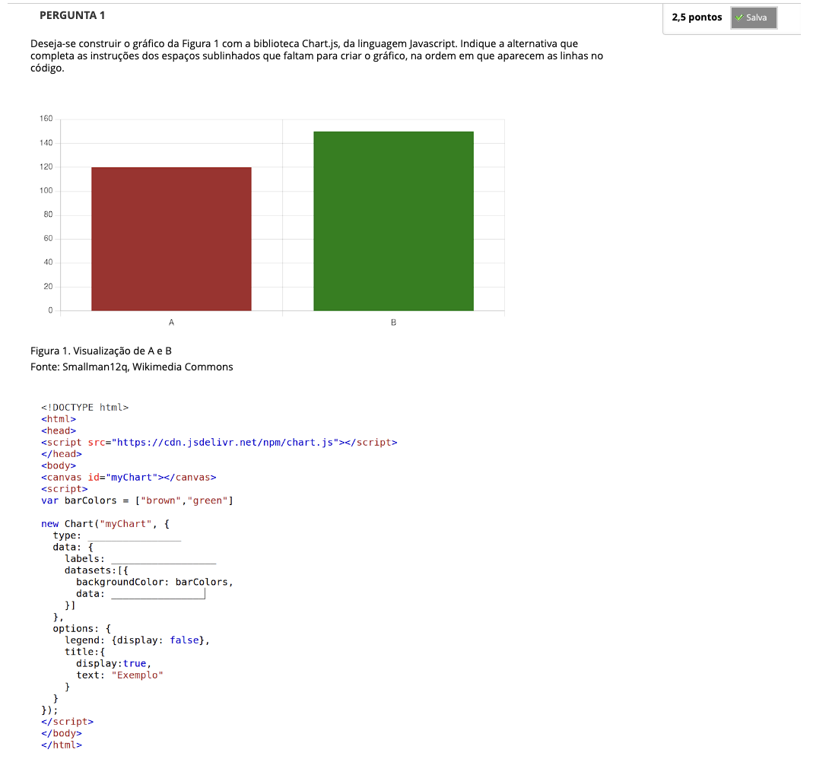
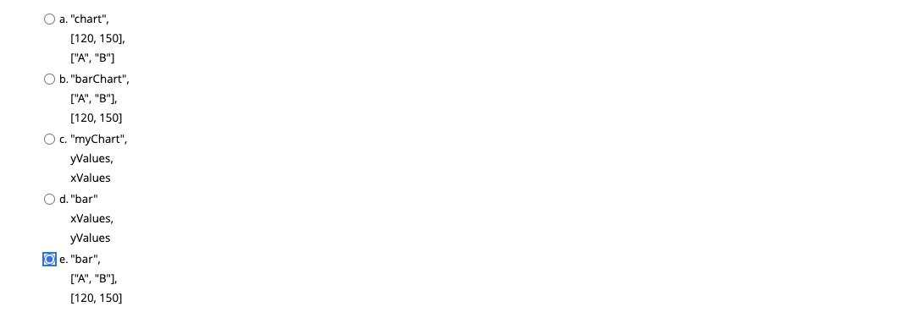
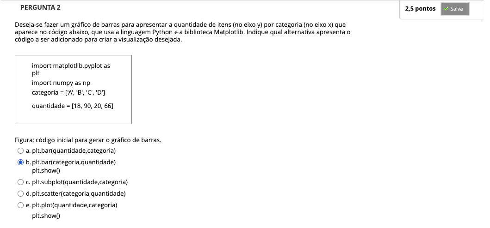
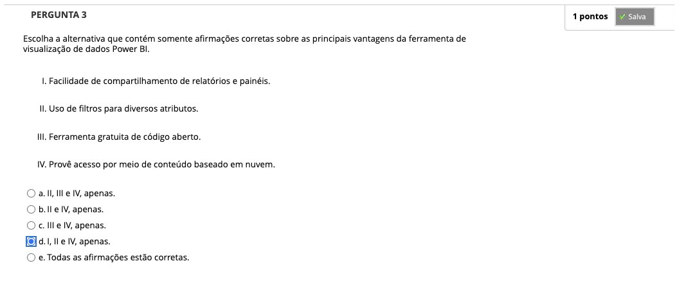
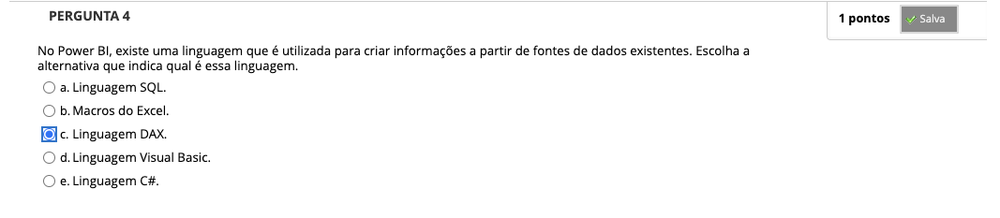
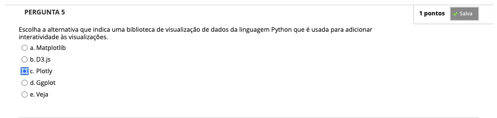
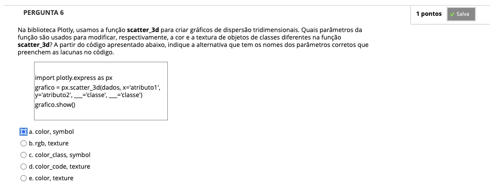
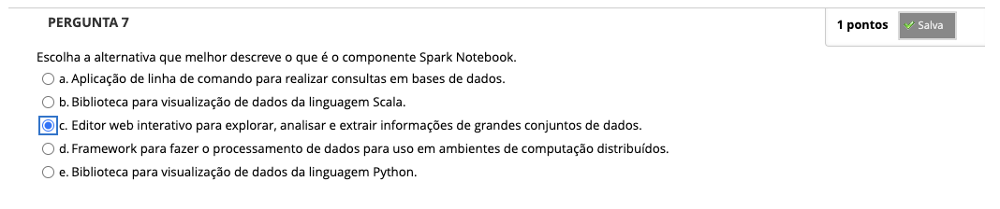

# Semana 5 - Ferramentas de Visualização de Dados

## Desafio

---

## Revisitando Conhecimentos
### Videoaula

---

##
### Texto base 1 - Visualização de dados - Power BI (páginas 263 a 287) | Alessandra M. Paz Milani et al.

### Videoaula 9 - Ferramentas para Visualização de Dados Power BI - Tutorial

### Quiz da videoaula 9

### Tutorial da videoaula 9 - Tutorial Instalação Power BI

### Quiz da videoaula 9

### Videoaula 10 - Visualização de dados com Power BI

### Quiz da videoaula 10

### Texto base 2 - Visualização de dados - Frameworks de visualização de dados (páginas 231 a 249) | Alessandra M. Paz Milani et al.

### Videoaula 11 - Bibliotecas de visualização de dados do Python

### Quiz da videoaula 11

### Videoaula 12 - Visualização de dados com Python

### Tutorial da videoaula 12 - Visualização de dados com Python

### Quiz da videoaula 12

### Texto base 3 - Visualização de dados - Frameworks de visualização de dados de big data (páginas 251 a 262) | Alessandra M. Paz Milani et al.

### Quiz Objeto Educacional

### Exercícios de Apoio

---

## Aprofundando o tema
### Texto de apoio
### Texto de apoio
### Texto de apoio

---

## Atividade Avaliativa - Semana 5

---

## Em Síntese