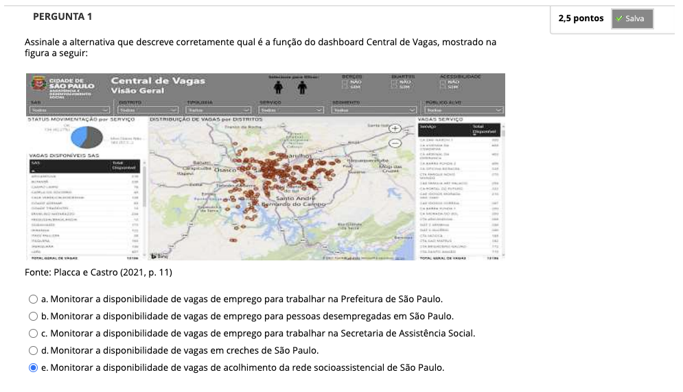
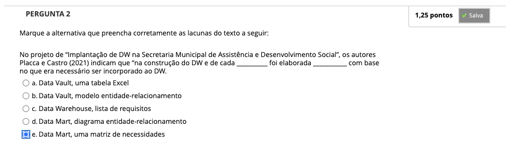
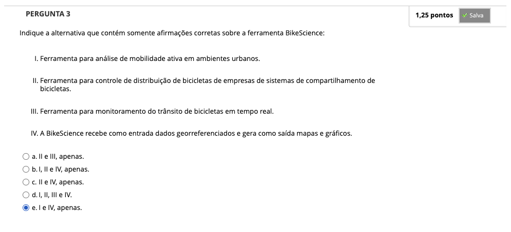
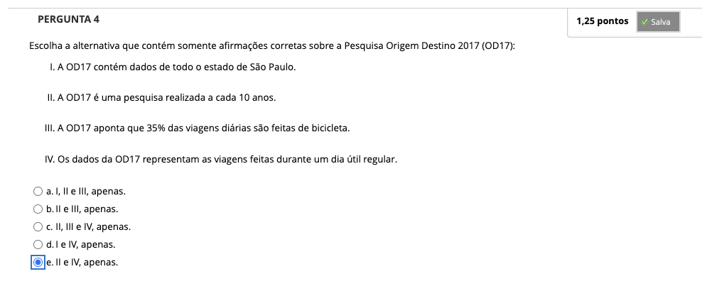
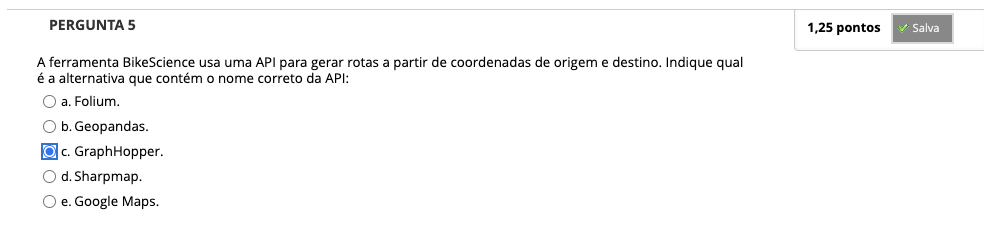
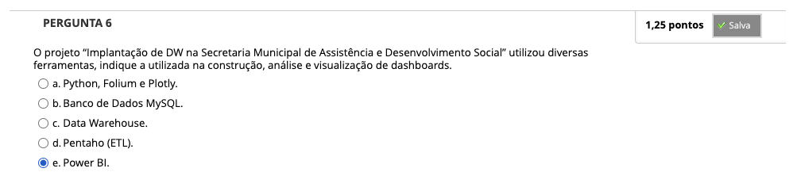
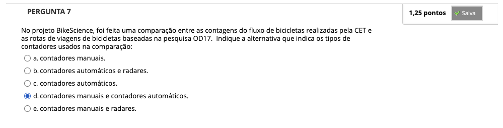

# Semana 6 - Exemplos de Visualização e Análise de Dados

## Desafio

---

## 
### Texto base 1
### Videoaula 13 - Construção de um ambiente de BI para Secretaria de Assistência Social da Prefeitura Municipal de São Paulo
### Quiz da videoaula 13
### Videoaula 14 - Usando Bundling para visualizar viagens na Reunião Metropolitana de São Paulo
### Quiz da videoaula 14
### Texto base 2
### Videoaula 15 - Visualizando dados de viagens de bicicletas na cidade de São Paulo
### Quiz da videoaula 15
### Quiz Objeto Educacional
### Exercício de Apoio 1
### Exercício de Apoio 2

---

## Aprofundando o tema
### Artigo
### Vídeo de apoio
### Aplicação Web
### Material de apoio

---

## Atividade Avaliativa - Semana 6

---

## Em Síntese