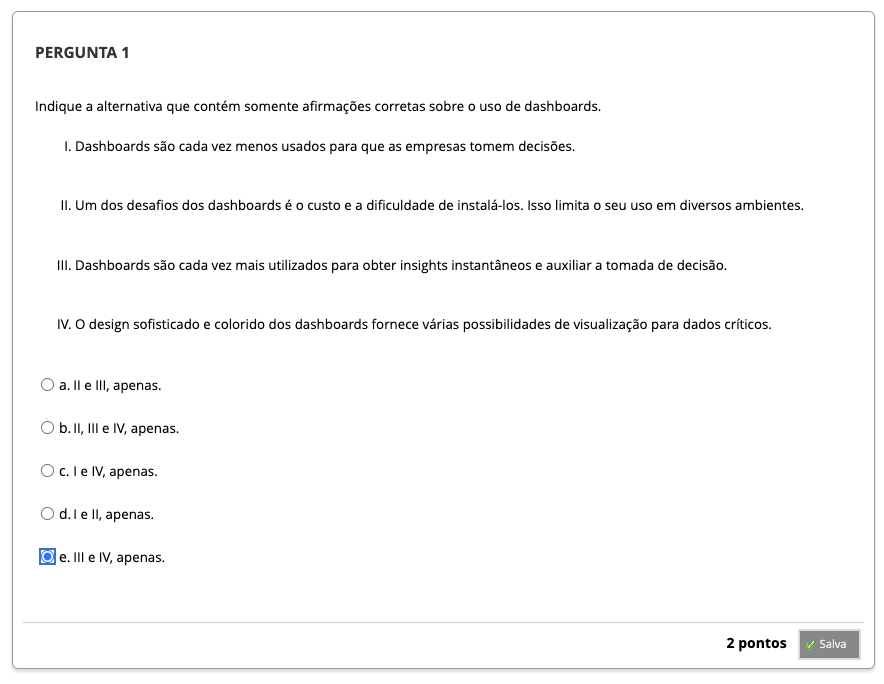
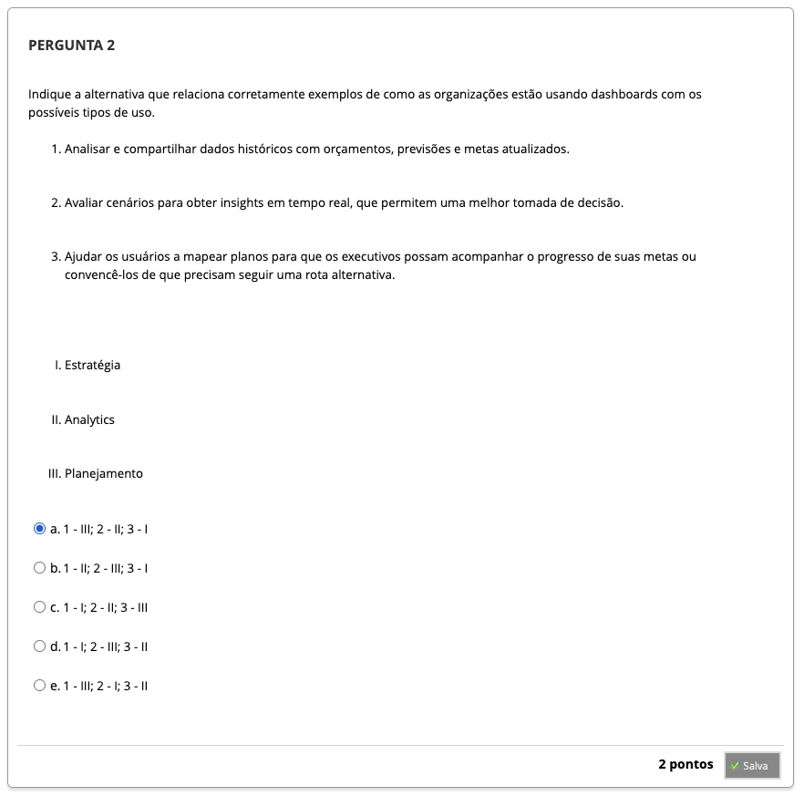
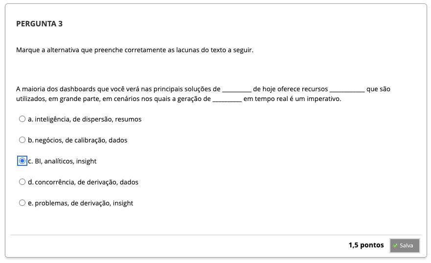
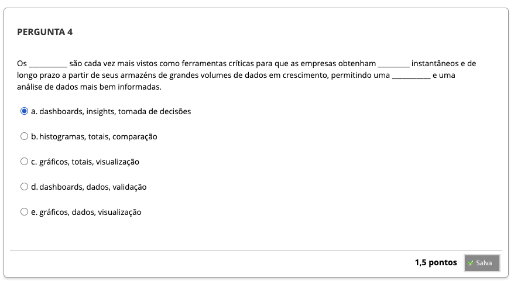
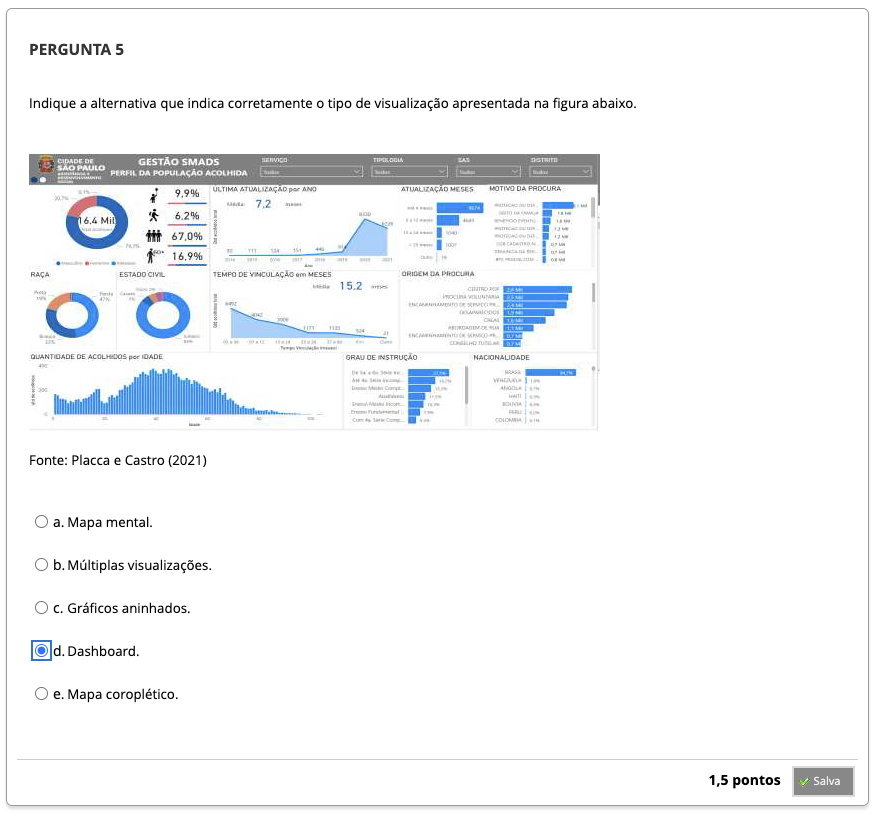
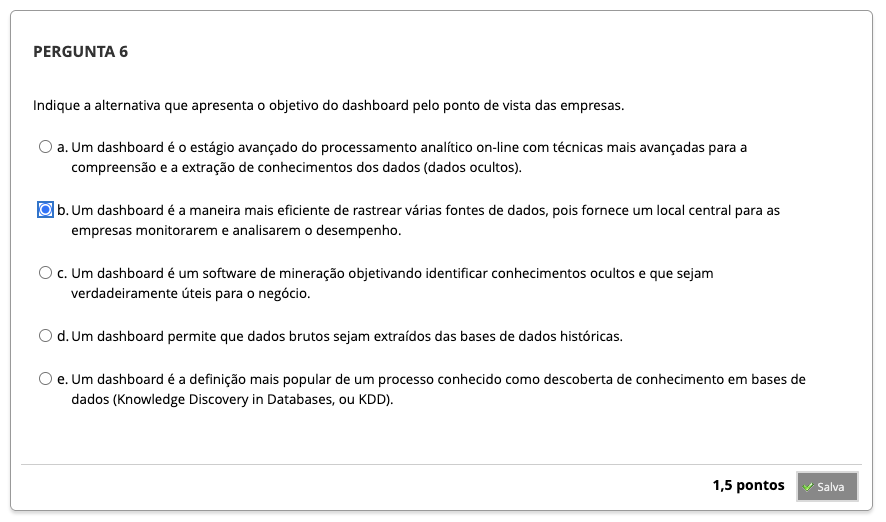

# Semana 7 - Entrevistas com Especialistas

## Desafio

---

##
### Videoaula 16 - Visualizando dados para apoio a políticas públicas para mobilidade urbana em São Paulo

### Quiz da videoaula 16

### Videoaula 17 - Atuação do profissional em visualização de dados

### Quiz da videoaula 17

### Texto-base 1: Visualização de dados (capítulo: "Análise de dados usando dashboards"- p. 221 a 229) | Alessandra M. Paz Milani et al.

### Quiz Objeto Educacional

### Exercício de Apoio 1

### Exercício de Apoio 2

---

## Aprofundando o tema
### Vídeo de apoio: Power BI 10 Exemplos de Dashboards para se inspirar | Karine Lago - DATAB

### Material de apoio: Site do Centro de Operações da Prefeitura do Rio de Janeiro

### Material de apoio: Painel - Ocorrências de veículos enguiçados entre 2016 e 2022 no Rio de Janeiro | COR-Rio

### Texto de apoio: Prefeitura inicia testes para utilização de sistema de patrulhamento inteligente | Prefeitura de Belo Horizonte

### Material de apoio: Site do Centro Integrado de Operações do Belo Horizonte

---

## Atividade Avaliativa - Semana 7

--- 

## Em Síntese