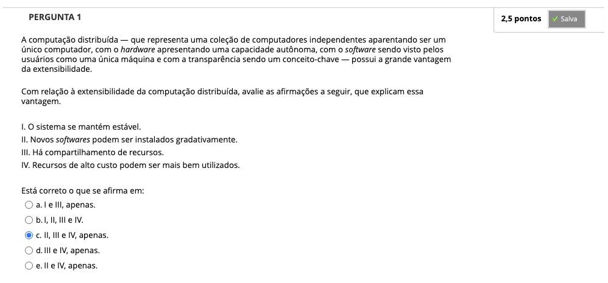
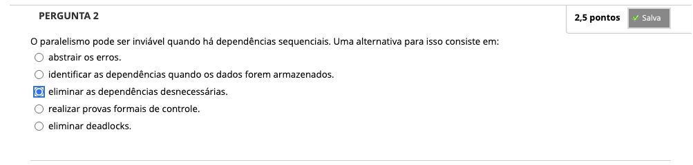
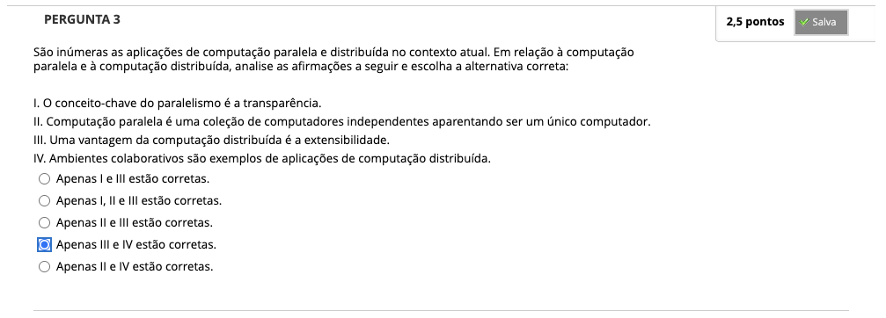
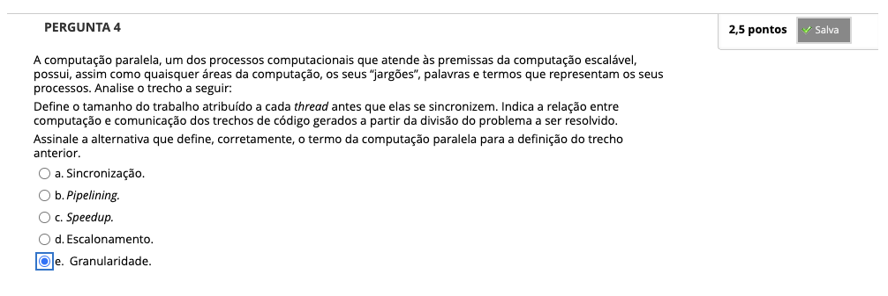

# Semana 1 - Introdução à Computação Paralela e Distribuída

## Desafio

## Revisitando Conhecimentos

##
### Videoaula 1: Computação Paralela e Distribuída

#### Quiz: Videoaula 1

### Videoaula 2: Conceitos Fundamentais

#### Quiz: Videoaula 2

### Material-base
#### Texto-base 1
- Introdução à programação paralela e distribuída - Suzana de Siqueira Santos - Capítulo 3

### Quiz Objeto Educacional

## Aprofundando o Tema
### Vídeo de apoio 1

### Material de apoio 1

---

## Atividade Avaliativa - Semana 1

## Em Síntese

