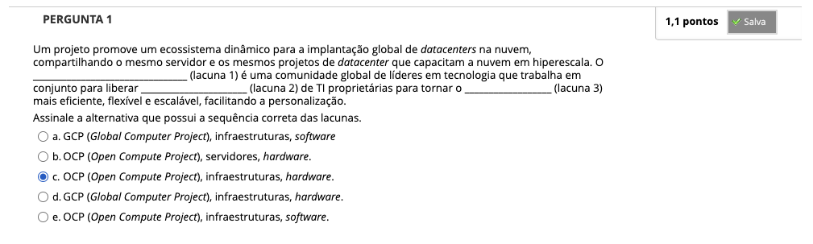
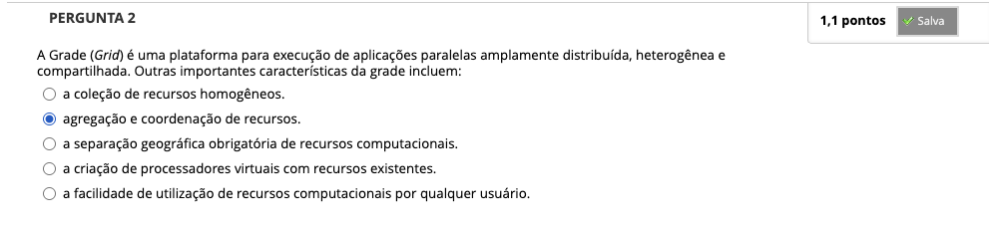
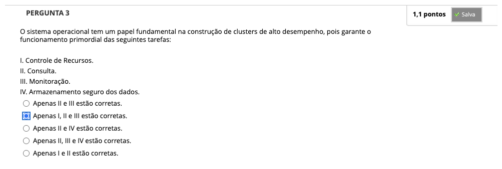
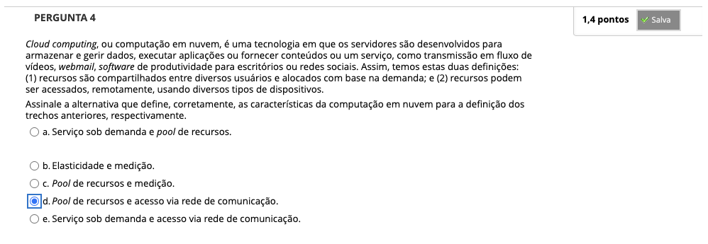
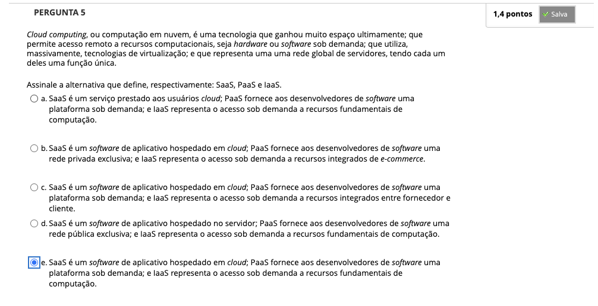
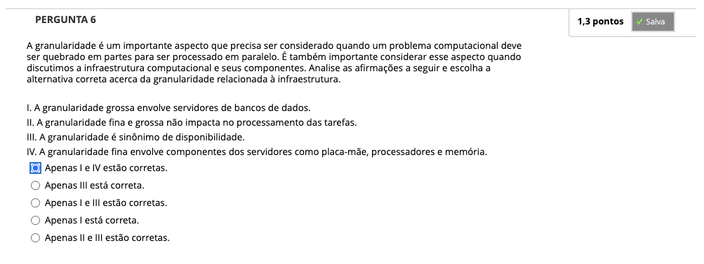
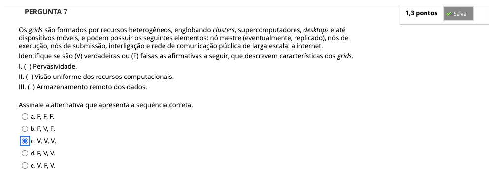
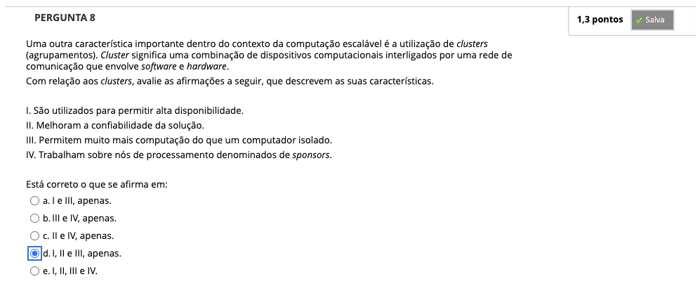

# Semana 3 - Infraestrutura para Computação Paralela e Distribuída

## Desafio

## Revisitando Conhecimentos
### Vídeo de apoio

##
### Videoaula 5 - Infraestrutura para Computação Paralela e Distribuída

#### Quiz - videoaula 5

### Videoaula 6 - Clusters

#### Quiz - videoaula 6

### Videoaula 7 - Grids

#### Quiz - videoaula 7

### Videoaula 8 - Cloud

#### Quiz - videoaula 8

## Material-base
### Texto-base 1
### Texto-base 2
### Texto-base 3
### Texto-base 4

## Quiz Objeto Educacional
## Aprofundando o Tema
### Vídeo de apoio 1
### Vídeo de apoio 2
### Vídeo de apoio 3
### Material de apoio

---

## Atividade Avaliativa - Semana 3

---

## Em Síntese