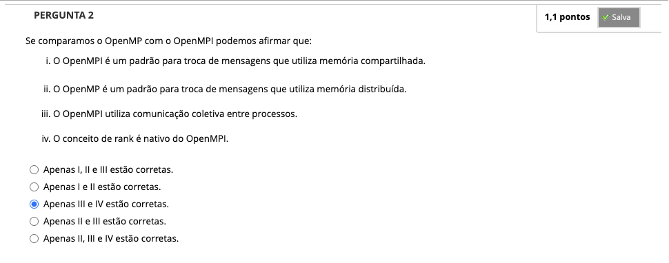
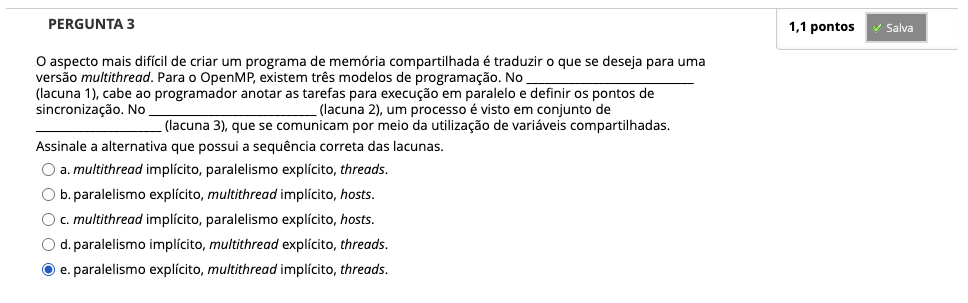
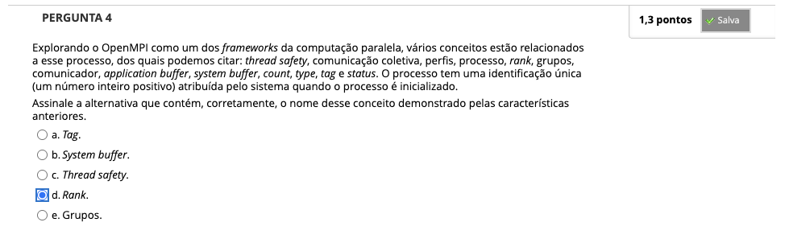
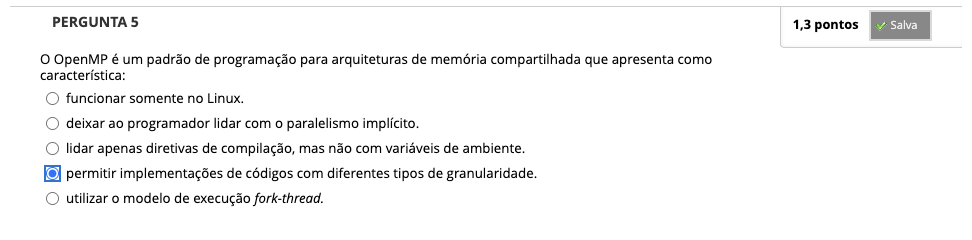
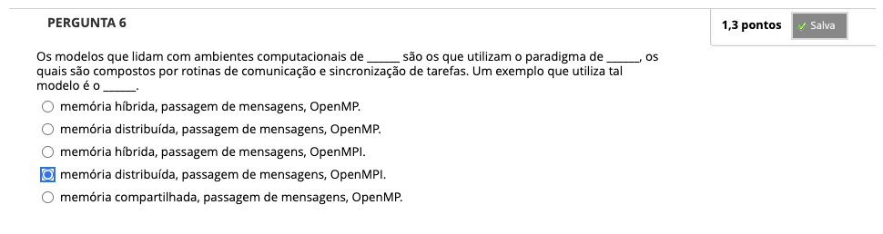
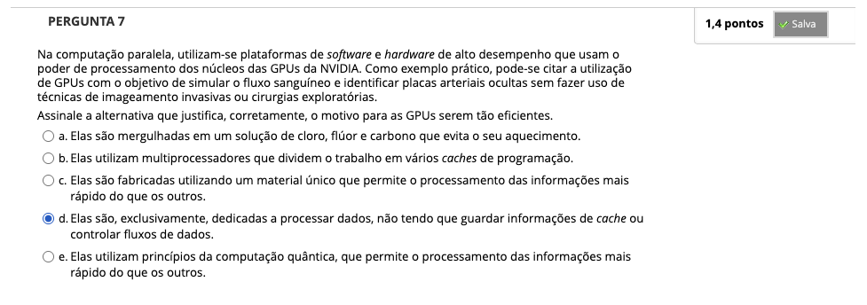
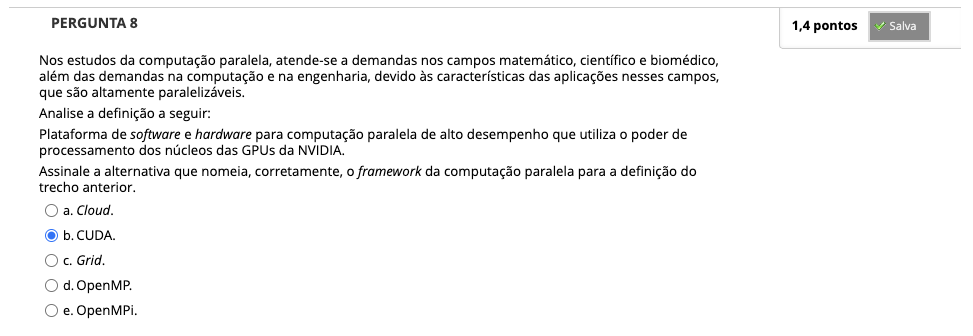

# Semana 4 - Frameworks para Computação Paralela

## Desafio

## Revisitando Conhecimentos

##
### Videoaula 9 - Frameworks para Computação Paralela

#### Quiz - videoaula 9

### Videoaula 10 - Frameworks para Computação Paralela - OpenMPI

#### Quiz - videoaula 10

### Videoaula 11 - Frameworks para Computação Paralela - CUDA

#### Quiz - videoaula 11

## Material-base
### Texto-base 1

### Texto-base 2

### Texto-base 3

## Quiz Objeto Educacional

## Aprofundando o tema
### Material de apoio
### Material de apoio
### Material de Apoio
### Material de apoio
### Material de apoio
### Material de apoio

---

## Atividade Avaliativa - Semana 4

---

## Em Síntese