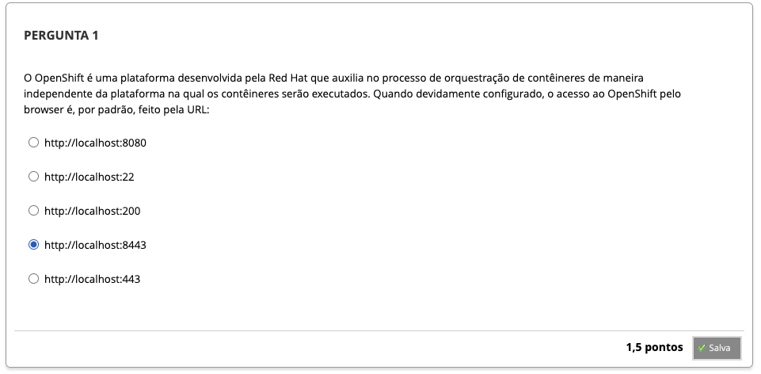
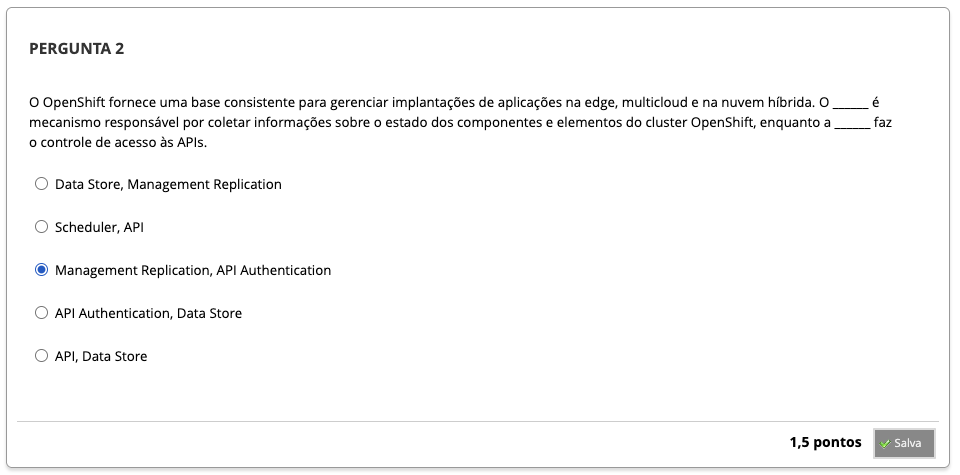
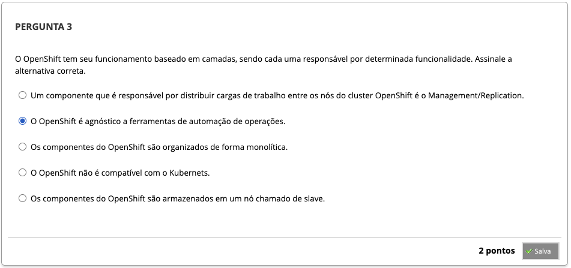
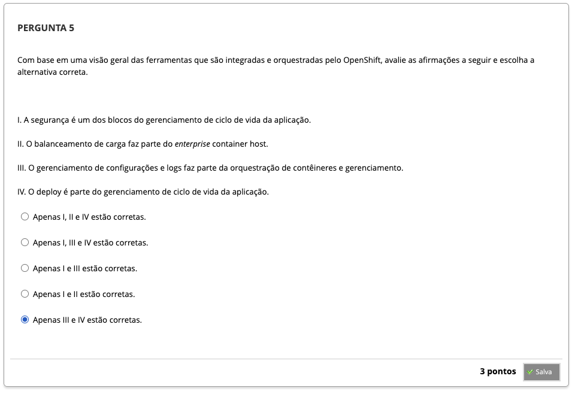

# Semana 7 - OpenShift - Introdução, Arquitetura e Deploy de Aplicações

## Desafio

## Revisitando Conhecimentos
### Texto de apoio

## 
### Videoaula 19 - OpenShift - Introdução e Arquitetura
#### Quiz - videoaula 19
### Videoaula 20 - Criação de um Cluster com OpenShift
#### Quiz - videoaula 20
### Videoaula 21 - Deploy de Aplicações com OpenShift
#### Quiz - videoaula 21

## Material-base
### Texto-base 1
### Texto-base 2

## Quiz Objeto Educacional

## Aprofundando o Tema
### Material de apoio
### Material de apoio
### Material de apoio
### Material de apoio

---

## Atividade Avaliativa - Semana 7

---

## Em Síntese