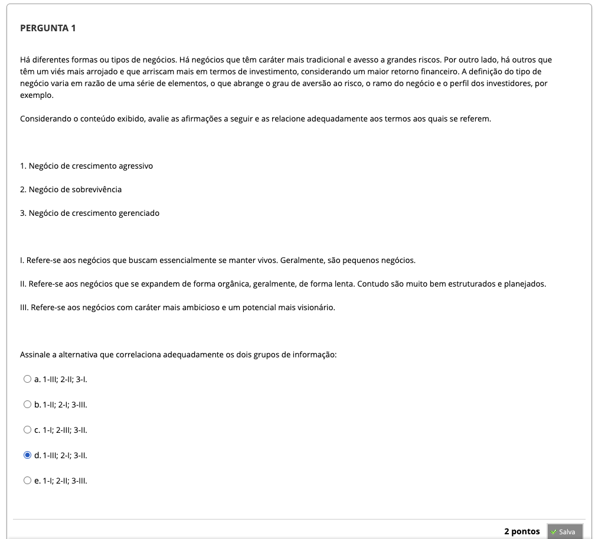
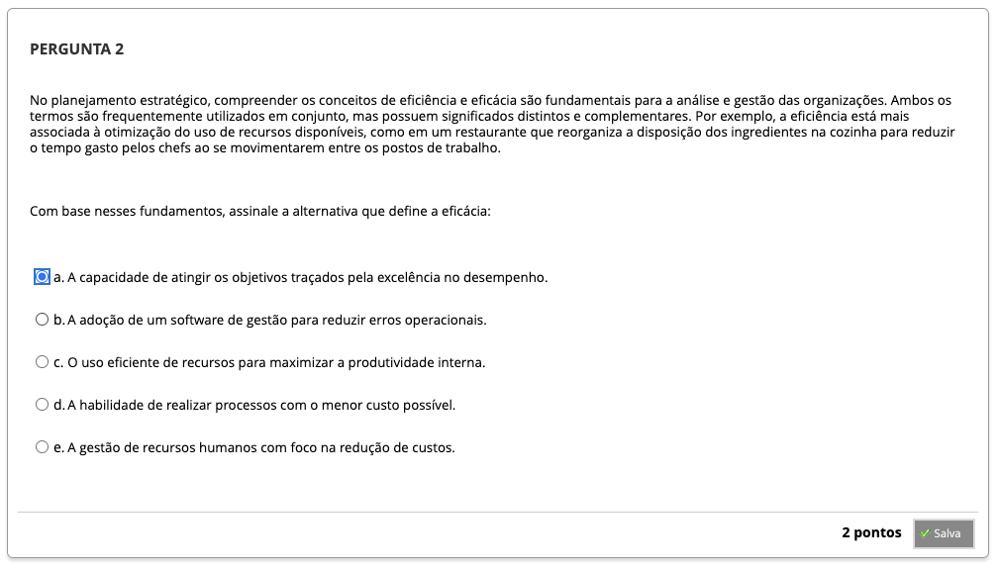
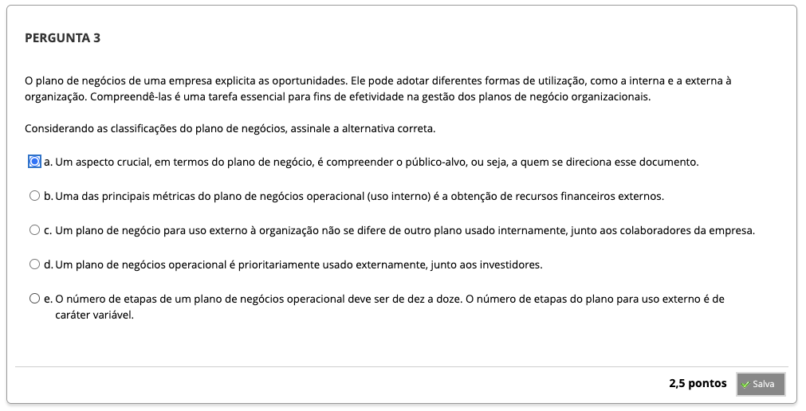
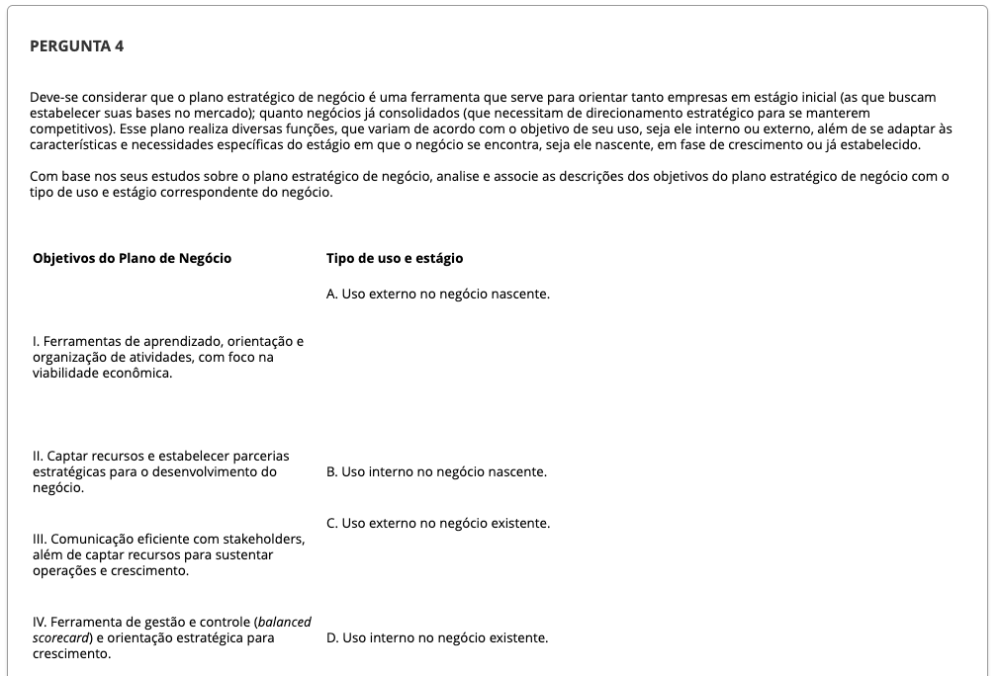

# Semana 1 - Fundamentos Básicos de Planejamento de Negócios

## Desafio

##
### Videoaula 1: Fundamentos de Planejamento de Negócios - Parte 1

#### Quiz: Videoaula 1

### Videoaula 2: Fundamentos de Planejamento de Negócios - Parte 2

#### Quiz: Videoaula 2

### Videoaula 3: Fundamentos de Planejamento de Negócios - Entrevista

#### Quiz: Videoaula 3

### Texto-base 1

### Texto-base 2

## Aprofundando o Tema
### Texto de apoio 1

### Texto de apoio 2

### Quiz Objeto Educacional

### Exercício de Apoio

---

## Atividade Avaliativa - Semana 1

---

## Em Síntese