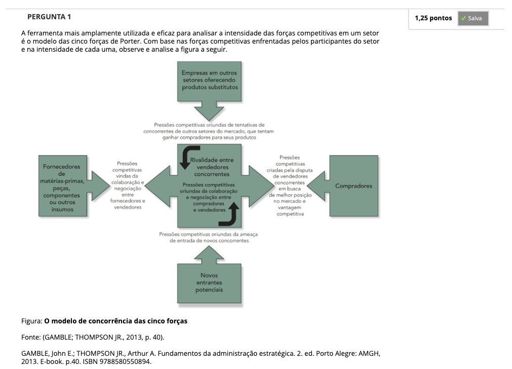
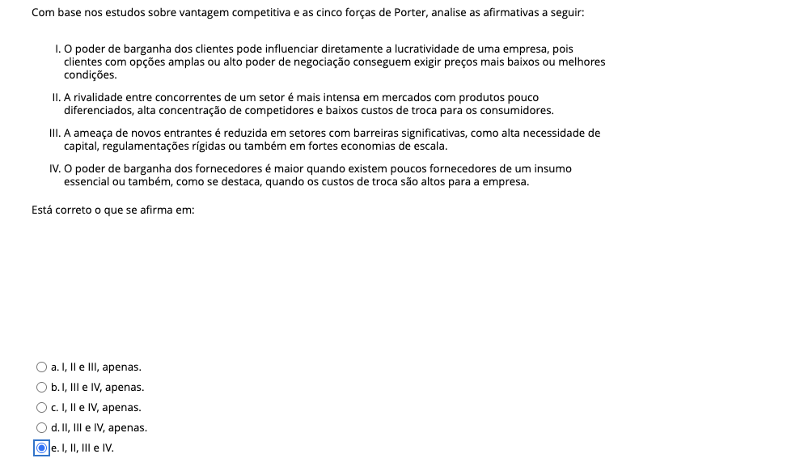
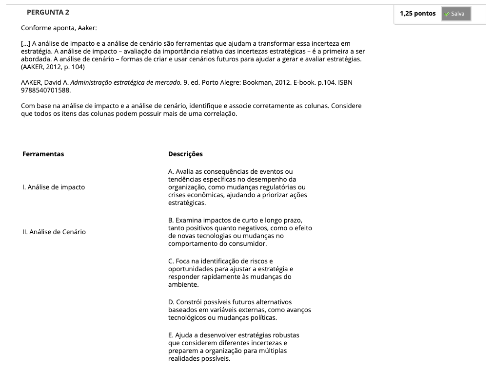
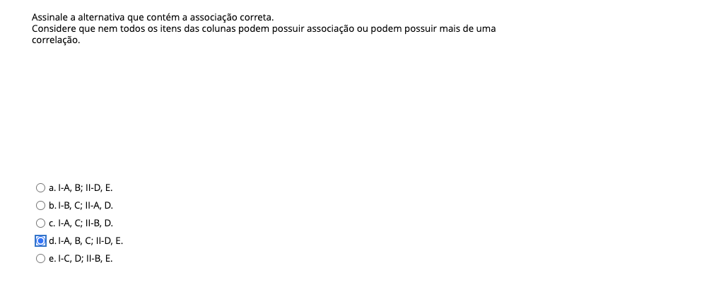
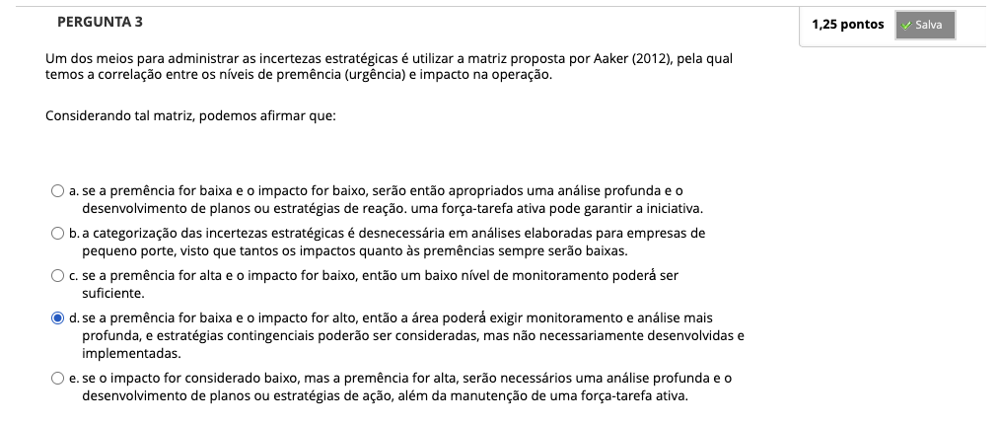
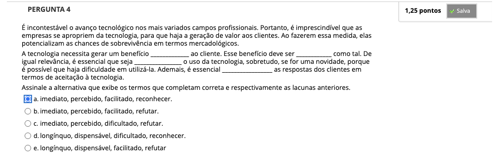
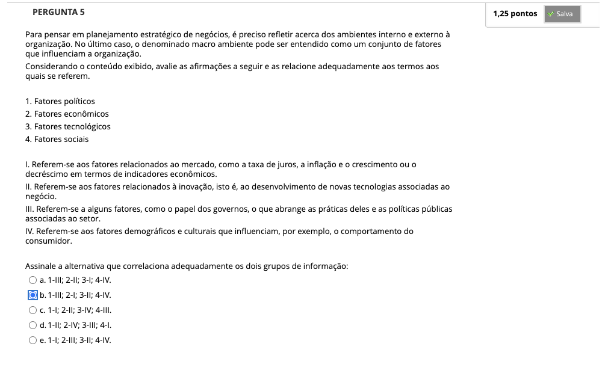
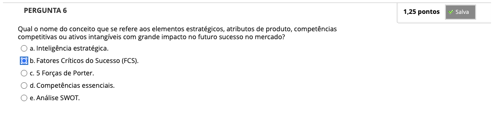
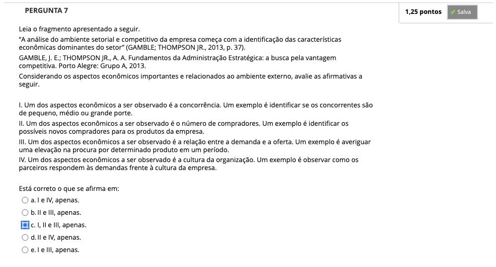

# Semana 3 - Diagnóstico do Ambiente Externo

## Desafio

##
### Videoaula 7 - Análise do Macroambiente
#### Quiz da videoaula 7
### Videoaula 8 - Análise do Microambiente
#### Quiz da videoaula 8
### Texto-base 1
### Texto-base 2

---

## Aprofundando o Tema
### Texto de apoio 1
### Texto de apoio 2
### Vídeo de apoio

---

## Quiz Objeto Educacional

---

## Exercício de Apoio

---

## Atividade Avaliativa - Semana 3

---

## Em Síntese