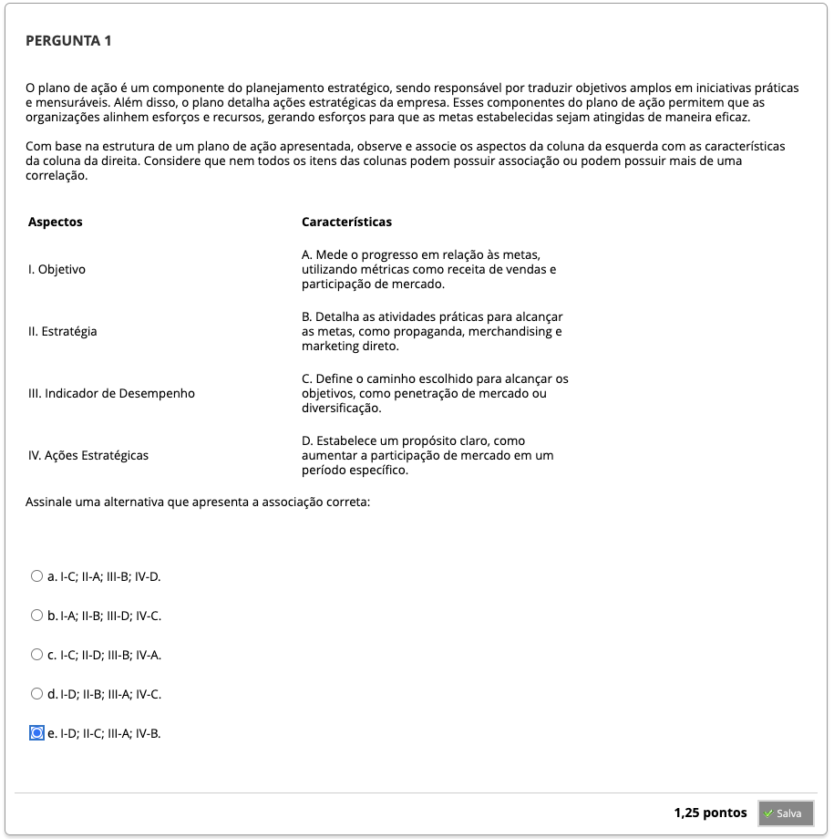
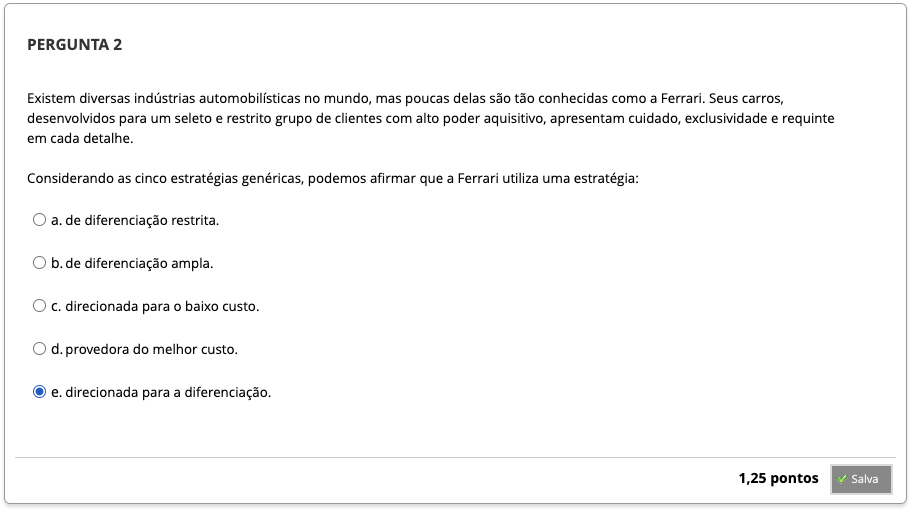
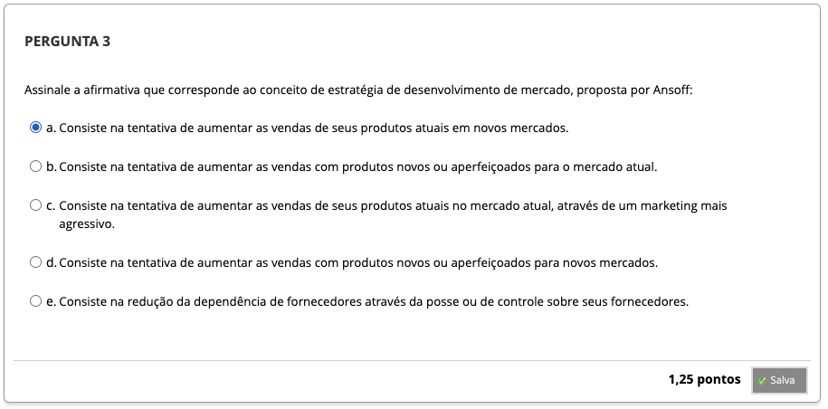
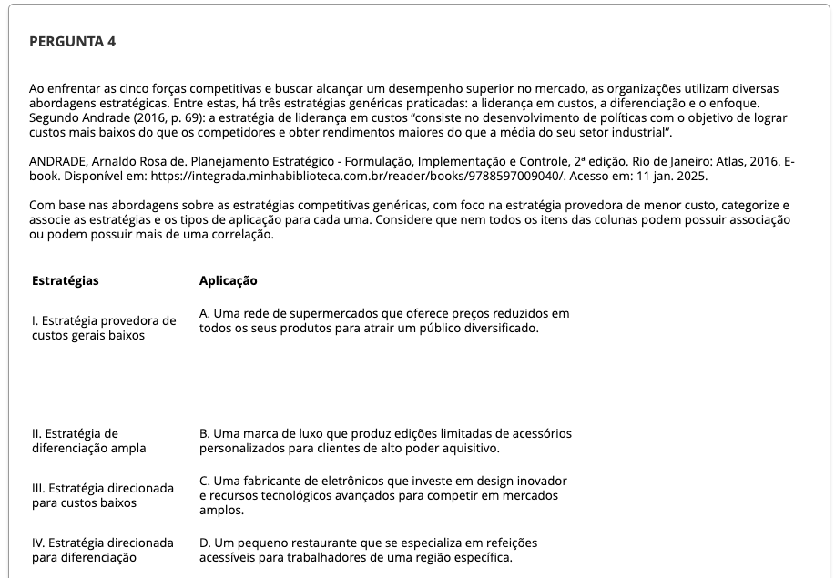
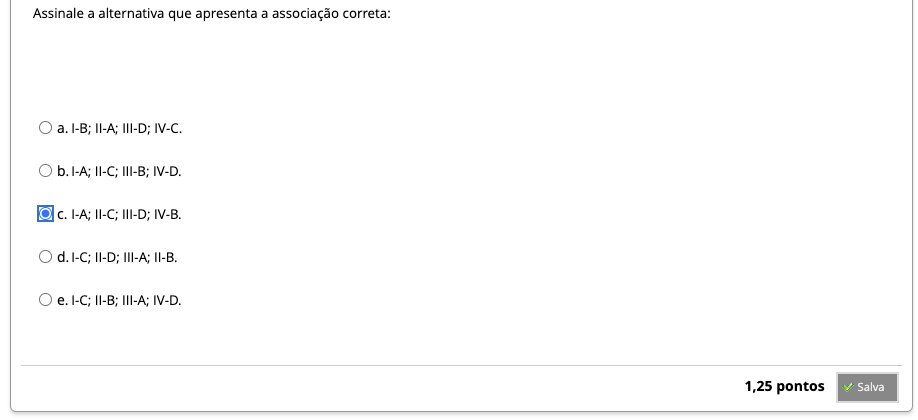
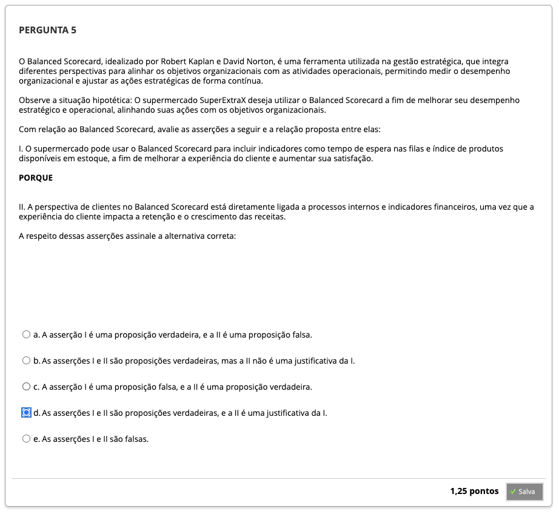
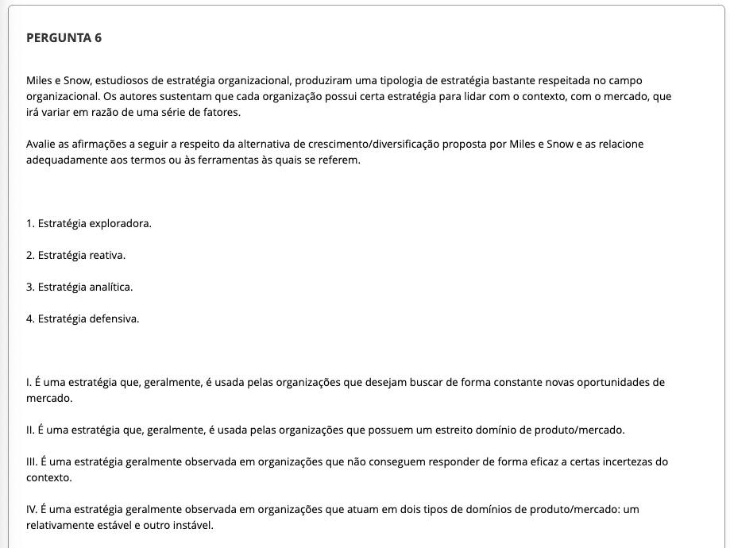
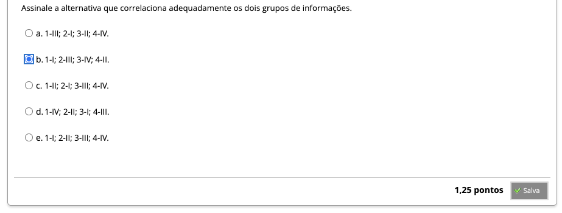
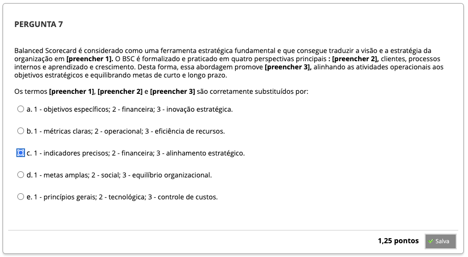
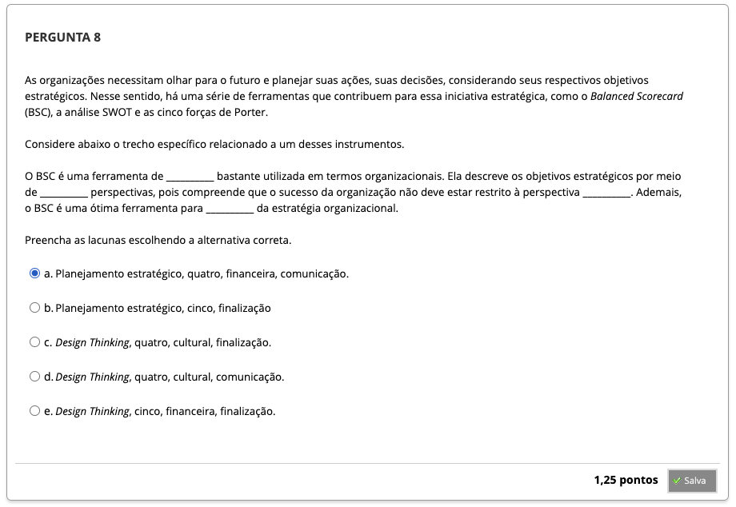

# Semana 5 - Plano Estratégico

## Desafio

## Revisitando Conhecimentos
### Material de Apoio
### Material de Apoio 2

##
### Videoaula 11 - Plano Estratégico - Parte 1
#### Quiz - videoaula 11

### Videoaula 12 - Plano Estratégico - Parte 2
#### Quiz - videoaula 12

### Videoaula 13 - Case Monitora Soluções
#### Quiz - videoaula 13

### Videoaula 14 - Case E-Cliente
#### Quiz - videoaula 14

### Texto-base 1
### Texto-base 2
### Texto-base 3
### Texto-base 4

## Aprofundando o Tema
### Texto de apoio 1
### Texto de apoio 2
### Texto de apoio 3

## Quiz Objeto Educacional

## Exercício de Apoio

---

## Atividade Avaliativa - Semana 5

---

## Em Síntese