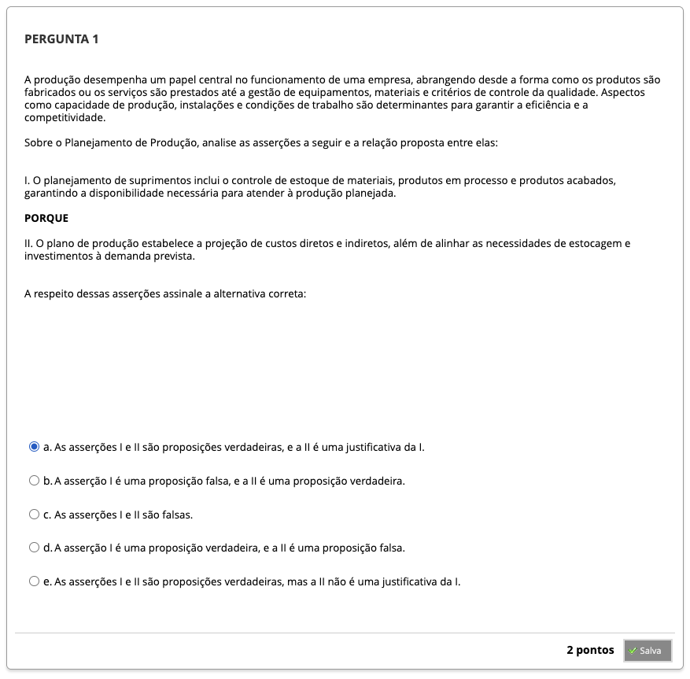
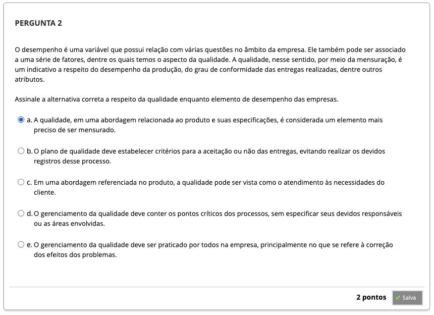
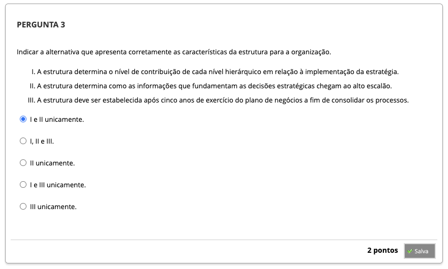
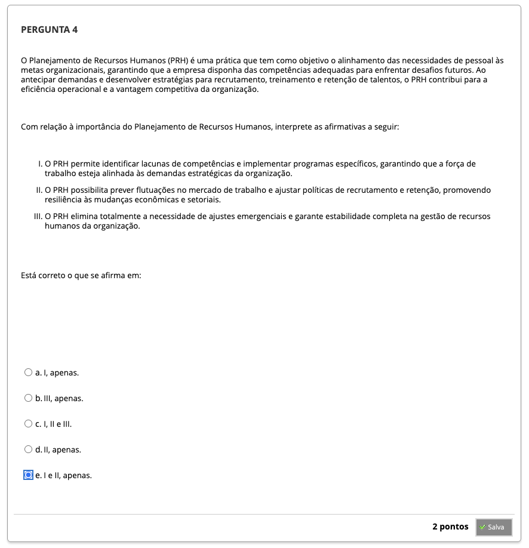
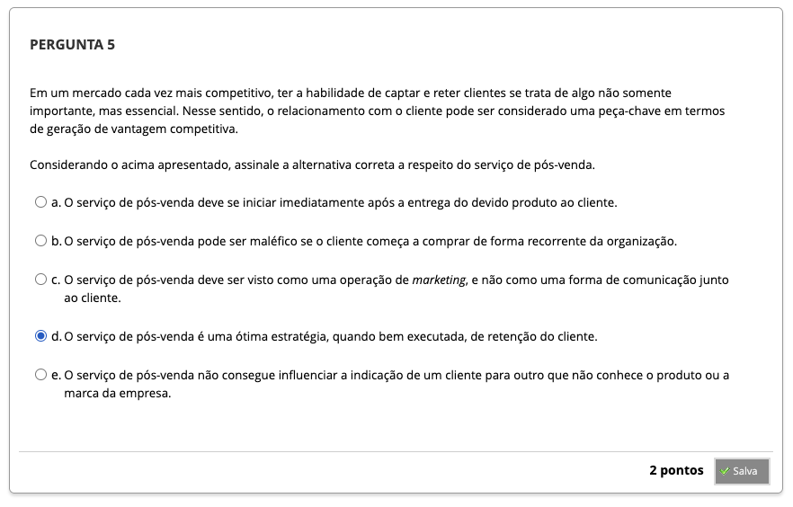

# Semana 7 - Planejamento Operacional e Financeiro

##
### Videoaula 18 - Operacional e Financeiro
#### Quiz - videoaula 18

### Videoaula 19 - Planejamento de Recursos Humanos
#### Quiz - videoaula 19

### Videoaula 20 - Planejamento Financeiro
#### Quiz - videoaula 20

### Videoaula - Revisão

### Texto-base 1
### Texto-base 2

---

## Atividade Avaliativa - Semana 7

---

## Em Síntese