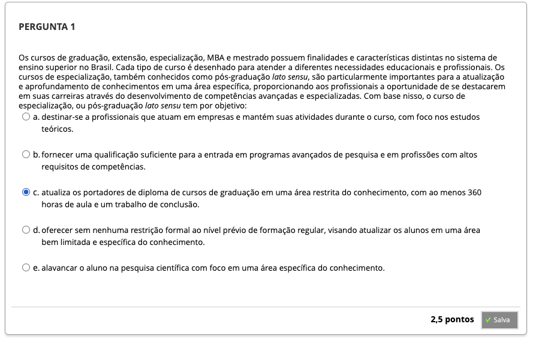
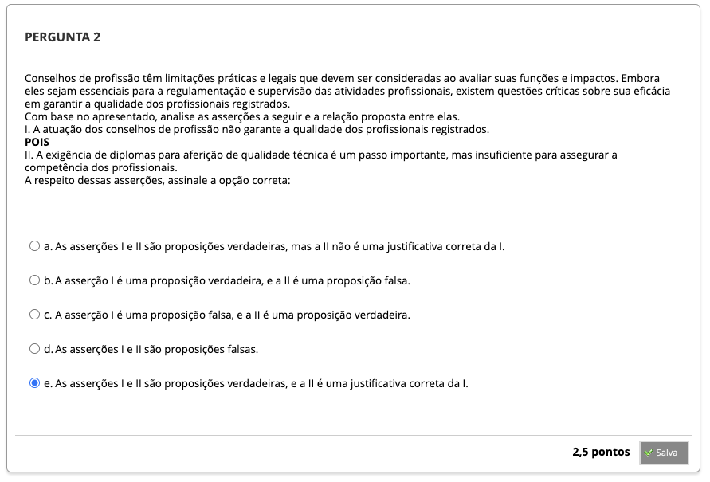
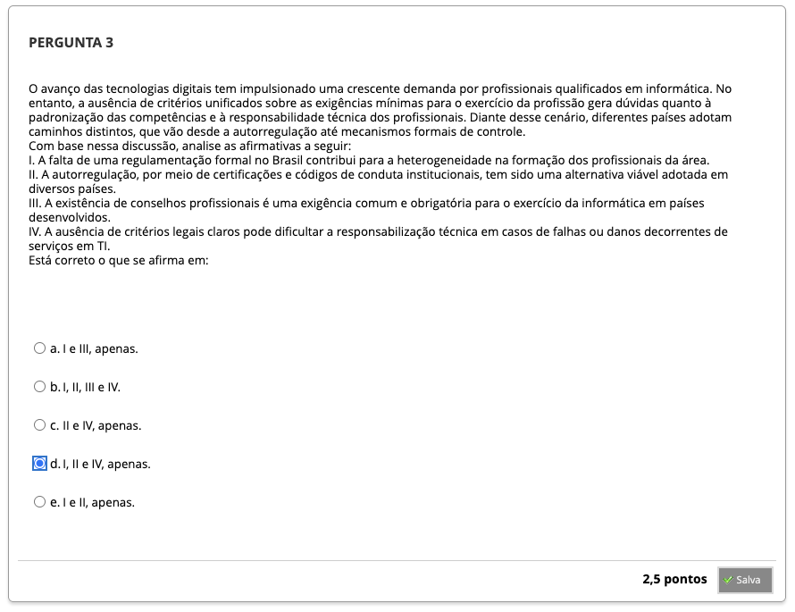
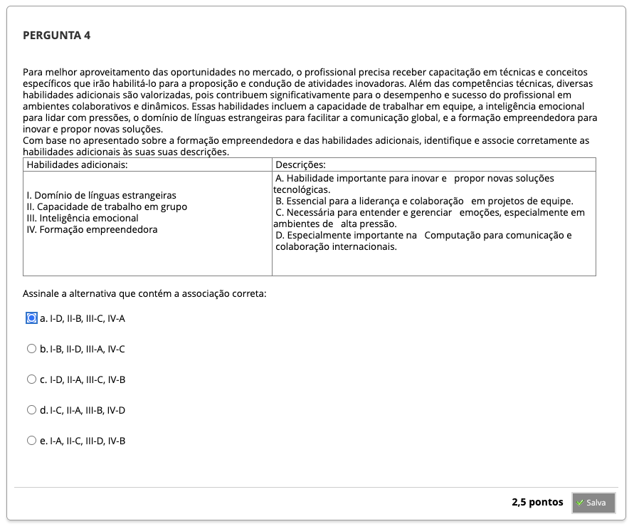

# Semana 1 - O Profissional de Computação: Formação e Regulamentação da Profissão

## Desafio

##
### Videoaula 1 - A formação em Computação

#### Quiz da videoaula 1

### Videoaula 2 - Regulamentação da Profissão

#### Quiz da videoaula 2

## Material-base
### Texto-base 1
### Texto-base 2

## Quiz Objeto Educacional

---

## Atividade Avaliativa

---

## Em Síntese