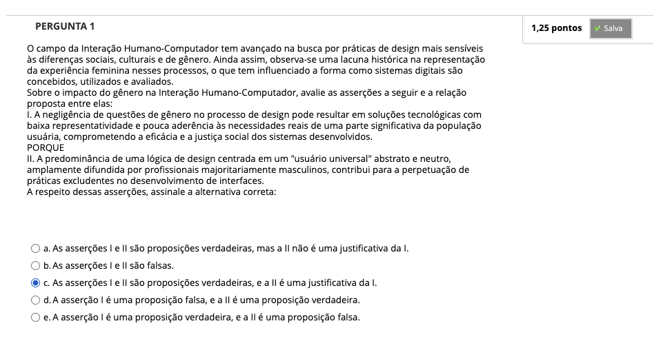
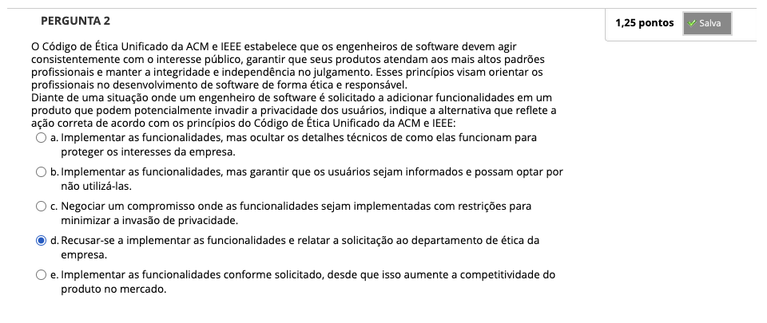
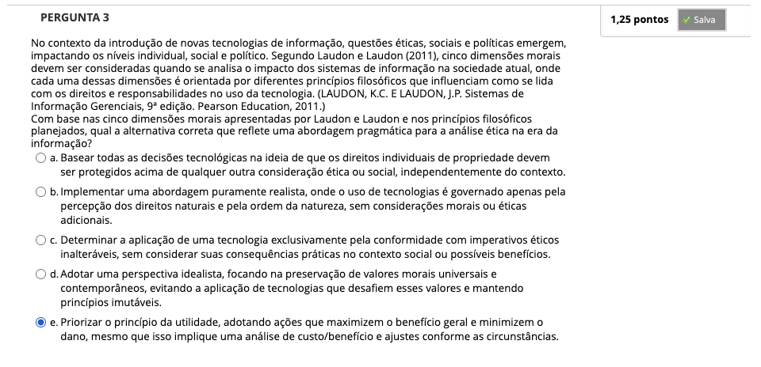
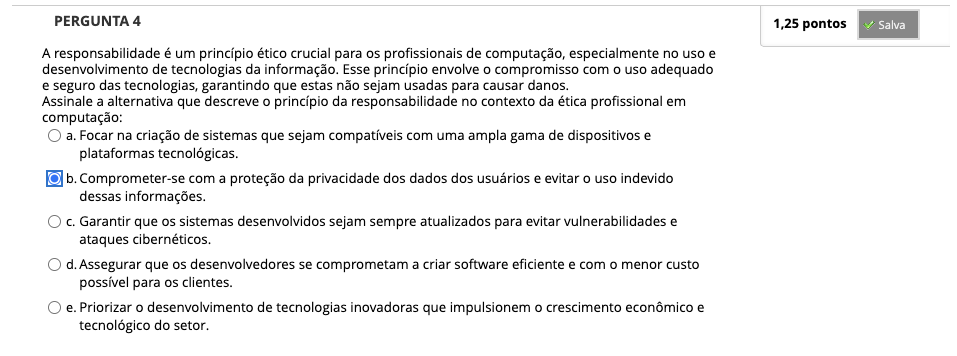
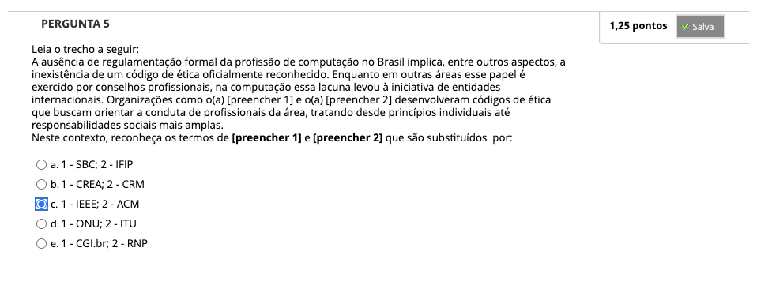
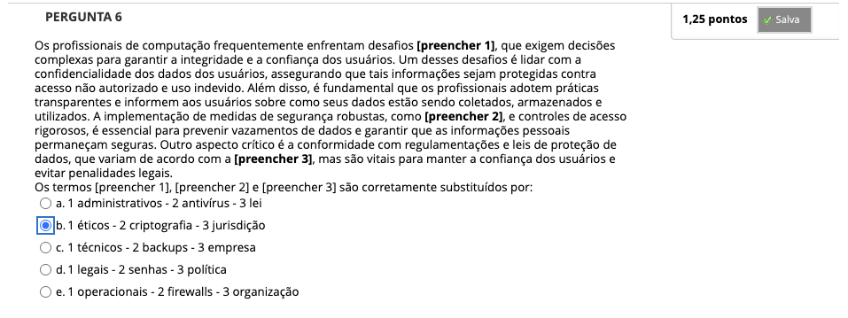
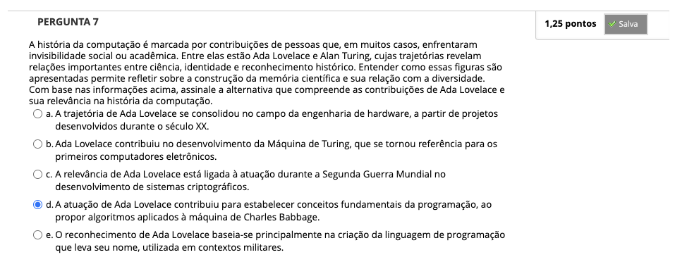
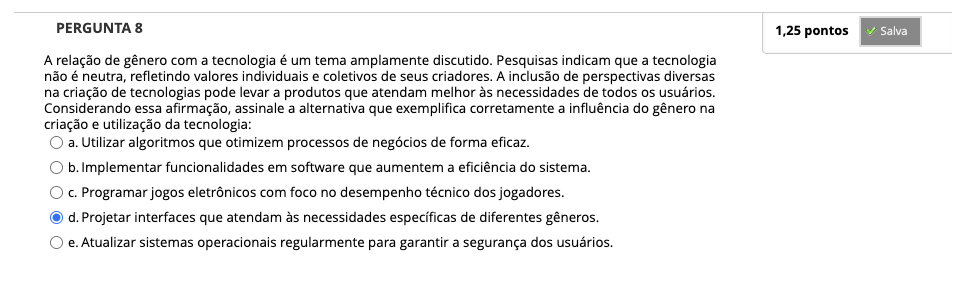

# Semana 2 - Ética em Computação, Gênero e Tecnologias

## Desafio

##
### Videoaula 3 - A ética profissional em Computação

#### Quiz da videoaula 3

### Videoaula 4 - Gênero e Tecnologias

#### Quiz da videoaula 4

### Videoaula 5 - Entrevista: Mulheres na Computação

#### Quiz da videoaula 5

## Material-base
### Texto-base 1
### Texto-base 2

## Quiz Objeto Educacional

---

## Atividade Avaliativa - Semana 2

---

## Em Síntese