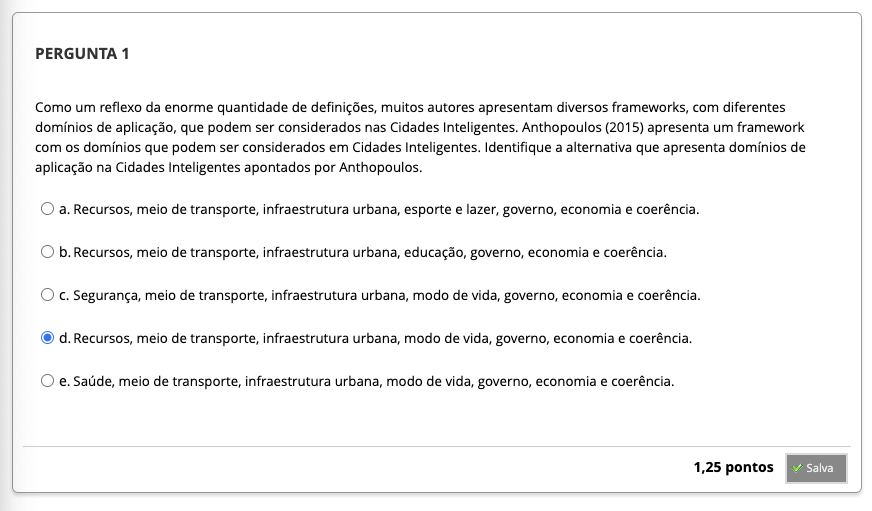
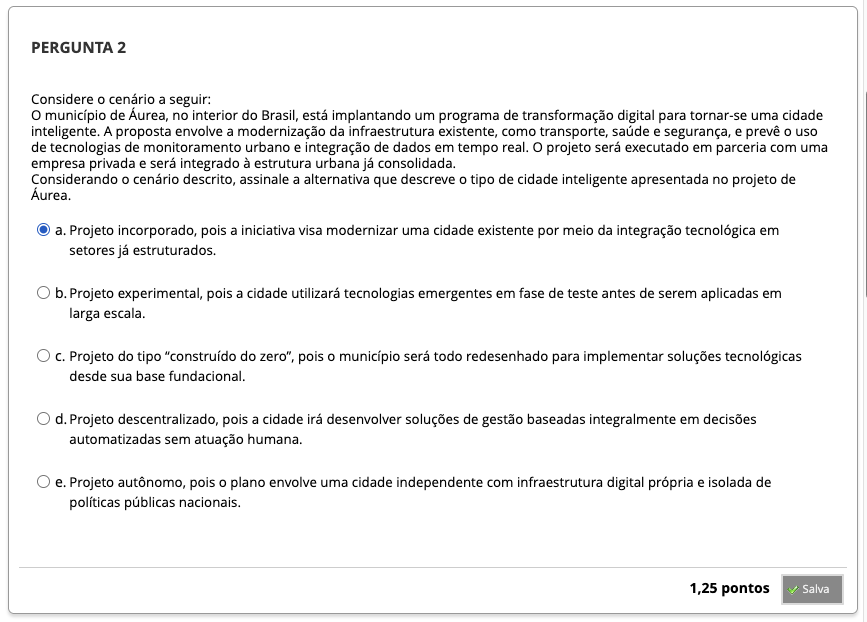
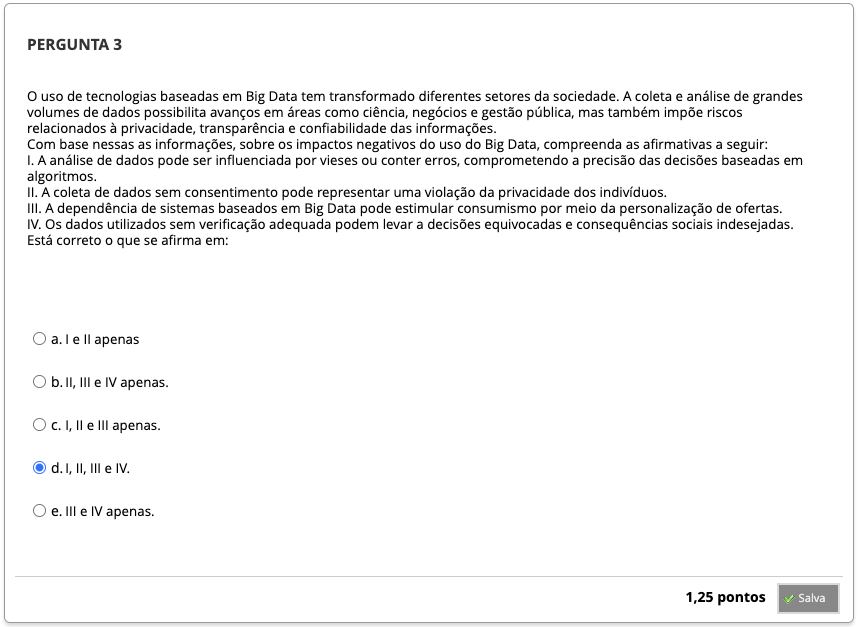
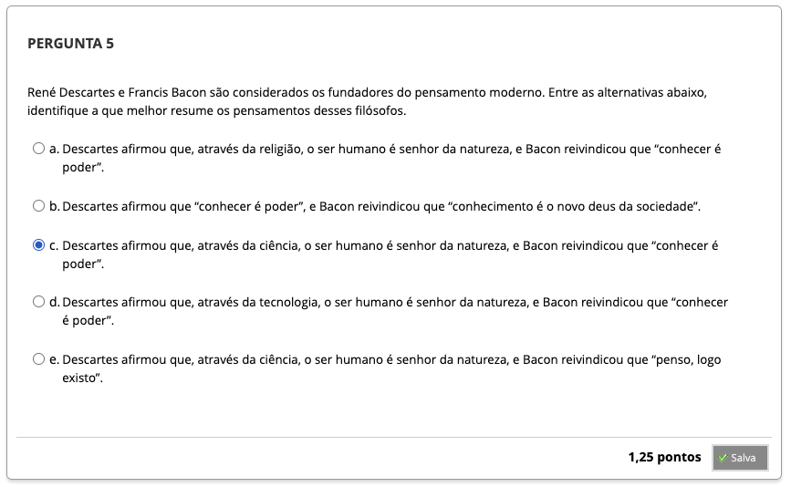
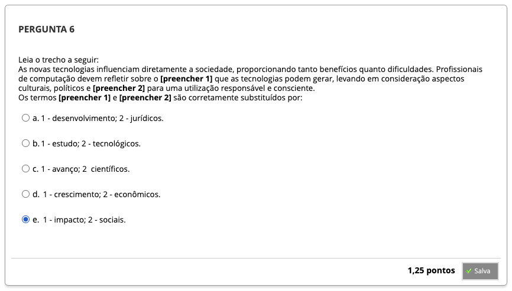
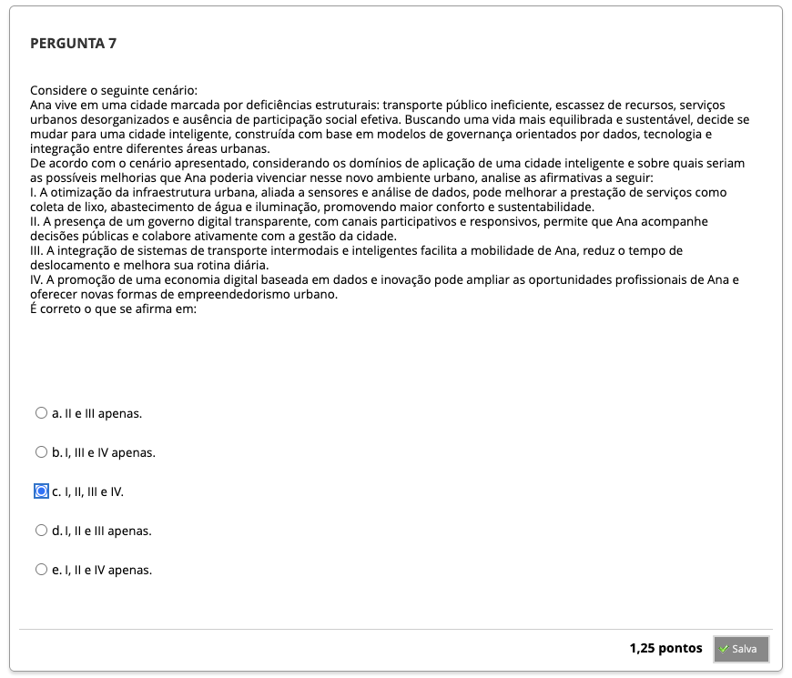
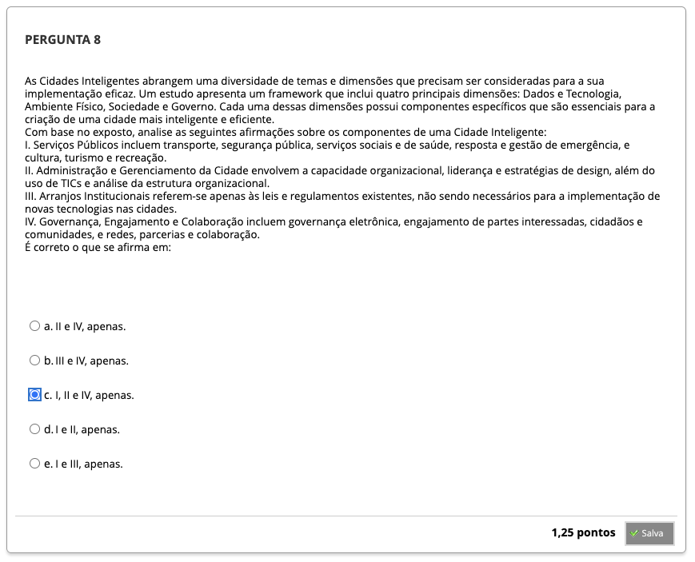

# Semana 3 - Novas Tecnologias e as Cidades do Futuro

## Desafio

##
### Videoaula 6 - Impacto social as novas tecnologias
#### Quiz - videoaula 6

### Videoaula 7 - As cidades do futuro e a computação
#### Quiz - videoaula 7

---

## Material-base
### Texto-base 1
### Texto-base 2

---

## Quiz Objeto Educacional

---

## Atividade Avaliativa - Semana 3

---

## Em Síntese