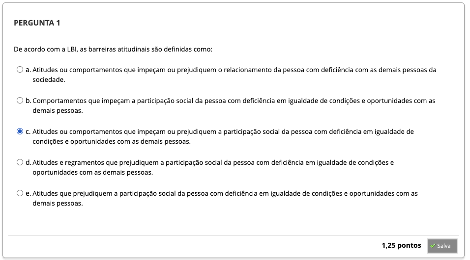
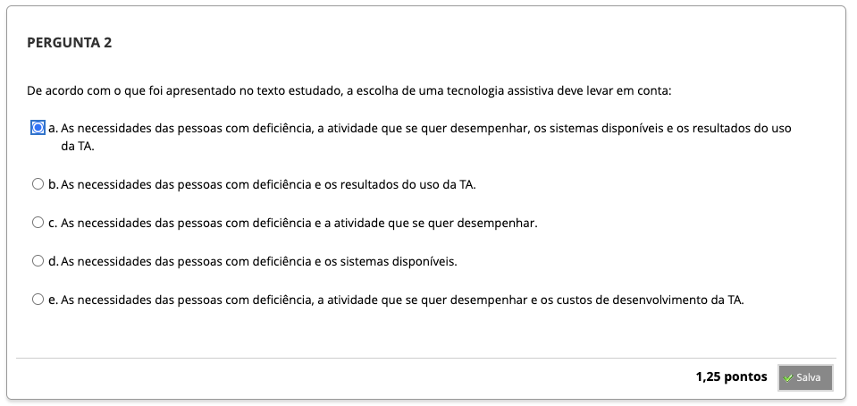
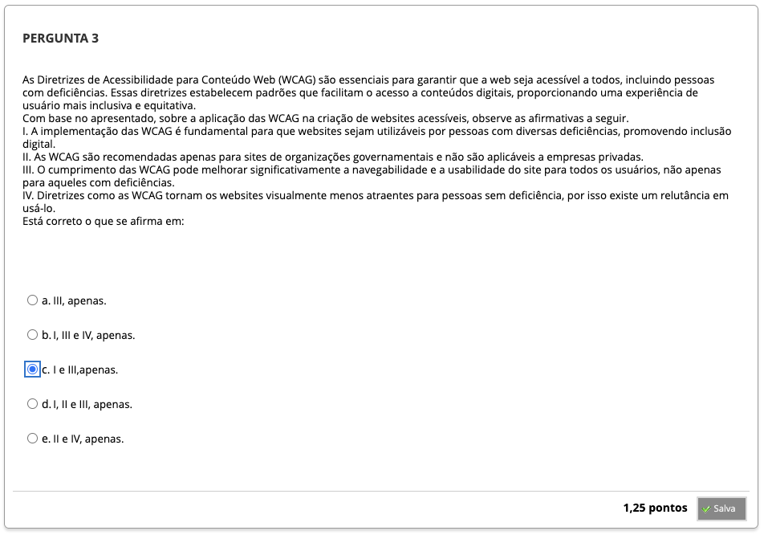
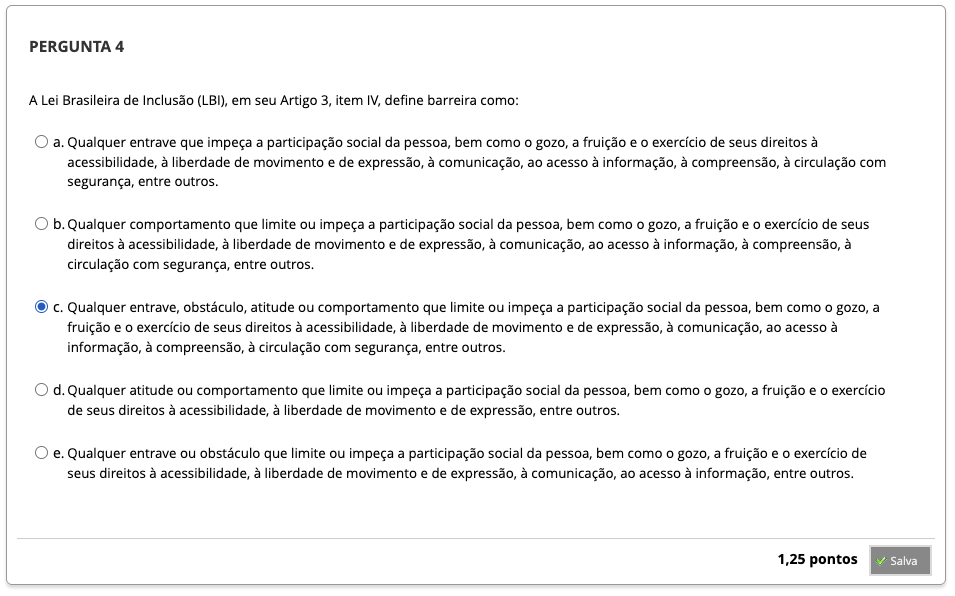
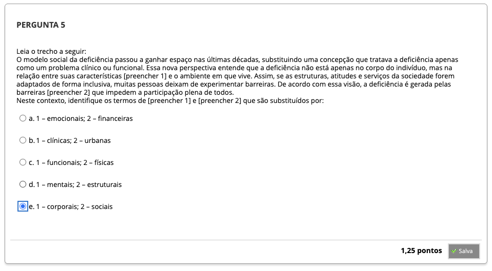
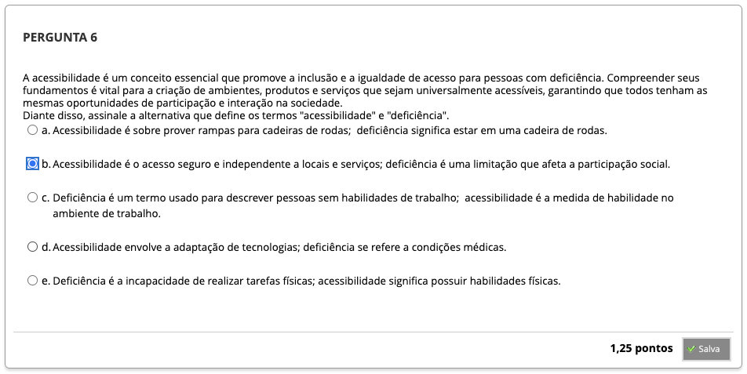
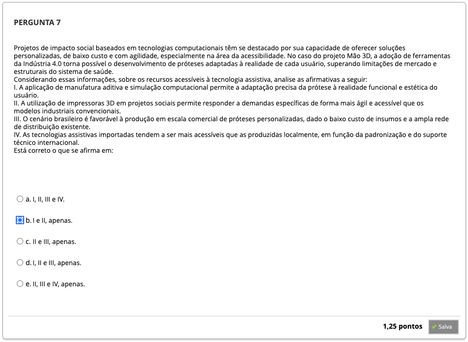
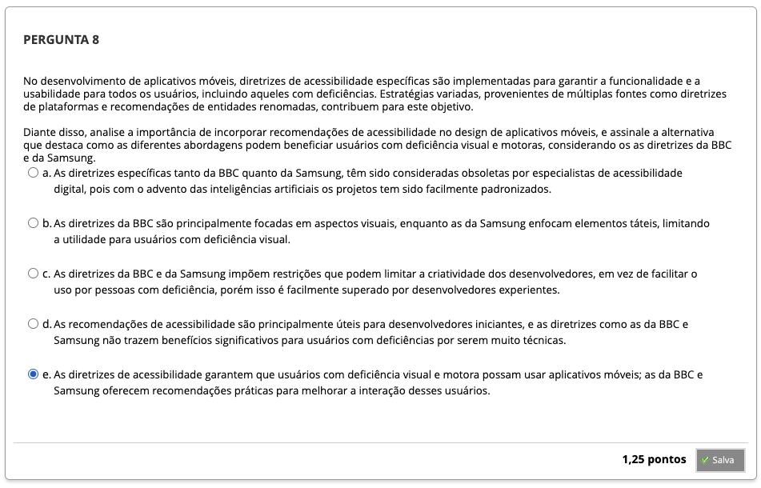

# Semana 5 - Tecnologias e Acessibilidade

## Desafio

## 
### Videoaula 11 - Acessibilidade
#### Quiz - videoaula 11
### Videoaula 12 - Entrevista: Tecnologias Computacionais e Acessibilidade
#### Quiz - videoaula 12

## Material-base

## Quiz Objeto Educacional

---

## Atividade Avaliativa - Semana 5

---

## Em Síntese