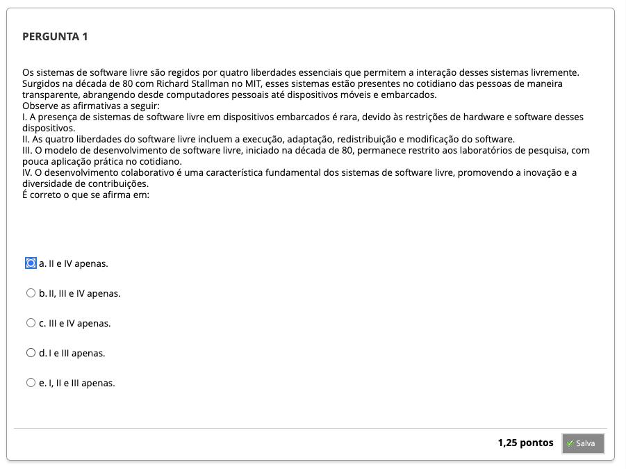
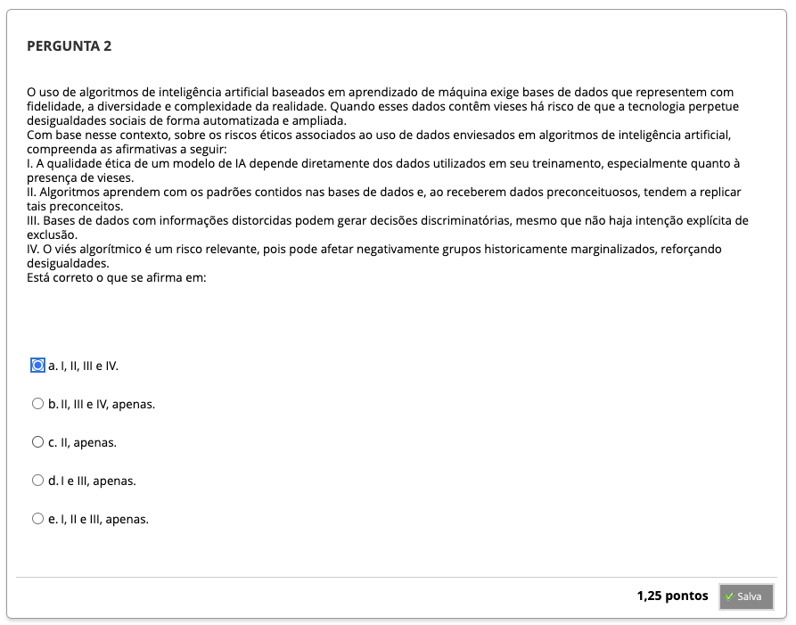
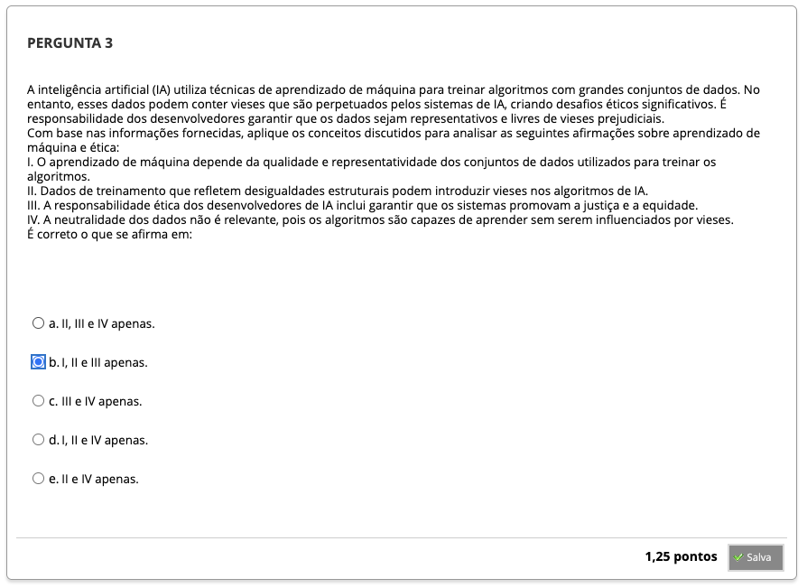
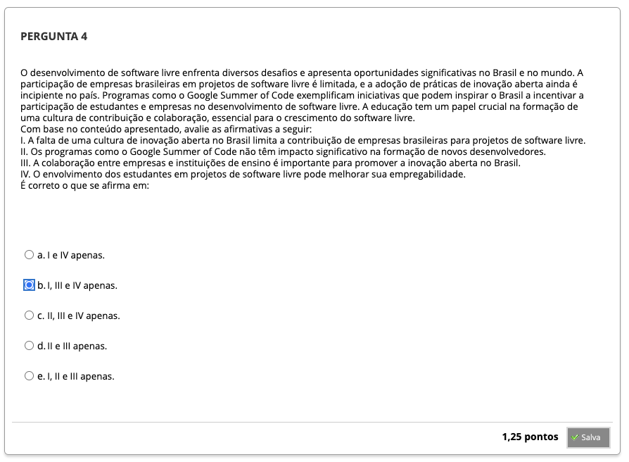
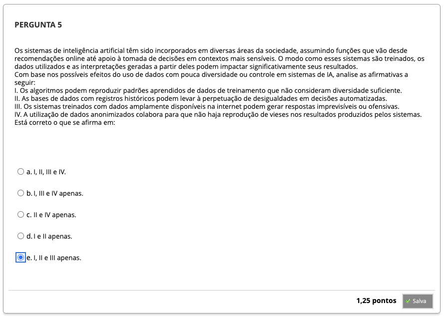
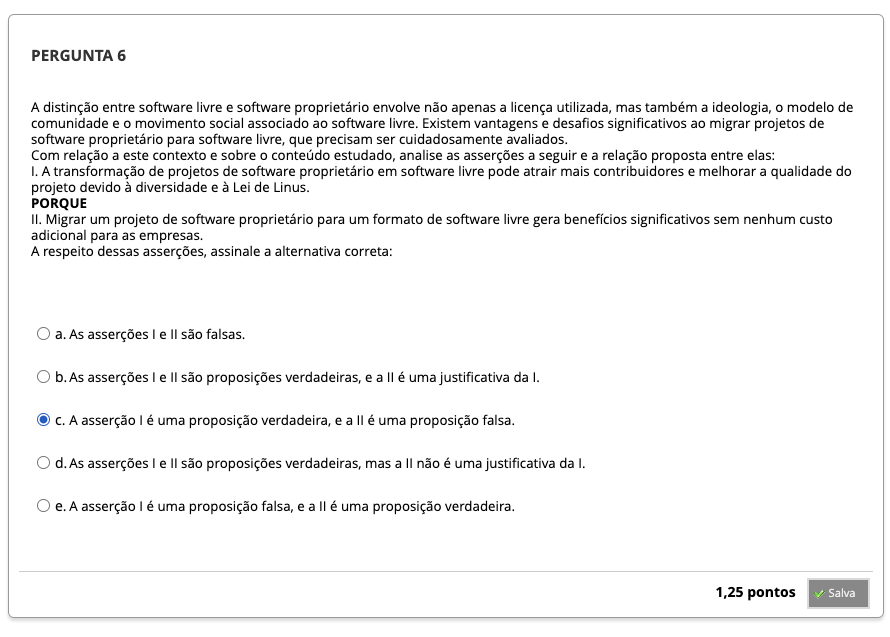
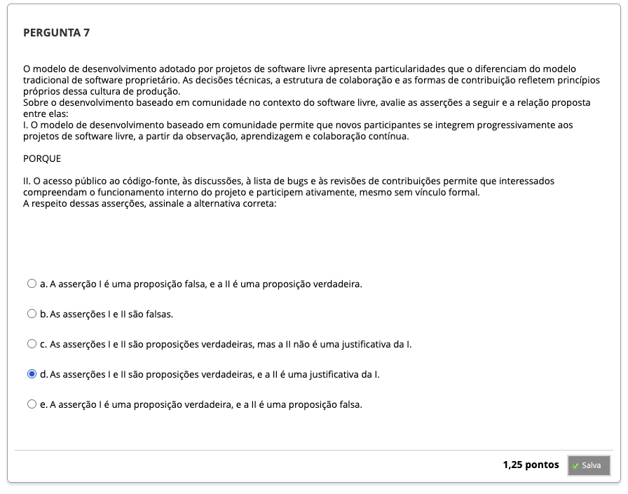

# Semana 7 - Software Livre, Ética e Inteligência Artificial

## Desafio

## Videoaula 15 - Software Livre

#### Quiz - videoaula 15

### Videoaula 16 - Entrevista: Software Livre no Mundo e no Brasil

#### Quiz - videoaula 16

### Videoaula 17 - Ética e Inteligência Artificial

#### Quiz - videoaula 17

### Videoaula 18 - Entrevista: Ética e Inteligência Artificial

#### Quiz - videoaula 18

## Material-base
### Texto-base
### Texto-base

## Quiz Objeto Educacional

---

## Atividade Avaliativa - Semana 7

---

## Em Síntese