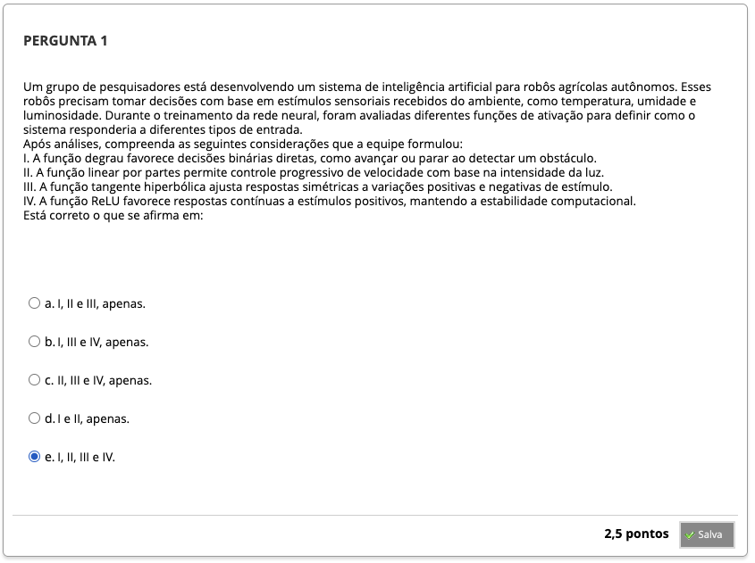
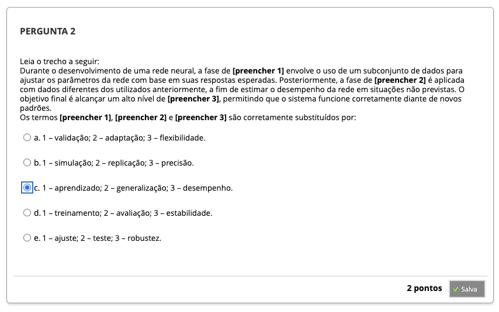
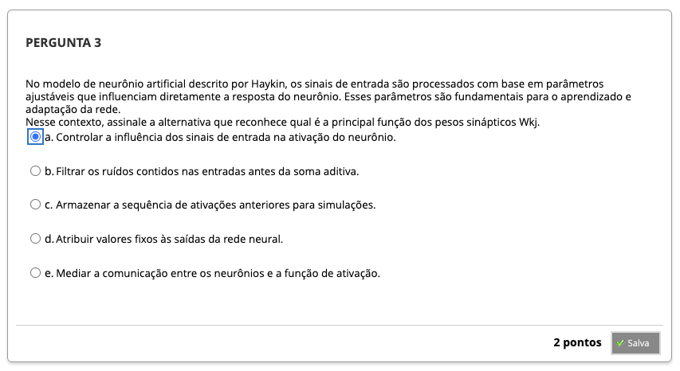
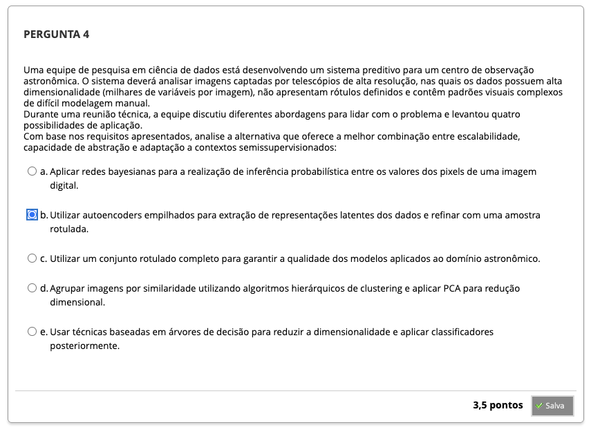

# Semana 1 - Introdução às Redes Neurais Artificiais

## Desafio

##
### Texto-base 1 - Redes Neurais: Princípios e Prática
### Videoaula 1 - Introdução às Redes Neurais Artificiais
https://youtu.be/kzFqGhK8Q2s

#### Quiz da videoaula 1
### Texto-base 2
### Videoaula 2 - O Neurônio Biológico e sua Modelagem Matemática
#### Quiz da videoaula 2
### Texto-base 3
### Texto-base 4
### Videoaula 3 - Aprendizagem em Redes Neurais e seus Principais Paradigmas
#### Quiz da videoaula 3

## Quiz Objeto Educacional

---

## Aprofundando o Tema
### 
###
###
###

---

## Em Síntese

---

## Atividade Avaliativa - Semana 1

