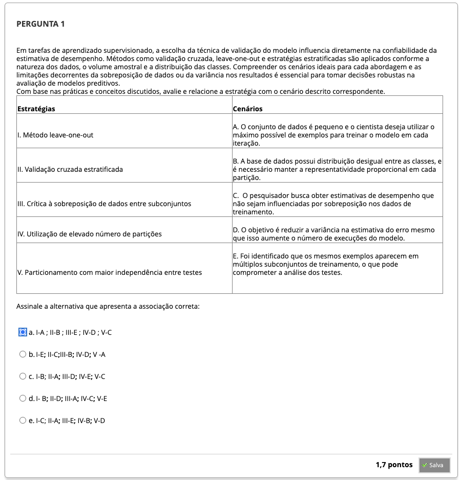
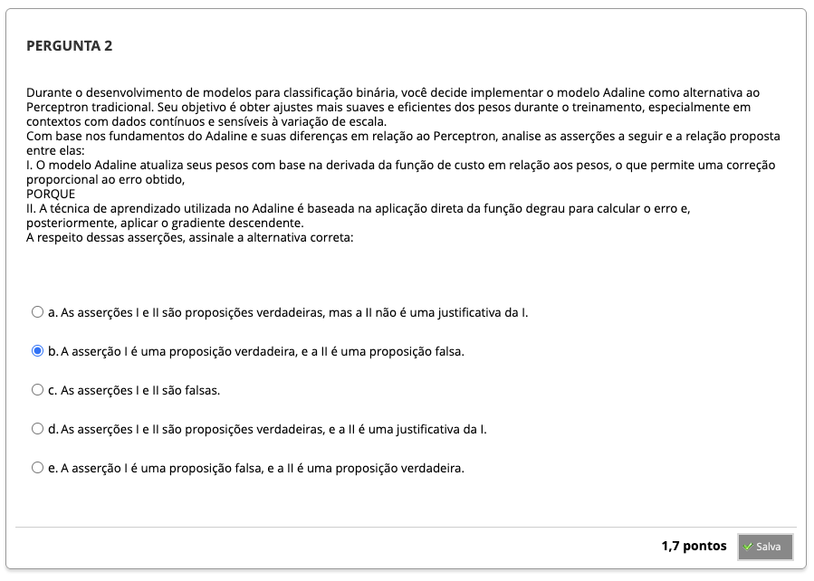
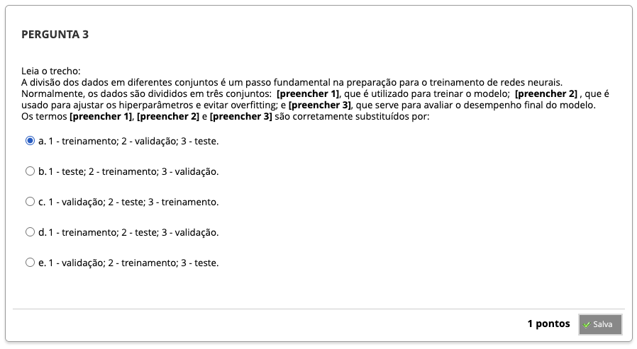
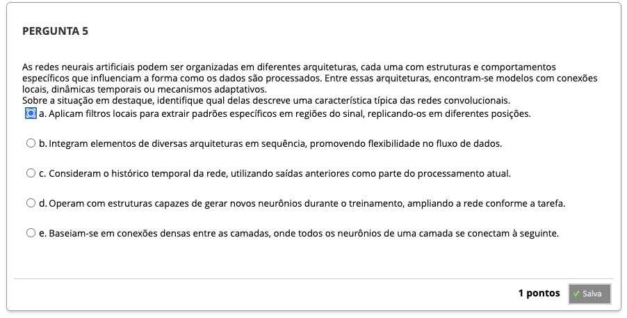
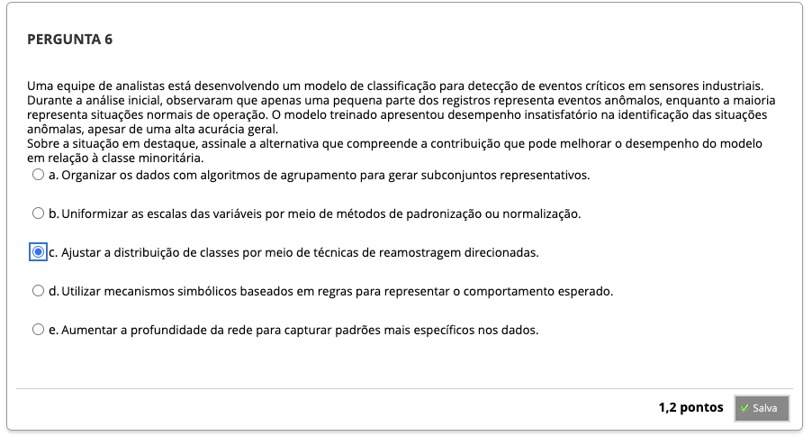
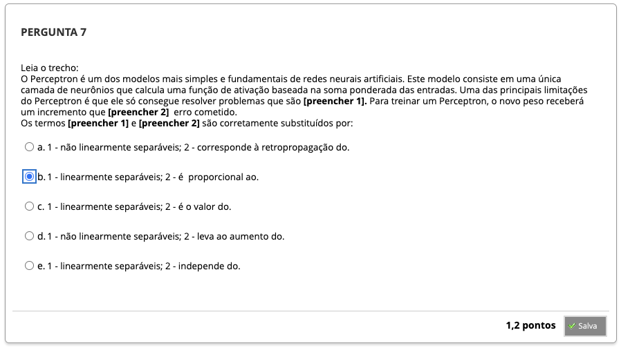

# Semana 2 - Arquiteturas de Redes, Preparação dos Dados e Modelos Lineares

## Desafio

##
### Texto-base 1

### Videoaula 4 - Principais Arquiteturas de Redes Neurais

#### Quiz - videoaula 4

### Texto-base 2

### Texto-base 3

### Videoaula 5 - Preparação dos Dados para Treinamento das Redes Neurais

#### Quiz - videoaula 5

### Texto-base 4

### Texto-base 5

### Videoaula 6 - Primeiros Modelos - Perceptron e Adaline

#### Quiz - videoaula 6

---

## Quiz Objeto Educacional

---

## Aprofundando o tema
### 1

### 2

### 3

### 4

### 5

### 6

---

## Em Síntese

---

## Atividade Avaliativa - Semana 2

